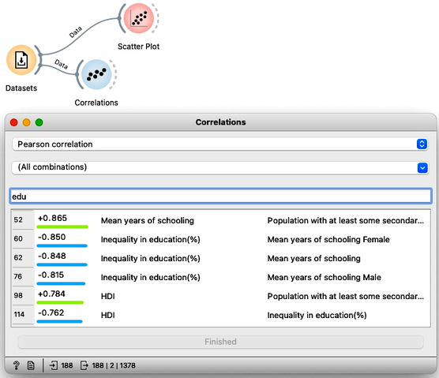
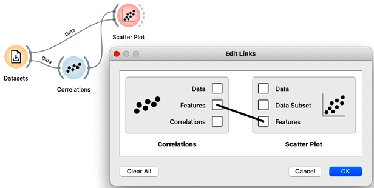

This section is actually to show that not all orange widget channels carry the data. We will demonstrate this on the humand development index and through exploring the correlations between data features.

<!!! float-aside !!!>

The most common communication item carried from one widget to another is the data table, denoted with "Data".

Namely, in all our previos workflows, Orange widgets sent data instances to one another. For example, we loaded the human development index data with the Datasets widget and then looked at the data in the Data Table. Notice that Orange reports that the two widgets communicate using the Data channel. We also used the Scatter Plot, and again the output carried from the Datasets widget is labeled as “Data”.

But the information carried from one widget to another does not necessarily contain only the data instances. For example, Orange widgets can also output distance matrices, objects that learn from the data, evaluation results, or a set of data features. We will learn about these and other types of channels later, but let us make an example here. We will use a correlations widget that displays correlations between two features in my dataset. The widget sorts the feature pairs by the absolute correlation. We can see that some features in human development index data are strongly correlated. For instance, countries with high infant mortality rates have also high mortality rates for kids. More interestingly and besides the most obvious correlations, inequality of education is negatively correlated with mean years of schooling. 

We would like to display each such particular relation between to widgets in the scatterplot. We could open a scatter plot, and manually find this particular pair of features. But we would need to do this for every pair I find interesting in the Correlations widgets. Instead, we can connect Correlations to the Scatter Plot. Orange asks us on what type of connection we would prefer. We do not want Correlations to emit the data with only the chosen set of two features, so we click on the link and cancel this signal. Instead, we see that Correlations also outputs the information on the two features that I can select in the widget, and the Scatter Plot can receive this information on the Features channel. Let us establish this communication channel by dragging a line from the Features box of Correlations to the Features box in the Scatter Plot.

<!!! float-aside !!!>

Correlations widget emits a tuple of features to the Scatter Plot.

We can see that Orange now adds the label Features on the link between Correlations and Scatter Plot. We can now open both widgets side-by-side; selecting a row in Correlations now emits a signal that informs the Scatterplot which axis to display. We can, for instance, see why inequality of education is negatively correlated with mean years of schooling, or why there is such a high correlation between male and female populations with at least some secondary education.

