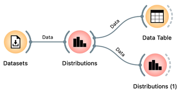

Let us continue with our human development index (HDI) data set to meet a few more visualizations. We start with distributions and add the [Distributions](https://orangedatamining.com/widget-catalog/visualize/distributions/) widget to the Datasets. 

<!!! float-aside !!!>
Load the HDI data in the Datasets widget. See the previous chapter for the details.

<!!! float-aside !!!>
A widget similar to Distributions is a [Violin Plot](https://orangedatamining.com/widget-catalog/visualize/violinplot/). We will skip it in this introduction but encourage you to use it and compare it to the Distributions widget.

Distributions display a histogram of values of selected features. For example, the life expectancy distribution is skewed to higher values, and life expectancy is low only in a few countries. You may want to change the bin width to obtain the visualization below.

Here, it is worthwhile to go through other features of interest and check their distribution. We continue our example with the distribution of the human development index, which looks almost uniform and select data where this index is high in the distribution widget. We perform this selection by clicking and dragging through the histogram bars. For a start, let us check the output of the Distribution widget in the Data Table:

<!!! width-max !!!>

Again, notice that any data selection changes in the Distributions widget propagate through the workflow and trigger an update in the Data Table. Perhaps more interesting is the following combination with a Scatter Plot widget.

We aim to see where the countries with high or low human development index, whatever we selected in the Distributions widget, in the visualization displayed in the Scatter Plot. For instance, most of the countries with high development index have a developed education system and high life expectancy:

<!!! width-max !!!>

Most countries with a high human development index are in the upper quadrant of the life expectancy-schooling plot, though not entirely. There is, however, some overlap. For instance, some countries with high mean years of schooling have a low human development index. It would be interesting to compare the distributions of years of schooling for countries with low and countries with high development index. We can do this, and here is the trick: we will construct the workflow with two Distributions widgets. In the first one, we will select the countries with high development index, and push the information about this selection, together with the data, to the second Distributions widget. To start with, here is the workflow:

<!!! float-aside !!!>
Double-clicking the link between the widgets opens an Edit Links window. Click on the solid line to remove the link, or drag a line from a square representing the output channel of one widget to the square representing the input of the other widget.

Notice that if we drag the link between the Distribution widget and the Data Table widget, Orange will, by default, connect the Selected Data output channel. In the workflow above, we changed this setting by double clicking on the link between the two widgets any rewiring the connection to link the Data output of the Distributions widget with the Data input of the Data Table widget:

<!!! float-aside !!!>
The Data output of the Distributions widget carries out the entire data set but includes a special feature called Selected that reports if the data instance was selected or not.

This way, we have changed the link for the Data Table and the Distributions (1) widgets. Opening a Data Table widget reveals that the Distribution widget added two features to our data set: the Selected feature and a feature called Bin. We will use the Selected feature here, as it reports if the country was or was not selected in the Distributions widget. The Selected is a two-valued feature, with values Yes and No:

We used Data Table in our workflow to check what the data on the output of the Distributions widget looks like. It is always good to observe any raw, augmented, or transformed data in the Data Table prior to the analysis to verify that everything looks all right and to understand the outputs of the Orange widget. Now that we know about the presence of the indicator feature Selected, we can use it in Distributions (1) to split the data and observe conditional distributions:

The overlap is now clearly visible, and so is our previous observation that only the countries with high life expectancy have a higher human development index. You can observe conditional distributions of other variables and perhaps observe that the differences in the distributions are indeed pronounced with some of the variables and are less apparent with the others.

<!!! float-aside !!!>

A widget similar to Distributions but with a different presentation of the variability of values is a [Box Plot](https://orangedatamining.com/widget-catalog/visualize/boxplot/). Let us add it to the workflow and use it to confirm our previous findings. Again, we will rewire the link to this widget, remove the connection from Selected Data and connect the Data channel output from the Distributions widget. Make sure to choose Selected for subgrouping the data and observe the differences in life expectancy given our choice of grouping related to the human development index.

<!!! float-aside !!!>

The box plot shows that the mean life expectancy in countries with a high human development index is much higher than in other countries (79.7 vs. 68.2), and there is little overlap between the two distributions. Regarding the overlap: it would be interesting to find features where the differences between the countries with low and high human development indexes are the largest. At this stage, let us consider what we mean by "little overlap". We want the means to be as far away as possible. And we would like distributions with little spread. We could compute the difference of the means and divide it with the root of the sum of the squared variances to get the feature score. This score is, in fact, the [Welch's t-test](https://en.wikipedia.org/wiki/Welch%27s_t-test), also displayed at the bottom of the Box Plot visualization. The value of the t statistics for our split of the data and life expectancy is 14.98, a value that would be improbable to obtain if the split between selected and a non-selected group of countries were random (hence p=0.0). Checking the "Order by relevance to subgroups" checkbox orders the features by the p-value. It turns out that features reporting on national income, life expectancy, inequality, and health care quality are most related to the human development index.

<!!! float-aside !!!>

Several widgets in Orange can help us explore joint distributions of two or more variables. One such visualization is a [Sieve Diagram](https://orangedatamining.com/widget-catalog/visualize/sievediagram/), which discrete the continuous variables into four intervals and displays how likely it is to encounter a particular combination of the two features. For schooling and life expectancy, it turns out that the most likely combinations are either with both feature values low or both values high. There are other exciting combinations in this data set, and we encourage you to find them with the Score Combination feature. You may also compare Sieve Diagram to the [Mosaic Plot](https://orangedatamining.com/widget-catalog/visualize/mosaicdisplay/), a somehow more sophisticated widget where you can examine joint distributions of more than two features.

