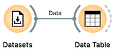
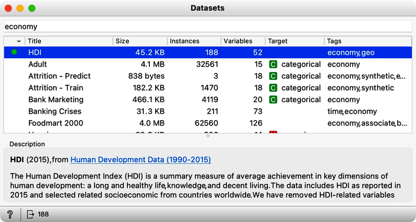
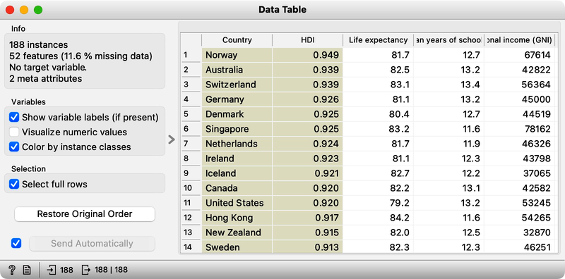
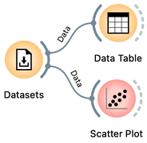
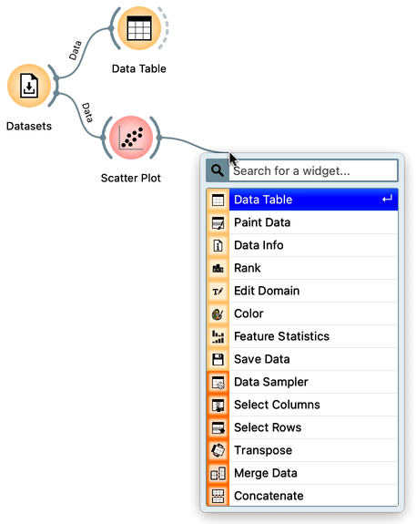
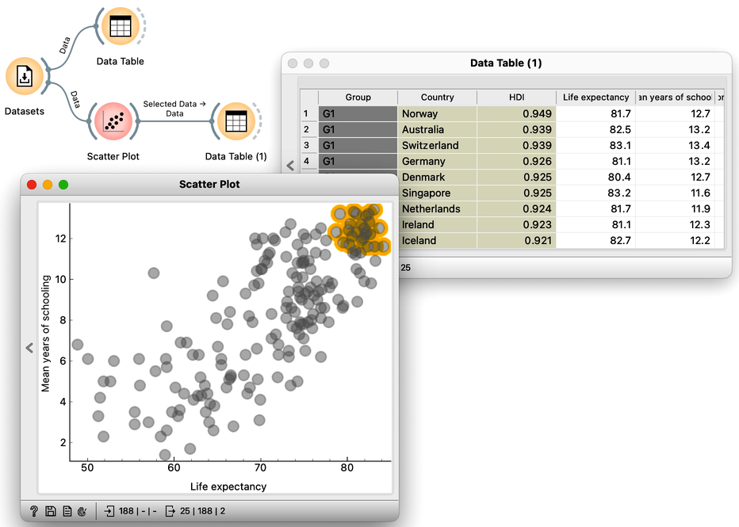
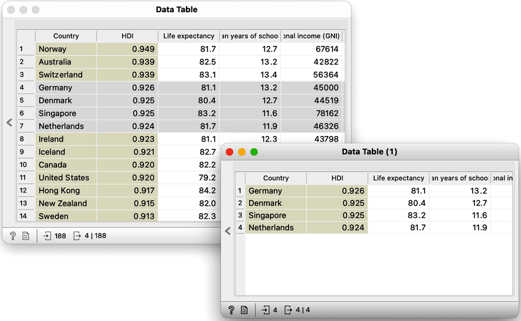
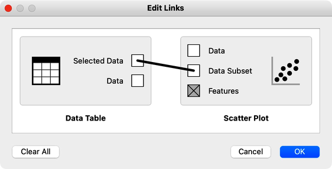

Orange supports the analysis of data through the construction of workflows. Orange workflows contain components that read, process and visualize data and models. We refer to these components as "widgets." We place the widgets on a "canvas" drawing board to design a workflow. Widgets communicate by sending information along their communication channels. We construct workflows by linking the output of one widget to another widget's input.

<!!! float-aside !!!>
A simple workflow with two connected widgets. The outputs of a widget appear on the right, while the inputs appear on the left. 

<!!! float-aside !!!>

We construct workflows by placing widgets onto the canvas and connecting them by drawing a line from the transmitting widget to the receiving widget. There are several ways to place a new widget on the canvas:

* click on the icon of a widget in the widget toolbar, and the new, unconnected widget will appear on the canvas,
* right-click on the empty space of the canvas, search for the widget by typing a part of its name, and select the widget of choice,
* drag a line from the output or an input of a widget to some empty space on the canvas; just like above, a menu with a list of widgets appears.

The widget's outputs are on the right and the inputs on the left. In the workflow above, the [Datasets](https://orangedatamining.com/widget-catalog/data/datasets/) widget sends its data to the [Data Table](https://orangedatamining.com/widget-catalog/data/datatable/) widget. The Datasets widget loads the data from Orange's datasets server and then pushes the data to the Data Table. Data Table displays the data from its input in a spreadsheet-like form. Don't confuse Data Table with spreadsheet programs like Excel: Data Table only shows the data and is not a data editor. To change the data, one would need to go to its source file, change the data there, and then reload it into Orange. There are, of course, Orange widgets to change and transform the datasets, but we will introduce them later in this guidebook.

If you are using Orange for the first time, the Datasets widget did not load any data yet. Constructing the above workflow with Datasets and Data Table will result in the dashed connection between the two widgets:

With the dashed connection, Orange tells us that the widgets are connected, but no information is transmitted through the channel. Namely, we have yet to tell the Datasets widget which data to load. Let us double-click the Datasets widget to get its content. The widget displays the list of available data sets. Find HDI, the human development index dataset, and load the data by double-clicking on its row or pressing a return key when the row is selected.

Now, the line between Datasets and Data Table becomes solid, and it is time to check what the loaded data looks like. Let us double-click on the Data Table widget to reveal its contents.

The human development index dataset includes 52 features and two meta variables. The metavariables store the country's name and the HDI index, and the features profile the countries with various socioeconomic indices. Although also just a number, like all other features, we set the HDI index as a meta as it is computed from all other features. We will learn about assigning different roles and types to variables in the following chapters of this guideline.

<!!! float-aside !!!>

The first few features in the HDI dataset report on life expectancy, mean years of schooling, and gross national income. In which country should we live for the most extended lifespan? Where do people spend the most years in schools? Are these two features related? Do you have to go to school longer to earn better? Well, not everything can be answered in the Data Table, but certainly, we can find the answers to the first two questions. Sort the countries according to the features by clicking on their corresponding header. Do the results surprise you? We can visualize the data in a scatter plot to find the answer to the third question. Let us add the Scatter Plot widget to the workflow and open the Scatter Plot widget by double-clicking on its icon.

Life expectancy seems to be related to years spent in school. The longer we go to school, the longer we live? Well, not necessary. Causality and correlation should not be mixed. It would still be interesting to see which countries have the most elaborate school system and where you live long. At this stage, we can

* hoover over the data point to find which country it represents,
* switch on the data point labeling by selecting country from the Label pull-down menu,
* select a few countries of interest and feed the data to the data table.

Let us go with the third option. We will first connect a new Data Table to the output of the Scatter Plot. Remember, we can do so by dragging a new connection from the Scatter Plot widget and choosing Data Table from the drop-down menu when we release the mouse:

A resulting workflow now contains four widgets. The widget Datasets loads the data, sends it to Data Table, which displays the complete data set, and to Scatter Plot, which visualizes the data for a chosen combination of two features. The Scatter Plot sends selected data to the Data Table (1):

Why is the connection between the Scatter Plot and the downstream Data Table dashed? Oh, we did not select any data in Scatter Plot yet. Let us do this and have both Scatter Plot and Data Table (1) open, side by side.

<!!! width-max !!!>

Few remarks are in place here:

* Selecting the points in the Scatter Plot, the dashed connection between the Scatter Plot and Data Table (1) widget icons becomes full. The Scatter Plot has loaded the data on this connection. Try single-clicking on the empty part of the scatterplot to remove any selection, empty the data on the output channel, and then select some data again.
* In the screenshot above, we have hidden the control part of the widget. You can always show it back by clicking on an arrow on the left edge of the widget's window.
* Any change in the selection of the Scatter Plot points propagates through the workflow and updates the display in the Data Table (1). This mechanism is excellent: we have just constructed our first combination of widgets for exploratory analysis. Use it to find the countries with the lowest lifespan. Or the country in the upper left quadrant of the scatter plot display looks like an outlier? Do you think countries in each group belong to some geographical regions?
* Every time we click on Orange's canvas, the canvas window comes up front and hides the widgets. We can bring the windows of the opened widgets to the front by choosing Bring Widgets to Front command from the View menu. Or, from the same menu, choose always to display widgets on the top.

We can select a data subset in most of Orange's widgets with data visualizations, including the Data Table. Let us remove Scatter Plot and Data Table (1) widgets and add another widget at the existing Data Table's output. We can remove widgets by:

* right-clicking on its icon and selecting Remove from the pull-down menu, 
* clicking on the widget to select it and then pressing delete or backspace key, or
* dragging a rectangle around a group of icons of widgets we would like to remove and then pressing the delete or backspace key.

Our workflow should now contain three widgets:

Open Data Table and Data Table (1), and select some data items (rows) in the Data Table. Notice how the selection of rows propagates to the Data Table (1):

While this, we hope, is instructive from the point of view of Orange mechanics, displaying the selection from one Data Table in another Data Table is rather useless. It would be much more interesting to select rows in the Data Table and highlight the selected data items in the Scatter Plot. This way, we could sort the data by country name, choose our featured states, and find where they are in the Scatter Plot. Let us do so! We can remove Data Table (1) and a Scatter Plot and then (and only then) connect the Scatter Plot to the Data Table:

We can now open both Data Table and Scatter Plot widget and browse through countries in the Data Table, selecting those of interest and checking out how well they do in the Scatter Plot. 

The workflow above implements another exploratory data analysis combined with two widgets. And we have just started our Orange data science journey! For our last workflow, we learned that widgets could accept multiple inputs. Scatter Plot can receive data as well as a data subset. Double click on any of the links in the workflow to view what kind of signals widgets can output and what they can receive on the input. The details between the communication link between Data Table and Scatter Plot, for instance, show that the Scatter Plot widget has three input channels, and Data Table two:

What does the Features channel of Scatter Plot do? And who can output this type of signal? Read on.
