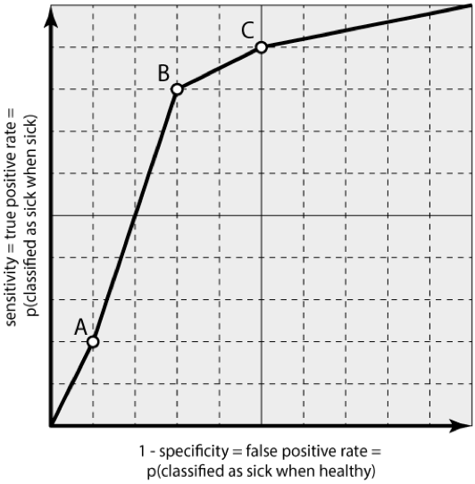

## ROC Curve

#### A solved warm-up exercise

You won a lottery prize, and you don't yet know which one. The probability that you'll get $5 is 0.8 and the probability that you'll get $10 is 0.2. What is the expected value of the prize?

Solution: if you get $5 with a probability of 0.8 and $10 with a probability of 0.2, the expected prize is the weighted average of the prizes, 0.8 x $5 + 0.2 x $10 = $6.

#### Now for the homework

Sara the veterinarian treats hamsters for Chomsky disease. About one-half of hamsters she sees have this disease; luckily, the condition is not severe; it only makes hamsters run backward on the running wheel.
She can make two kinds of mistakes:

- If she fails to detect the disease when it's present, the associated cost (lawsuits, etc.) is $1000.

- If she treats a hamster that is healthy, the cost (lawsuits, etc.) is $600.

(Don't worry about Sara, in both cases, she charges enough to make a nice living.)

She will make her choice of whether to administer the cure according to the classifier that predicts the probability of the disease from the observed symptoms. The classifier she uses is not perfect, as shown in the ROC curve.

Read the first two sections of the [Wikipedia page about ROC curves](https://en.wikipedia.org/wiki/Receiver_operating_characteristic) (up to, including ROC Space) and answer the following questions.

1. What is the false positive rate (FPR) of each point marked on the ROC curve?

2. What is the true positive rate (TPR) of the three marked points on the ROC curve?

3. How do you compute the false negative rate (FNR) from one of these two, that is, from either FPR or TPR (give a formula)? Compute FNR for each of the three marked points on the ROC curve.

4. Each of the two kinds of Sara's mistakes is associated with one of the above three probabilities. For each of the two kinds of mistake, what is the associated probability in terms of FPR, TPR, or FNR?

5. What is the expected cost of mistakes for each point on the ROC curve? Points A, B and C in the graph are associated with probability thresholds Sara can use when using the classifier. Which of the three points defines the optimal threshold; in other words, for which of the three points the associated cost of mistakes is the lowest?

6. Sara has accidentally put a sick and a healthy subject (that is, hamster) in the same cage. Now she doesn't know which is which. She is going to diagnose both hamsters and administer the cure to the one which she believes is more likely to be sick. What is the probability that she'll pick the wrong one?

Submit your homework as a short report in PDF (not Word!) where you answer to the above questions. **Please itemize your answers and mark them with numbers that correspond to questions above. Be crisp, just provide the computations and short answer, no long explanations.** Use 11 pt Calibre or Arial or similar sans-serif font, and 1.2 spacing between lines. Use 6 pt separation between paragraphs. Name this document as lastname-firstname-5.pdf (like smith-mary-5.pdf; notice there are no spaces in the name, all letters are lowercase, and the dash is used to separate the first and last name) where last name is your last name and first name your first name. Email the report to bzupan@gmail.com with subject DM-HW5 (copy the subject title and then paste it into the email title field; notice there are no spaces in the subject title).
The deadline is 11:00 am on Thursday, February 23.
