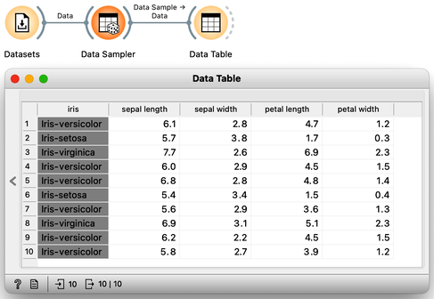
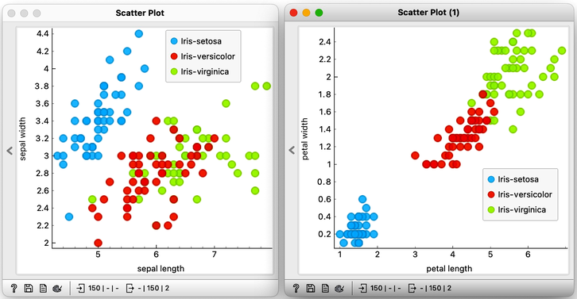
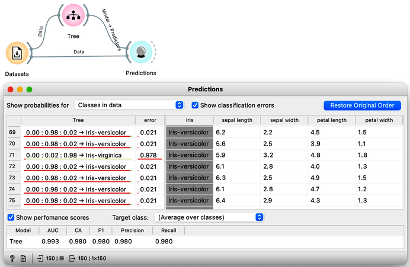

<!!! float-aside !!!>
We call the variable we wish to predict a target variable, or an outcome or, in traditional machine learning terminology, a class. Hence we talk about classification, classifiers, classification trees...

The Iris flower data set is widely renowned as one of the most prominent data sets globally. It contains 150 Iris flowers, each of which can be distinguished based on the width and length of their sepals and petals. Although it may be challenging for an untrained observer to differentiate between the different types of Iris flowers, the data set, which dates back to 1936, actually includes three distinct species - Iris setosa, Iris versicolor, and Iris virginica - with 50 flowers belonging to each species. To access the Iris data, one can utilize the Datasets widget. Presented below is a small excerpt of the Iris data set:

Let's examine the Iris flower data using a scatterplot, with two distinct projections. It's evident that the combination of petal and leaf measurements creates a clearer separation of the three classes. This separation is so distinct that we could potentially use a set of rules based on the two measurements to predict the species of Iris.

Speaking of prediction, classifying the flowers into one of the three species is precisely what we want to accomplish. Imagine visiting a flower shop, taking the flower's measurements, and then using them to determine its species. This would be an impressive feat, transforming even regular customers into knowledgeable botanists.

A model that uses the morphological characteristics of the Iris, such as sepal and petal measurements, to classify the species of Iris is known as a classification model. The Iris flowers in our data set are classified into one of the three distinct categories, and the task at hand is classification.

To create a classification model, we feed the data into the [Tree](https://orangedatamining.com/widget-catalog/model/tree/) widget, which then infers a classification model and transfers it to the [Predictions](https://orangedatamining.com/widget-catalog/evaluate/predictions/) widget. Unlike previous workflows where the widgets mostly communicated the data between widgets, there is now a channel that carries a predictive model. The Predictions widget also receives the data from the Datasets widget and uses the model on its input to make predictions about the data, which are then displayed in a table in the "Tree" column. Visible are also inferred probabilities of each of the three classes.

<!!! float-aside !!!>
Something in this workflow is conceptually wrong. Can you guess what?

How correct are these predictions? Do we have a good model? How can we tell? But (and even before answering these very important questions), what is a classification tree? And how does Orange create one? Is this algorithm something we should really use? So many questions to answer.