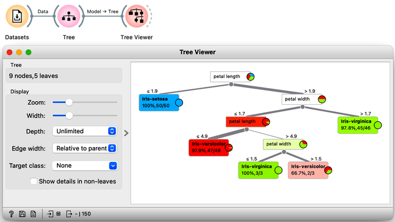
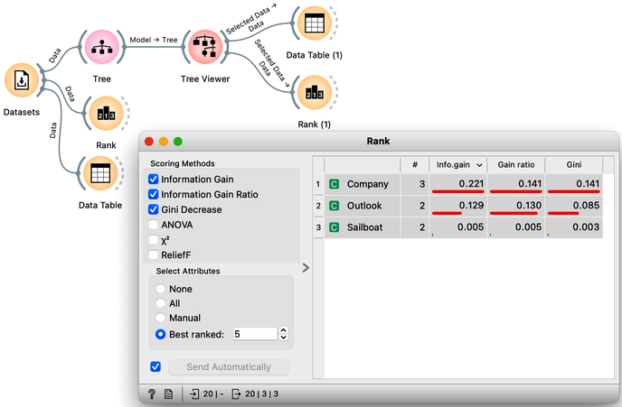
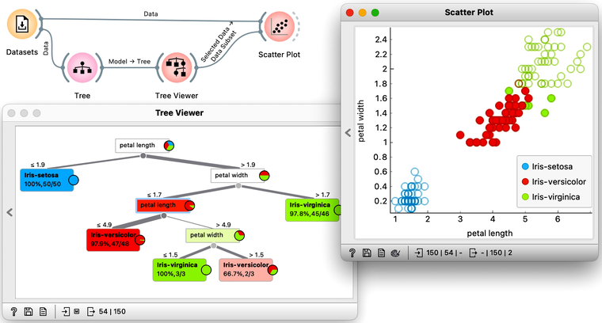
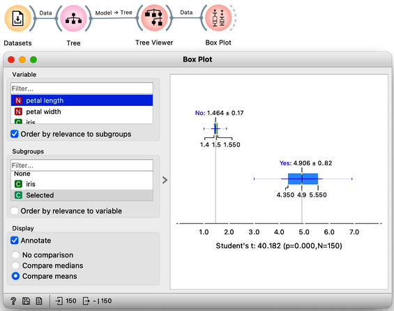

<!!! float-aside !!!>
Classification trees were hugely popular in the early years of machine learning, when they were first independently proposed by the engineer [Ross Quinlan](https://en.wikipedia.org/wiki/Ross_Quinlan) (C4.5) and a group of statisticians (CART), including the father of random forests [Leo Brieman](https://en.wikipedia.org/wiki/Leo_Breiman).

In the previous lesson, we used a classification tree, one of the oldest, but still popular, machine learning methods. We like it since the method is easy to explain and gives rise to random forests, one of the most accurate machine learning techniques (more on this later). What kind of model is a classification tree?

Let us load the iris flowers data set, build a classification tree using the [Tree](https://orangedatamining.com/widget-catalog/model/tree/) widget  and visualize it in a [Tree Viewer](https://orangedatamining.com/widget-catalog/visualize/treeviewer/).

We read the tree from top to bottom. Looks like the feature "petal length" best separates the iris species setosa from the others, and in the next step, "petal width" then almost perfectly separates the remaining two species.

Trees place the most useful feature at the root. What would be the most useful feature? The feature that splits the data into two purest possible subsets. It then splits both subsets further, again by their most useful features, and keeps doing so until it reaches subsets in which all data belongs to the same class (leaf nodes in strong blue or red) or until it runs out of data instances to split or out of useful features (the two leaf nodes in white).

<!!! float-aside !!!>
The Rank widget can be used on its own to show the best predicting features. Say, to figure out which genes are best predictors of the phenotype in some gene expression data set, or to infer what socioeconomic feature is most related to country's well-being.

We still have not been very explicit about what we mean by "the most useful" feature. There are many ways to measure the quality of features, based on how well they distinguish between classes. We will illustrate the general idea with information gain. We can compute this measure in Orange using the [Rank](https://orangedatamining.com/widget-catalog/data/rank/) widget, which estimates the quality of data features and ranks them according to how informative they are about the class. We can either estimate the information gain from the whole data set, or compute it on data corresponding to an internal node of the classification tree in the Tree Viewer. 

The following example uses the Sailing data set, which includes three features and a class. The data set observes, say, a friend who likes to sail. Suppose that every Wednesday, we ask her what kind of boat she has available and the size of the company that will join her, look at the weather forecast, and then record if she went sailing during the weekend. In the future, we are intrigued to predict on Wednesday if she will go sailing. We would also like to know which of the three features bears the most information about the prediction. Here is the workflow where we use the Rank widget on the whole data set and the data sets that are intrinsic to every note of the classification tree to check if the chosen variable in that node is indeed the most informative one.

<!!! float-aside !!!>
Try to assemble this workflow, open the widgets, and select any of the internal nodes of the tree from the Tree Viewer. Check out the resulting changes in the Rank (1) and Data Table (1).

Besides the information gain, the [Rank](https://orangedatamining.com/widget-catalog/data/rank/) widget displays several other measures, [including Gain Ratio](https://en.wikipedia.org/wiki/Information_gain_ratio) and [Gini index](https://en.wikipedia.org/wiki/Gini_coefficient), which are often quite in agreement and were invented to better handle discrete features with many different values.

<!!! float-aside !!!>
Note that the Data widget needs to be connected to the Scatter Plot's Data input and Tree Viewer to the Scatter Plot's Data Subset input. Do this by connecting the Data and Scatter Plot first.

To explore the tree model further, here is an interesting combination of a Tree Viewer and a Scatter Plot. This time, we will again use the Iris flower data set. In the Scatter Plot, we can first find the best visualization of this data set, the one that best separates the instances from different classes. Then we connect the Tree Viewer to the Scatter Plot. Data instances from the selected node of the Tree Viewer, flowers that satisfy the criteria that lead to that node, are highlighted in the Scatter Plot.

<!!! width-max !!!>

We could include a few other widgets in this workflow for fun. Say, connecting the Tree Viewer with a Data Table and Distributions widget. Or connecting it to a Box Plot, but then rewiring the connection to pass all the data to it and sub-grouping the visualization by a feature called "Selected". Like below.

In a way, a Tree Viewer behaves like Select Rows, except that the rules used to filter the data are inferred from the data itself and optimized to obtain purer data subsets.
