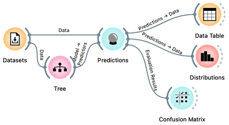
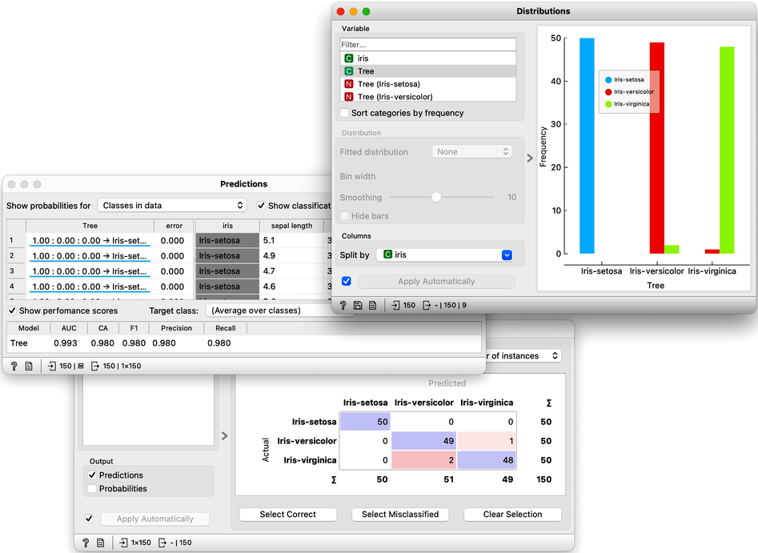

Now that we know what classification trees are, the next question is what is the quality of their predictions. For beginning, we need to define what we mean by quality. In classification, the simplest measure of quality is classification accuracy expressed as the proportion of data instances for which the classifier correctly guessed the value of the class. Let's see if we can estimate, or at least get a feeling for, classification accuracy with the widgets we already know, plus with a new widget that displays so-called confusion matrix.

Let us use this workflow with the Iris flower data set. The [Predictions](https://orangedatamining.com/widget-catalog/evaluate/predictions/) widget outputs a data table augmented with a column that includes predictions. In the Data Table widget, we can sort the data by any of these two columns, and manually select data instances where the values of these two features are different (this would not work on big data). Roughly, visually estimating the accuracy of predictions is straightforward in the Distribution widget, if we set the features in the view appropriately. Iris setosas are all classified correctly, and for the other two species there are just three misclassifications. Classification accuracy is thus (150-3)/150 = 0.98, that is, our tree classifier is 98% correct. This same statistics on correctly and incorrectly classified examples is also provided in the [Confusion Matrix](https://orangedatamining.com/widget-catalog/evaluate/confusionmatrix/) widget.

