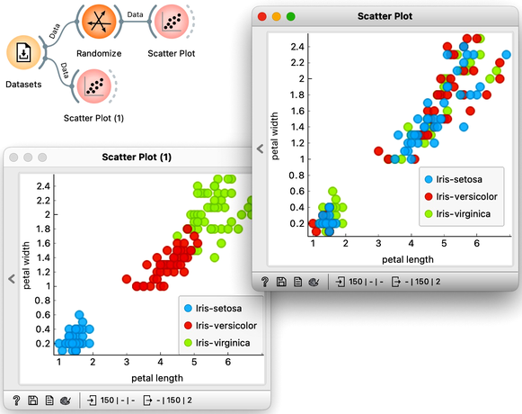
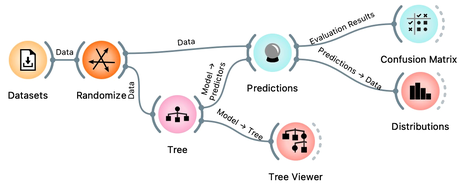
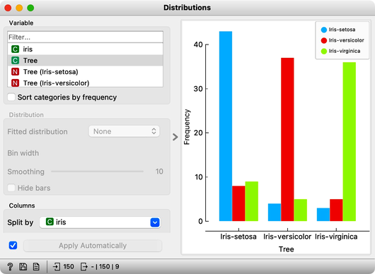
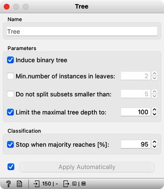
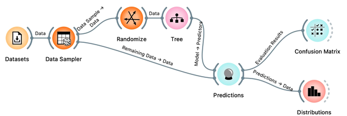
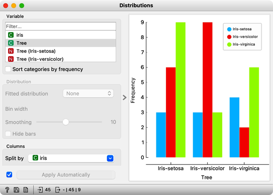

<!!! float-aside !!!>
This lesson has a strange title and it is not obvious why it was chosen. Maybe you, the reader, should tell us what this lesson has to do with cheating.

At this stage, the classification tree on the Iris flower data set looks very good. There are only three data instances where the tree makes a mistake. Can we mess up the data set so bad that the trees will ultimately fail? Like, remove any existing correlation between features and the class? We can! There's the [Randomize](https://orangedatamining.com/widget-catalog/transform/randomize/) widget with class shuffling. Check out the chaos it creates in the Scatter Plot visualization where there were nice clusters before randomization, and where now, of course, the classes have been messed up.

<!!! float-aside !!!>
Scatter plot of the original Iris data set the data set after shuffling the class of 100% of rows.

Fine. There can be no classifier that can model this mess, right? Let us check out if this is indeed so.

And the result? Here is a screenshot of the Distributions widget.

Most unusual. Despite shuffling all the classes, which destroyed any connection between features and the class variable, about 80\% of predictions were still correct.

Can we further improve accuracy on the shuffled data? Let us try to change some properties of the induced trees: in the \widget{Tree} widget, disable all early stopping criteria.

Wow, almost no mistakes now, the accuracy of predictions is nearly 99%. How is this possible? On a class-randomized data set? To find the answer to this riddle, open the \widget{Tree Viewer} and check out the tree. How many nodes does it have? Are there many data instances in the leaf nodes?

With 161 nodes and 81 leaves the tree is huge and it is impossible to visualize it in a modest-size window. It is perhaps even more complex than the Iris data table itself. Looks like the tree just memorized every data instance from the data set. No wonder the predictions were right. The tree makes no sense, and it is complex because it simply remembered everything.

Ha, if this is so, if a classifier remembers everything from a data set but without discovering any general patterns, it should perform miserably on any new data set. Let us check this out. We will split our data set into two sets, training and testing, randomize the train and feed it into the classification tree and then estimate its accuracy on the test data set.

<!!! float-aside !!!>
Notice that we needed to rewire the connection between Data Sampler and Predictions, so that remaining, out-of-sample data is feed to Predictions.

Let’s use the Distributions widget to check how the classifications look like after testing the classifier on the test data.

The results are a complete fail. The tree almost predicts for almost equal frequency that the Iris is setosa, regardless of original, true class. On the class-randomized training data our classifier fails miserably. Finally, just as we would expect.

We have just learned that we need to train the classifiers on the training set and then test it on a separate test set to really measure performance of a classification technique. With this test, we can distinguish between those classifiers that just memorize the training data and those that actually learn a general model.

Learning is not only memorizing. Rather, it is discovering patterns that govern the data and apply to new data as well. To estimate the accuracy of a classifier, we therefore need a separate test set. This estimate should not depend on just one division of the input data set to training and test set (here's a place for cheating as well). Instead, we need to repeat the process of estimation several times, each time on a different train/test set and report on the average score.