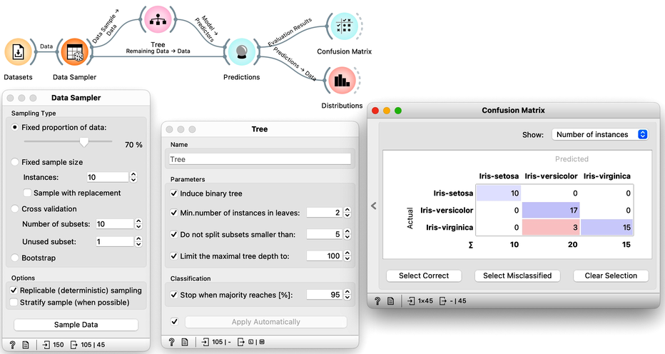
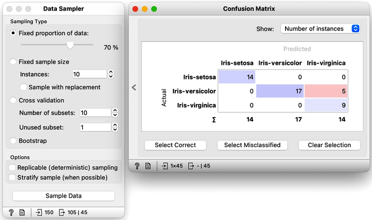
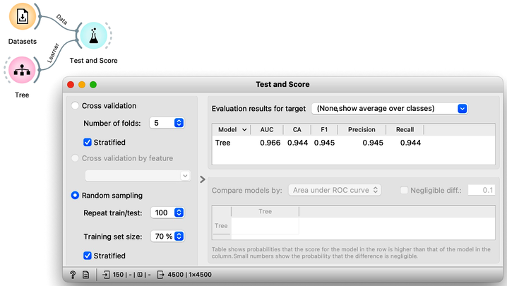
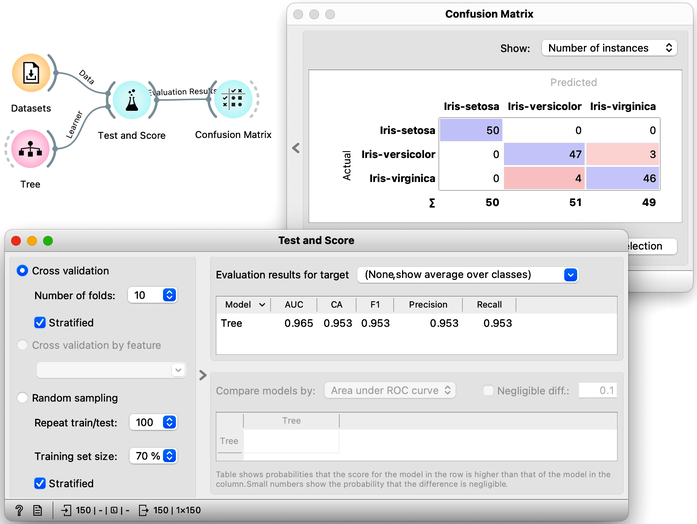

So how would the right estimation of the accuracy of the tree classifier look like. In the previous chapter, we have learned that we need to split the data to training and test set, that is, we need to test the model on the data that the model has not seen in the testing phase. Else, it is just as we would always accurately predict yesterday's weather. Let us do so without randomization, and set the tree parameters back so that they enable some forward pruning of the tree.

<!!! width-max !!!>

It looks like our classification tree indeed has high estimated accuracy. Only three iris flowers were misclassified. But this estimate can depend on the random split of the data. Let us check this out. In the Data Sampler, we will uncheck replicable sampling, click, perhaps several times, the Sample Data button and observe if there are any changes in the confusion matrix.

On every click on the Sample Data button, the widget emits the new random sample, and the confusion matrix changes. The number of errors is small, and usually fluctuates between misclassifing versicolor and virginica. If we are really lucky, the composition of the training and test set is such that the tree inferred on the training set makes no errors on the test set. 

So if we are about to write a paper on the utility of the machine learning for some data set, which error would we report? The minimal one that we obtain? The maximal one? Actually, none of these. Remember, the split of the data to the training and test set only provides means to estimate the error the tree would make if presented a new data set. A solid estimate would not depend on particular sampling of the data. Therefore, it is best to sample many times, like 100 times, and report on the average accuracy.

Pressing Sample Data button a hundred times and computing the average score would be really boring. Instead, Orange has a widget that does all that for us. The widget is called [Test and Score](). To repeat training and testing 100 times with the same training algorithm, we have to provide it a data set and the training algorithm. The widget then iteratively splits the data, uses the training algorithm to develop a predictive model on the subset of data for training, uses the resulting model on the test data and calculates the accuracy, and at the end reports an average accuracy (column called "CA") from all the iterations. 

<!!! float-aside !!!>
The Test and Score uses the training algorithm, not a model. Hence, the Tree widget sends it the Learner, an object storing a learning method. Why is there no connection needed between the Datasets and the Tree?

While we could conclude our discussion at this point, there is an alternative and more widely-used method for estimating accuracy that we should consider. This method, called cross-validation, avoids the possibility that certain data instances will be placed into the test set more frequently than others by randomly splitting the data multiple times. Instead, each data instance is included in the test set exactly once. To perform cross-validation, the data is first divided into k folds. Then, in each of the k iterations, one fold is used for testing while the remaining folds are used for training. Typically, k is set to 10, but in Orange, the default value of 5 is used to conserve computing resources. The results of performing ten-fold cross-validation on the Iris flower data set are shown below. To ensure that each fold contains a roughly equal distribution of classes, the "stratification" option is utilized during the creation of the folds.

<!!! float-aside !!!>
Another advantage of using cross-validation is that the resulting confusion matrix includes each data item from the original data set exactly once. Namely, the confusion matrix displays the performance results for each data item when it was used in the test set.

