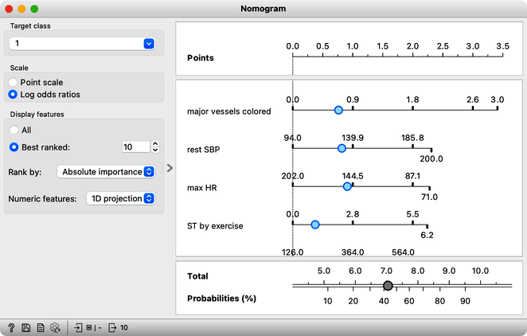

Logistic regression is a well-known classification algorithm that estimates the likelihood of a class variable based on input features. To handle multiclass problems, it employs a one-versus-all technique, where it treats one target value as positive and the rest as negative, transforming the problem into a binary classification task. Next, it identifies an optimal decision boundary that separates instances with the target value from those without. This boundary is found by computing distances from the instances to the decision boundary, and then using the logistic function to transform these distances into probabilities. Instances that are far from the boundary are assigned a higher probability of belonging to the positive class, while those near the boundary are assigned probabilities closer to 0.5, indicating more uncertainty in the prediction.

<!!! float-aside !!!>

    Can you guess what would the probability for belonging to the blue class be for A, B, and C?
    

The goal of logistic regression is to identify a plane that maximizes the distance between instances of one class and the decision boundary, in the appropriate direction.

[Logistic Regression](https://orangedatamining.com/widget-catalog/model/logisticregression) widget in Orange offers the advantage of interpretability through the use of a [Nomogram](https://orangedatamining.com/widget-catalog/visualize/nomogram).

A nomogram displays the relative importance of variables in a model. The importance of a variable is indicated by its position on the nomogram: variables higher up on the list are more important. In addition, the length of the line corresponding to each variable indicates its relative importance: longer lines indicate more important variables. Each line represents the coefficient of the corresponding variable, which is used to compute the probability of the target class. By adjusting the blue point along a line, you can explore how changing the value of the corresponding variable affects the model's output, demonstrating the relationship between different input values and the predicted probability of the target class.

Logistic regression takes into account the correlation among variables when evaluating them simultaneously. In cases where some variables are correlated, their importance is distributed among them.

However, logistic regression has limitations as it relies on linear decision boundaries, which means that it may not work well for datasets that cannot be separated in this way. Can you think of an example of such a dataset?
