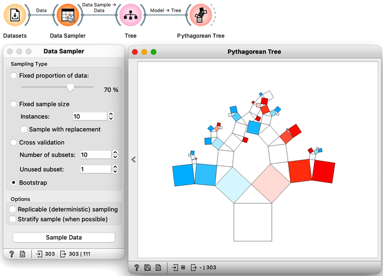

<!!! float-aside !!!>
The random forest algorithm develops each tree on a bootstrap sample, which is a sample with the same number of instances as the original dataset. In a bootstrap sample, each data instance is drawn from the original dataset with replacement, creating a new dataset that includes approximately 63% of the original samples. The remaining 37% of the data instances can be used to estimate accuracy and feature importance.

Random forests, a modeling technique introduced in 2001, remains one of the most effective classification and regression methods. Unlike traditional decision trees that choose the feature with the best separation at each node, random forests build multiple trees using a random selection of features and data samples. This approach introduces variability in the tree-building process and can improve model performance. By randomly selecting among best-ranked features at each node, the models can account for interactions among variables and prevent overfitting. One way to visualize the impact of random sampling on tree structure is to use a tree visualization widget like Pythagorean Tree. By sampling the data with each tree construction, the resulting trees can vary substantially, allowing for greater model flexibility and robustness. We demonstrate this approach using a heart disease dataset.

Random forest trees are generally quite diverse, and for the final prediction, the trees collectively "vote" for the best class. This voting process is similar to asking a group of people with varying levels of expertise to make a decision by majority vote. While some people may not have enough knowledge to make an informed decision and will vote randomly, others may have relevant knowledge that will influence the decision in the correct direction. By aggregating the results of many trees, random forests can incorporate the knowledge of a diverse set of models to make accurate predictions.

Interpreting a random forest model can be challenging due to the many tree models involved. Understanding which features are the most important in a random forest can be particularly challenging. Fortunately, the creators of random forests have defined a procedure for computing feature importances. This importance is assessed by measuring the accuracy of each tree on its out-of-sample testing data when the tree uses the original testing data or the data with shuffled values of a chosen feature. Features that have a large difference in accuracy are deemed more important. To obtain this ranking, one can use a Random Forest learner with a Rank widget. This approach can help users identify the most important features and understand how they contribute to the model's predictions.

<!!! float-aside !!!>
Why do you think Random Forest does not need a connection from Datasets in the workflow on the right?

It is advantageous to compare the accuracy of random forests to that of classification trees. In practical applications, random forests consistently outperform classification trees in terms of precision and achieve higher classification accuracy.

