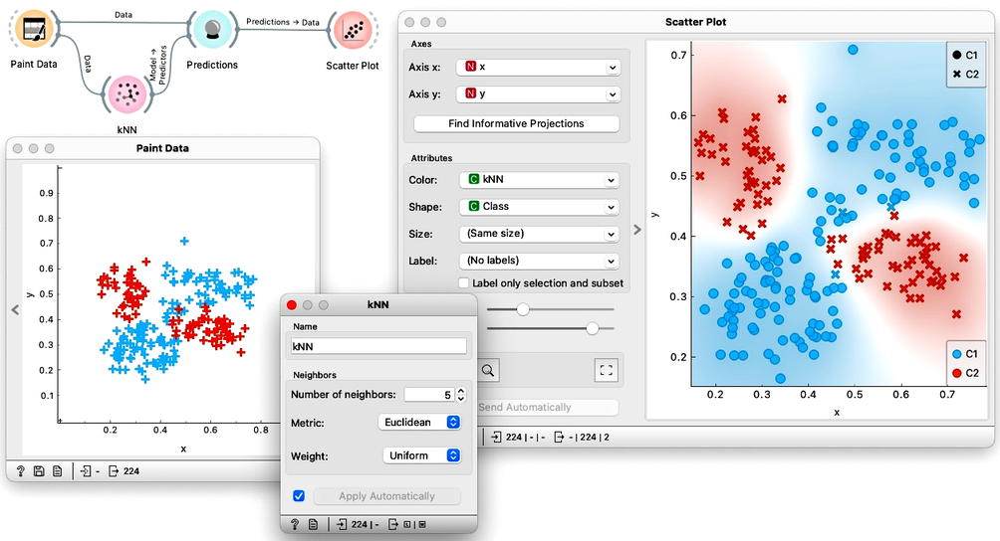

<!!! width-60 float-aside !!!>

    
    For an data instances to be classified, kNN looks at its k nearest neighbors. Here, we set k to the value of 5. Of these five neighbors, four belong to the red class and one to the blue class. Our data instance will thus be classified as red with 80\% probability.

The concept of k-nearest neighbors (kNN) is straightforward: find the k instances that are most similar to each data instance, and then make a prediction or estimate probabilities based on the classes of these k instances. In the case of classification, the final label is determined by the majority label among the k nearest instances, while for regression, in the cases where we would predict the value of a continuous class, the final value is the average of the values of the k nearest instances.

Unlike many other algorithms, k-nearest neighbors (kNN) does not build a model but rather in the training phase just stores the training data. This type of learning is referred to as "lazy learning." The kNN algorithm's main advantage is its ability to accurately model data that cannot be linearly separated into classes. Moreover, it can be rapidly retrained since new data instances only impact the model locally. However, the classification, that is, the stage when we use the model to predict a class, may be slow for large datasets, as the model must estimate all distances for each new data instance to be classified.

Below, we tried to paint a data set where linear classifiers such as logistic regression would fail but where kNN may succeed. Indeed, kNN was able to correctly classify most of the data instances from the training set. How many training data instances were misclassified?

<!!! width-max !!!>
