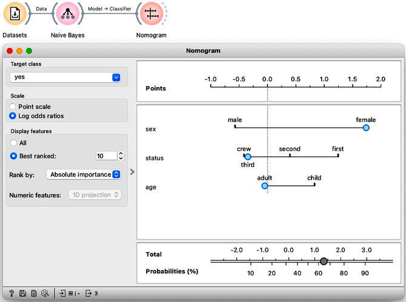

<!!! float-aside !!!>
The naive Bayes classifier assumes that the features are independent within each class. If a dataset were to have truly independent features, then the naive Bayes classifier would be the optimal choice. However, in practice, such datasets with independent features are rare.

The naive Bayes classifier, implemented in Orange's [Naive Bayes](https://orangedatamining.com/widget-catalog/model/naivebayes) widget is a method of classification. To illustrate how it works, we can use a dataset that pertains to the passengers of the Titanic, and which records the outcome of its 1912 disaster. This dataset, which we can obtain by using the Data Sets widget, includes information on 2201 passengers, such as their travel class (first, second, or third class, or crew), age, and gender. All of the features in the dataset are categorical. For instance, the age feature simply indicates whether a passenger was a child or an adult.

The structure of the naive Bayes models can be visualized and explained using the [Nomogram](https://orangedatamining.com/widget-catalog/visualize/nomogram) widget. The widget consists of a scale labeled "Points", a section where the point value of each feature value can be determined, and a scale with probabilities where individual points are summed up and transformed into a probability of the target class. In the upper left corner of the widget, you can set the "Target class" to either "Yes" or "No". If you set it to "Yes", the widget will show you the probability that a passenger survived.

<!!! float-aside !!!>
In probability theory, individual contributions should be multiplied to calculate joint probabilities. However, nomograms work in a log-space where a sum is equivalent to multiplication in the original space. By summing up the contributions of all feature values in the log-space, nomograms can bypass the need for multiplication and convert the sum back to a probability in the original space.

The Titanic nomogram shows that gender was the most influential feature for survival. If we move the blue dot to 'female', the probability of survival increases to 73%. Moreover, if that female passenger also traveled in first class, her probability of survival would be 90%. The bottom scales demonstrate the translation from feature values to probability estimates.