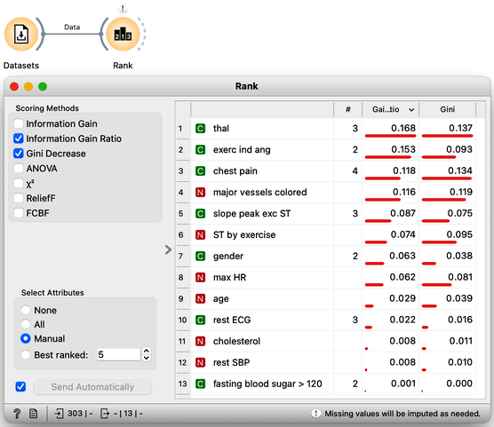
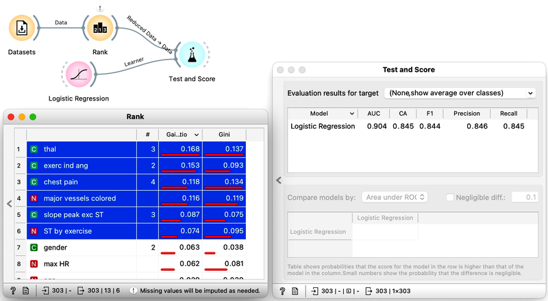

In some cases, collecting or measuring feature values can be expensive or time-consuming, or there may be a need for a model that can be trained quickly without sacrificing accuracy. Additionally, a model that uses a large number of features can be difficult to interpret. Therefore, it is useful to identify which features are important for the model and which ones are redundant. To accomplish this, a process called feature scoring is used. This process involves determining the relative importance of each feature in the model, which can help identify the most important features and streamline the modeling process.

Multiple scoring methods are available to estimate the importance of features with respect to the class. Most of these methods are univariate, meaning they examine the relationship between a single feature and the target variable. However, there are also multivariate methods that take into account feature interactions and the context of all other values when estimating feature importance. Additionally, some feature scoring methods are model-based, meaning they use classification models that have been developed to estimate feature importance.

One example of a univariate feature scoring technique is information gain, which measures the amount of information gained about the target variable y by knowing the value of a feature x. Another similar method is Gini decrease, which measures the decrease in impurity of the class distribution in a dataset after observing a feature x. These scoring techniques may favor multilabel features because they tend to split the data into more subsets, potentially resulting in purer subsets. However, both methods only consider the scored feature and a single class and disregard the values of other features, ignoring the context in which a feature may be important. For example, the importance of a feature may depend on a specific context, such as whether it is raining or not when considering whether to take an umbrella. Clouds alone may not be sufficient to make this decision.

Scoring the features in the context of all other features was the reason behind development of Relief and its later improved version ReliefF. Relief observes how do the changes of the feature change the values of the class under a specific context of all the other features.

Finally, there are model-based feature scoring techniques. Some are model-agnostic, and some have been designed specifically for particular learning algorithms. One such technique is feature scoring by random forests, which uses out-of-sample data sets and for every feature estimate the change of accuracy if that particular feature values are random. The bigger the change, the more important the features.

Most of these features scoring techniques are available in the Rank widget. Here is its output on the hearth disease data.

We may be tempted to select a subset of features, such as the top five scoring features, and estimate the accuracy using cross-validation. For example, in the case of heart disease prediction using logistic regression, we might find that we do not lose much accuracy by using only a subset of features. However, estimating the benefits of feature selection in this way can be misleading, and we will explain why in the following chapters.

<!!! width-max !!!>

