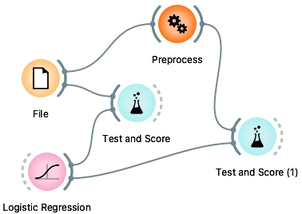
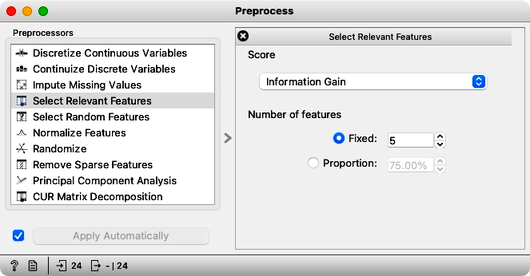
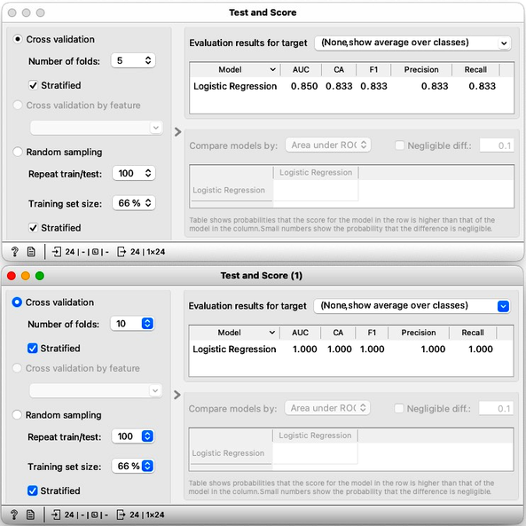

<!!! float-aside !!!>
We will borrow a gene expression data set from Gene Expression Omnibus for our example. There is a particular widget in the Orange bioinformatics add-on that we could use to fetch this and similar data sets. Instead, we will rely on the GEO [downloadable and Orange-ready data set gds360](http://file.biolab.si/datasets/gds360.pkl).

In gene expression analysis, when data typically reports on expression of genes in different tissue samples, data sets typically have samples in rows and gene expressions in columns. These data sets tend to be "fat," meaning they have more genes than samples. This is a common scenario in systems biology research.

When the goal is to classify samples by phenotype, many of the features (genes) in the data set may be irrelevant. In most cases, only a small number of features will be highly correlated with the phenotype of interest. Therefore, it may be beneficial to first select the most informative features and then perform the analysis. This approach can reduce the dimensionality of the data and improve the speed of cross-validation and other model inference algorithms. Overall, feature selection may be a useful tool in gene expression analysis for reducing noise, improving interpretability, and achieving better performance in downstream analyses.

Most often, only a few features correlate with class. So why not simply select a set of most informative features first and then perform the whole analysis? At least cross-validation will then work much faster, as the model inference algorithms will deal with much smaller data tables. Cool. What a nice trick! Let’s try it out in the following workflow.

The workflow above uses the data [Preprocess](https://orangedatamining.com/widget-catalog/transform/preprocess/) widget, which we have configured to select the five most informative features.

Observe the classification accuracy obtained on the original data set and the data set with the five best-selected features. What is happening? What is there such difference in classification accuracy?

