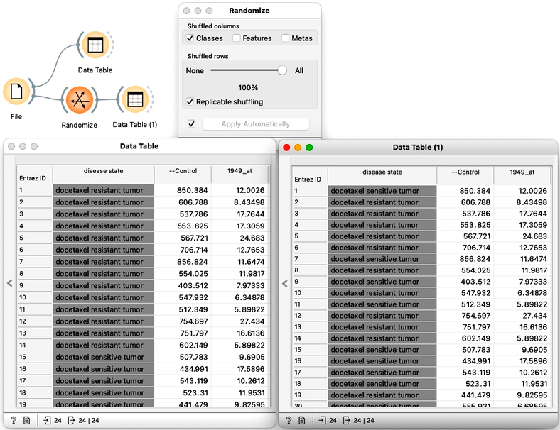
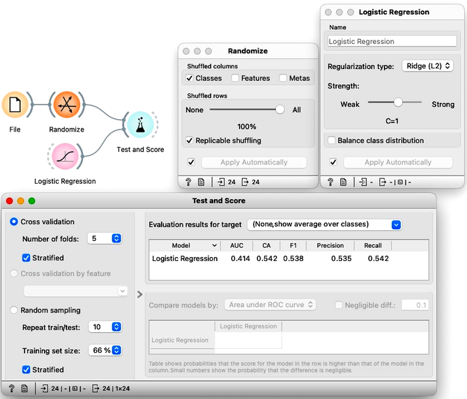
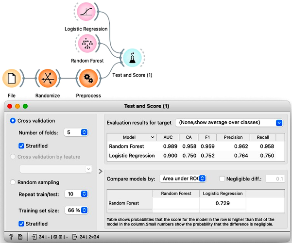

We can push the example from our previous lesson to the extreme. One can squeeze out an excellent cross-validated performance of classifiers even on the randomly generated data. To get such data, we will randomize the gene expression data from the previous chapter. We will take the column with the class values and randomly permute it. We can use the [Randomize](https://orangedatamining.com/widget-catalog/transform/randomize/) widget to do this, and use Data Table to inspect the results of randomization.

We will consider developing a classifier on this data set. We expect low classification accuracy, as the class assignment to the data instances is randomized. Indeed, the cross-validation results with logistic regression are miserable.

We now select five features that are most associated with the class. Even though we randomly permuted the classes, there have to be some features that are at least weakly correlated with the class. Simply because we have tens of thousands of features, and we have only a few samples. There are enough features to associate with class simply by chance. Finally, we score logistic regression on a randomized data set with selected features, and add the random forest just out of curiosity.

<!!! float-aside !!!>
Instead of selecting the five most informative features, you can further reduce this number. Say, to two most informative features. What happens? Why does accuracy rise after this change?

What great scores! Accuracy is optimal. And cross-validation runs fast as there are only five features. Problem solved. This pipeline should be used on any kind of data set, as it may lead to wonderful results. Or does it? Wait a moment! Why is the cross accuracy so high on data set with randomly assigned classes? Is everything we have done ok? Would adding more “most informative features” improve or degrade the cross-validated performance on a randomized data set? Would this pipeline help any classification algorithm to improve its accuracy? Is what we are doing right?

