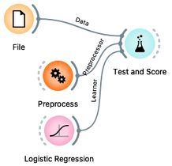
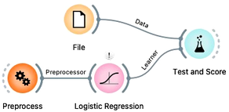

<!!! float-aside !!!>
In [Pitfalls in the Use of DNA Microarray Data for Diagnostic and Prognostic Classification](https://academic.oup.com/jnci/article/95/1/14/2520188) Simon et al. (2003) provide a great read on this topic. They found that many of the early papers in gene expression analysis reported high accuracy simply due to overfitting.

It is not recommended to transform the data before cross-validation, as this can lead to overfitting and inaccurate results. Instead, any necessary transformations should be performed within the cross-validation loop, first on the training set and then on the test set, if needed. Actually, one needs to be extremely careful not to succumb to overfitting when reporting results of cross-validation tests. The literature on systems biology is polluted with reporting on overly optimistic results, and high impact factors provide no guarantee that studies were carried out correctly (in fact, due to a lack of reviewers from the field of machine learning, mistakes likely stay overlooked).

To be more specific, it is acceptable to transform the data, but the transformation should be applied independently to the training and test sets. Additionally, for classification problems, the transformation on the test set should not use information about the class values, as this could introduce bias into the analysis. For example, data imputation is a common operation that may need to be performed, but it should be carried out separately for the training and test sets and should not take into account the classes.

By following these guidelines, we can ensure that the cross-validation results are reliable and reflect the true performance of the model on unseen data. It is important to be careful and avoid any steps that could introduce bias or lead to overfitting, as this can compromise the accuracy and interpretability of the results.

<!!! float-aside !!!>
The Preprocess widget does not necessary require a data set on its input. An alternative use of this widget is to output a method for data preprocessing, which we can then pass to either a learning method or to a widget for cross validation.

So how do we then correctly check the effect of preprocessing the data in Orange? The idea of reducing the number of features before inferring a predictive model may still be appealing, now that we know we can use it on training data sets (leaving the test set alone). Following are two workflows that do this correctly. In this first workflow, we gave the Test and Score widget a preprocessor -- we used feature selection in this example. The Test and Score uses it correctly only on the training sets. This type of workflow is preferred if we would like to test the effect of preprocessing on several different learning algorithms.

Alternatively, we can include a preprocessor in a learning method. The workflow now calls the preprocessor on the training data set just before this learner performs inference of the predictive model.

<!!! float-aside !!!>
Warning: use small data sets, this classifier could be very slow.

Can you extend this workflow to such an extent that you can test both a learner with preprocessing by feature subset selection and the same learner without this preprocessing? How does the number of selected features affect the cross-validated accuracies? Does the success of this particular combination of machine learning techniques depend on the input data set? Does it work better for some machine learning algorithms? Try its performance on k-nearest neighbors learner.

<!!! float-aside !!!>
This is not the first time we have used a widget that instead of a data passes forward a computation method. All the learners, like Random Forest, do so. A learner could get data on its input and pass a classifier to its output, or simple pass an instance of itself, that is, pass a learning algorithm to whichever widget could use it. For instance, to the Test and Score widget.

Somehow, in a shy way, we have also introduced a technique for feature selection and pointed to its possible utility for classification problems. Feature subset selection, or FSS in short, was and still is, to some extent, an essential topic in machine learning. Modern classification algorithms, though, perform it implicitly and can deal with many features without the help of external procedures for their advanced selection. Random forest is one such technique.