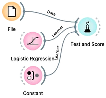
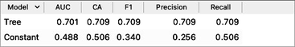
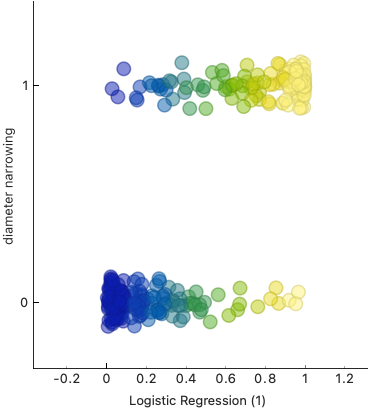
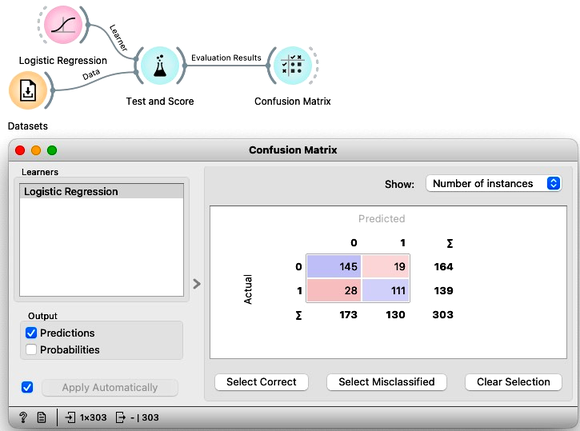
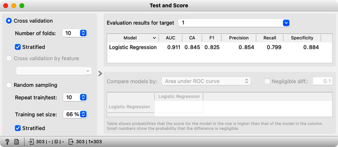

In multiple-choice exams, they grade you according to the number of correct answers. The same goes for classifiers: the more correct predictions they make, the better they are. Nothing could make more sense. Right?

Maybe not. Consider Dr. Smith. He is a specialist for specific types of diseases, and his diagnosis is correct in 98\% of the cases. Would you consider visiting him if you have some symptoms related to his specialization?

<!!! float-aside !!!>

Not necessarily. Dr. Smith's specialty are rare diseases. Two out of a hundred of his patients have it, and, being rather lazy, he always dismisses everybody as healthy. His predictions are worthless — although highly accurate. Classification accuracy is not an absolute measure, which we can judge out of context. At the very least, we have to compare it with the frequency of the majority class, which is, in the case of rare diseases, quite, hm, substantial. We can use Orange's [Constant](https://orangedatamining.com/widget-catalog/model/constant/) learner to do this, as it always predicts to the most common class in the training set.

For instance, on the GEO data set GDS 4182, the classification tree achieves 79\% cross-validation accuracy, which may be reasonably good. Let us compare this with the Constant model, which implements Dr. Smith's strategy by always predicting the majority. It gets 83\%. Classification trees are not so good after all, are they?

<!!! float-aside !!!>
What do other columns in Test and Score widget represent? Keep reading!

On the other hand, the accuracy of classification trees on GDS 3713 is about 71\%, which seems rather good compared to the 50\% achieved by predicting the majority.

<!!! width-60 float-aside !!!>

    Classes versus probabilities as estimated by logistic regression on hearth disease data. Can you replicate this image?
    

The problem with classification accuracy goes deeper, though. Classifiers usually make predictions based on the probabilities they compute. If a data instance belongs to class "healthy" with a probability of 80% and "diseased" with a probability of 20%, we classified it as "healthy". Such classification makes sense, right?

Maybe not, again. Say you fall down the stairs, and your leg hurts. You open Orange, enter some data into your favorite model and compute a 20% of having your leg broken. So you assume your leg is all right, and you take an aspirin. Or perhaps not?

What if the chance of a broken leg was 10%? 5%? 0.1%?
Say we decide that any leg with a 1% chance of being broken will be classified as broken. What will this do to our classification threshold? It is going to decrease badly — but we do not care. What do we do care about then? What kind of “accuracy” is essential?

<!!! float-aside !!!>
The numbers in the Confusion Matrix have names. We can classify a data instance as positive or negative; imagine this as being positive or negative when tested for some medical condition. This classification can be true or false. So there are four options, true positive (TP), false positive (FP), true negative (TN), and false negative (FN). Identify them in the table!

Not all mistakes are equal. We can summarize them in the Confusion Matrix. Here is one for logistic regression on the heart disease data.

<!!! float-aside !!!> Use the output from Confusion Matrix as a subset for Scatter plot to explore the data instances that were misclassified in a certain way.

Logistic regression correctly classifies 145 healthy persons and 111 of the sick, the numbers on the diagonal. Classification accuracy is then 256 out of 303, which is about 84%. Nineteen healthy people were unnecessarily scared. The opposite error is worse: the heart problems of 28 persons went undetected. We need to distinguish between these two kinds of mistakes.

We are interested in the probability that a person who has some problem will be correctly diagnosed. There were 139 such cases, and we correctly discovered 111. The proportion is 111 / 139 = 0.80. This measure is called sensitivity or recall or true positive rate (TPR).

If you were interested only in sensitivity, though, here’s Dr. Smith’s associate partner — wanting to be on the safe side, she considers everybody ill, so she has a perfect sensitivity of 1.0.

To counterbalance the sensitivity, we compute the opposite: what is the proportion of correctly classified negative instances? 145 out of 164, that is, about 88%. This score is called specificity or true negative rate. Here they are, among other scores, as reported by Test and Score widget.

<!!! float-aside !!!>
If you are interested in a complete list of statistics, see the Wikipedia page on [Receiver operating characteristic](https://en.wikipedia.org/wiki/Receiver_operating_characteristic).

So, if the model classifies you as healthy, do you have a 88% chance of actually being OK? No, it is the other way around: 88% is the chance of being classified as OK if you are OK. (Think about it, it is not as complicated as it sounds). If you are interested in your chance of being OK if the classifier tells you so, you look for the "negative predictive value". Then there is also precision, the probability of being positive if you are classified as such. And the fall-out and negative likelihood ratio. There is a list of other indistinguishable fancy names for various statistics, each useful for some purpose.
