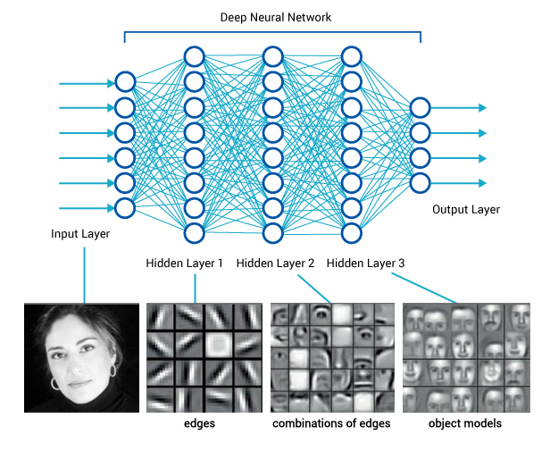
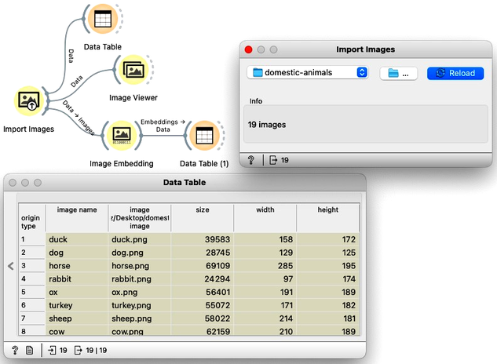
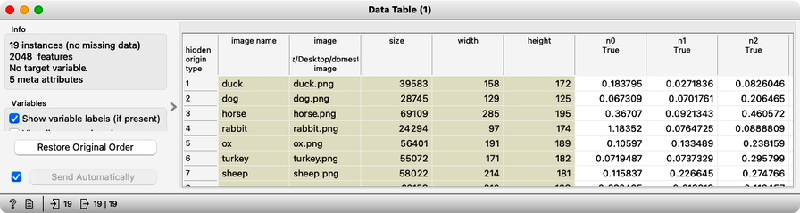
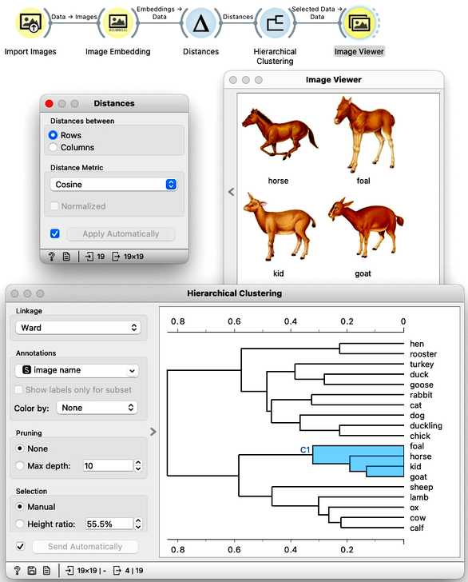

Every data set so far came in the matrix (tabular) form: objects (say, tissue samples, students, flowers) were described by row vectors representing a number of features. Not all the data is like this; think about collections of text articles, nucleotide sequences, voice recordings or images. It would be great if we could represent them in the same matrix format we have used so far. We would turn collections of, say, images, into matrices and explore them with the familiar prediction or clustering techniques.

Until very recently, finding useful representation of complex objects such as images was a real pain. Now, technology called deep learning is used to develop models that transform complex objects to vectors of numbers.

Consider images. When we, humans, see an image, our neural networks go from pixels, to spots, to patches, and to some higher order representations like squares, triangles, frames, all the way to representation of complex objects. Artificial neural networks used for deep learning emulate these through layers of computational units (essentially, logistic regression models and some other stuff we will ignore here). 

If we put an image to an input of such a network and collect the outputs from the higher levels, we get vectors containing an abstraction of the image. This is called embedding. Let us show here how to use it in Orange. We will start with the following workflow.

<!!! float-aside !!!>
Download the [zipped file with sketches of animals](http://file.biolab.si/images/domestic-animals.zip) and load it in Orange using [Import Images](https://orangedatamining.com/widget-catalog/image-analytics/importimages) widget. 

In the workflow, we load the images from a directory, and then we check what is in the data. The Data Table shows that, essentially, Orange just remembers the locations and size of the files, so nothing useful there. We can display the images that are listed in such data table with [Image Viewer](https://orangedatamining.com/widget-catalog/image-analytics/imageviewer/). It is always useful to check if the directory structure has been read well and all the images that we wanted to include in the analysis are there. 

The most important part of our workflow, though, is the embedding step. Deep learning requires a lot of data (thousands, possibly millions of data instances) and processing power to prepare the network. We will use one which is already prepared. Even so, embedding takes time, so Orange doesn't do it locally but uses a server invoked through the [Image Embedding](https://orangedatamining.com/widget-catalog/image-analytics/imageembedding/) widget. Image embedding describes the images with a set of 2048 features appended to the table with meta features of images.

<!!! width-max !!!>

We have no idea what these features are, except that they represent some higher-abstraction concepts in the deep neural network (ok, this is not very helpful in terms of interpretation). Yet, we have just described images with vectors that we can compare and measure their similarities and distances. Distances? Right, we could do clustering. Let's cluster the images of animals and see what happens.

To recap: in the workflow above we have loaded the images from the local disk, turned them into numbers, computed the distance matrix containing distances between all pairs of images, used the distances for hierarchical clustering, and displayed the images that correspond to the selected branch of the dendrogram in the Image Viewer. We used cosine similarity to assess the distances, also because the dendrogram looked better than with the Euclidean distance.

At this stage, we now know how to turn images to useful vectors of numbers, the process called embedding. Now, nothing prevents us to use this kind of presentation for clustering, PCA or t-SNE visualizations of images maps, classification and regression. Instead of describing all these applications here, we refer the reader to an [article on image analytics with Orange](https://www.nature.com/articles/s41467-019-12397-x).