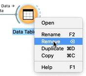
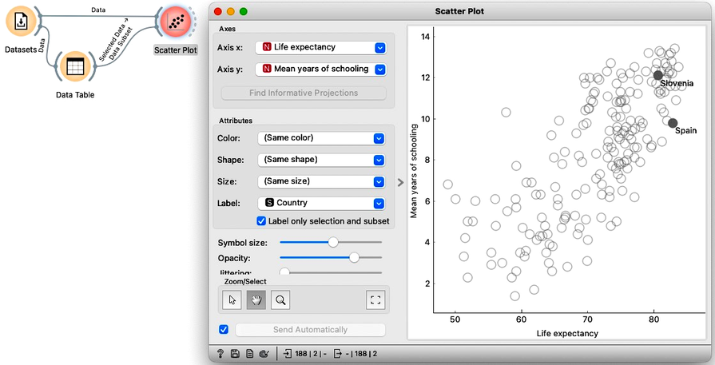

<!!! float-aside !!!>

Let us show you how to save your work in Orange. Before we do this, we will build a workflow and demonstrate a few more tricks for Orange’s visual programming. We will use the same socioeconomic data as in the previous chapter, Workflows. This time, however, we should add the instance of the Datasets widget without using the toolbox. To add the instance of the Datasets widget, we can right-click on canvas, type, say, "data," which will show me the Datasets widget, and, with its row highlighted, press return.

Opening the widget, we see that the HDI data set is already loaded – notice the green dot next to its name. Orange widgets remember our previous choices and actions, assumming, of course, that you have followed the lectures from the previous chapters in these notes and played with Orange accordingly. For example, we can check the data in the Scatter Plot to see that it still display the feature combination that we have last observed for our data set.

It does. The last time we have used the Scatter Plot was to display the relation between life expectancy and years of schooling. To add some more content on our workflow, let's find, say, my country, Slovenia, on this map. We could add the point labels to the plot, but then this visualisation becomes too crowded. One widget to easily find the specific countries is for instance Data Table, where we will sort the countries by name. The Data Table outputs data instances corresponding to rows I select in this widget. First, we can check if this is so by connecting another instance of the Data Table. Everything is fine; Slovenia is the only country displayed in the Data Table (1). We can can go back and select, say, Spain as well by pressing on the Command modifier key before clicking. Great, we now have Slovenia and Spain on the output. 

<!!! float-aside !!!>

Fine. We no longer need Data Table (1) in our workflow. We can select it and press Delete or Backspace to remove this widget, or right click the widget and choose remove. 

Our intermediate goal here is to highlight the countries chosen in the Data Table and highlight them in the Scatter Plot. We can connect the output of the Data Table to the Scatter Plot. Notice that Orange knows that the Scatter Plot already has Data on its input and plugs the new connection into a "Data Subset" channel of the Scatter Plot. The Scatter Plot now has two highlighted points in the upper right quadrant. We can now show the country labels but display them only for an input data subset.

<!!! width-max !!!>

We can now change the selections in the Data Table and observe the countries' positions in the Scatter Plot. For example, Singapore is on the right, Romania is up top, and Sierra Leone is below. The countries with the highest income are all in the top quadrant.

<!!! float-aside !!!>

Finally, back to what we have promised in the title of this section. We can now save our work by choosing Save from Orange's File menu. Let us save the workflow in the "countries" file, which we will place on the Desktop. We can now quit Orange and then open the saved workflow. Opening the Scatter Plot, we see that Orange saves the workflow and all the settings and selections in each workflow's widgets. 