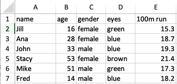
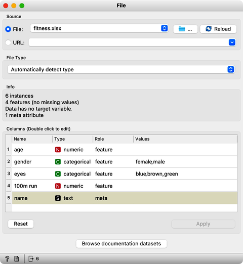
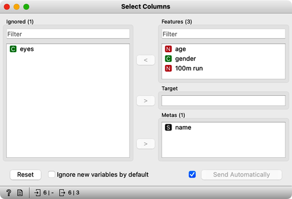
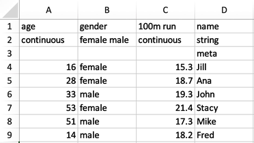

All of our previous data sets came from Orange’s data set server and to get them, we have been using the Datasets widget. We loaded the data – say, on countries and their socioeconomic indices – and started off by checking it out in Data Table. 

But what if I wanted to use some of my own data? As it turns out, Orange can read tabular data from various sources, including Excel files. So let’s start out by constructing one such data set. Our spreadsheet will include some data on students, and will include the column of names: Jill, Ana, John, Stacey, Mike, and Fred. It will also include a column with student's age, gender, and eye color. Finally, we can add their times for a 100 m run. Here is our spreadsheet we have just created, populated with the values of features for each student.

Not that this data makes much sense; it is just an example of how to prepare a tabulated data set for any machine learning. We will store the data set I have just created to the desktop in a file, say, fitness.xlsx. Now, we can open Orange, and place a File widget on Orange canvas. Like with other widgets, we used a right click to find this particular widget. Orange comes with some preloaded data sets that I can access from this widget, but right now we are interested in our fitness data. So we can click on the three dots button and find our Excel file. The File widget reports on the data columns, and shows the names of the features.

 
<!!! float-aside !!!>
Orange does actually provide a way to analyze text in the text-mining add-on, but I will skip that for now. 

Notice that Orange also detects the feature types. For instance, age is a numerical feature; it stores numbers. The color of the eyes is categorical. Categorical and numerical features profile the students, and we can use them, for instance, to compute distances. We cannot do anything computationally with names stored in the textual meta-feature. Meta features provide additional information about the data instances, for example, to identify them in the scatter plots, but Orange does not use them in any modeling.

Now back to our dataset. The first thing to do after loading the data is to check it out in a spreadsheet. Let us open it in Data Table. Here we find our data just like we set it up in Excel. Let us say we do not need information on eye color. I can use the Select Columns widget and move the eyes from the list of features to the Ignored box. Checking the data in a new Data Table I indeed find no eye colors here.

The [Select Columns]() widget is a great widget to manually edit the data domain and play with including and excluding features. We will use it from time to time in our next videos. Moving on we would now like to save my edited data set. 
 
This can be easily done with the [Save Data] widget: we just click Save As, choose to save our data in, say, an Excel file, and rename the file to fitness-no-eyes, as creepy as it sounds. This file can also just go on our desktop for now.Taking a look at the file I can double-click it to view it in Excel. 

Notice that apart from the feature names, Orange also stored some data on the feature types in the second and third rows. Saving of this extra info can be toggled on or off in the Save File widget.
 
Now we know how to prepare some of our own data for Orange. And we also know how to export data from Orange. Note, again, that every time we prepare our own data sets, it is just good practice to first check it out in Data Table. In our running example, we used Excel, but Orange also loads tab or comma separated data sets as well as data sets in a bunch of other formats.
