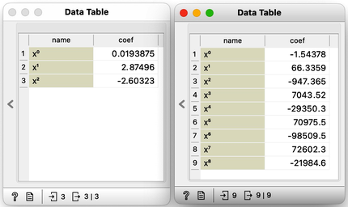
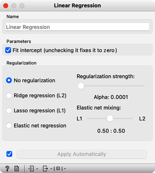
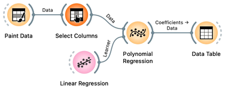

There has to be some cure for overfitting. Something that helps us control it. To find it, let's check the values of the parameters "w" under different degrees of polynomials.

With smaller degree polynomials, values of feature weights stay small, but then as the degree goes up, the numbers get huge.

<!!! float-aside !!!>
Which inference of linear model would overfit more, the one with high or with low regularization strength? What should the value of regularization strength be to cancel regularization? What if regularization strength is high, say 1000?

More complex models have the potential to fit the training data better, but they often produce a fitted curve that wiggles sharply. Since the derivatives of such functions are high, the coefficients "w" must also be high. However, it is possible to encourage linear regression to infer models with small coefficients. We can modify the optimization function that linear regression minimizes, which is the sum of squared errors. By adding a sum of all "w" squared to this function and asking linear regression to minimize both terms, we can achieve regularization. We may also weigh the "w" squared part with a coefficient, such as "w," to control the level of regularization.

Here we go: we just reinvented regularization, which helps machine learning models not to overfit the training data. To observe the effects of regularization, we can give [Polynomial Regression](https://orangedatamining.com/widget-catalog/educational/polynomial-regression/) to our linear regression learner, which supports these settings.

<!!! float-aside !!!>
Internally, if no learner is present on its input, the Polynomial Regression widget would use just ordinary, non-regularized linear regression.

The Linear Regression widget offers two types of regularization techniques. Ridge regression, which we previously discussed, minimizes the sum of squared coefficients "w." In contrast, Lasso regression minimizes the sum of the absolute value of coefficients. While the difference may appear minor, Lasso regression can lead to a significant portion of coefficients "w" becoming zero, effectively performing feature subset selection.

<!!! float-aside !!!>

Let's move on to the test. Set the degree of polynomial to the maximum and apply Ridge Regression. Does the inferred model overfit the data? How does the degree of overfitting vary with changes in regularization strength?
