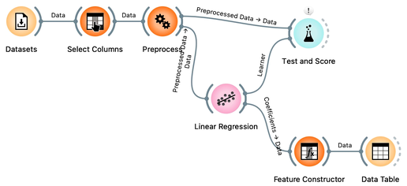
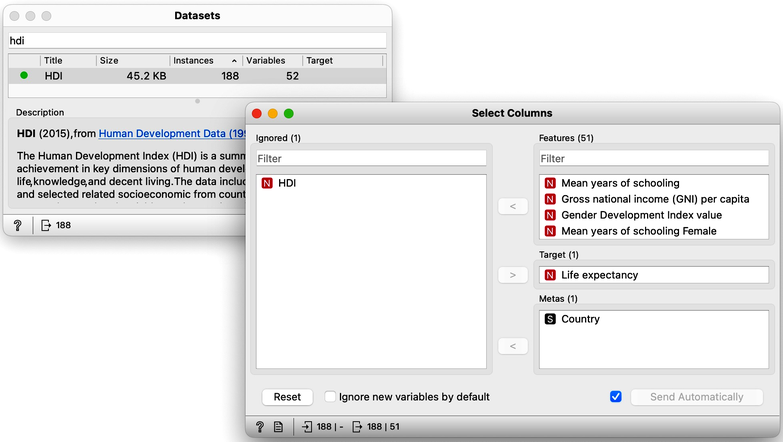
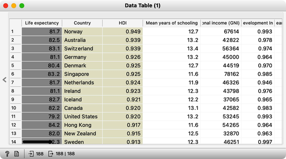
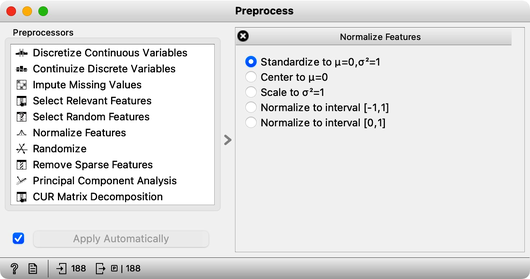
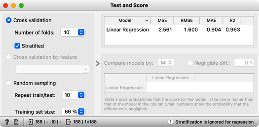
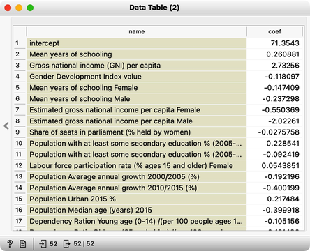
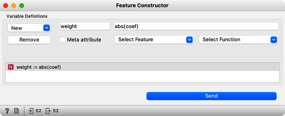
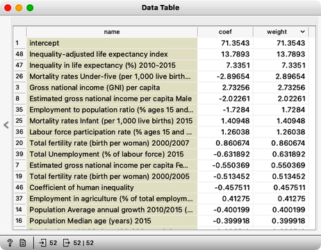
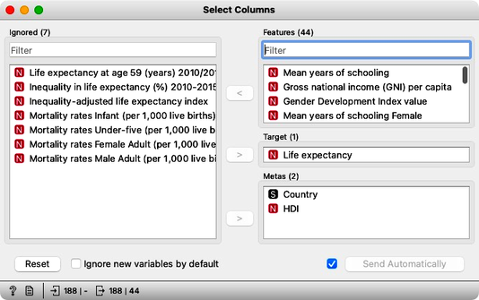

Previously, we demonstrated the pitfalls of overfitting by applying linear regression to a painted dataset. In this exercise, we will apply regression modeling to real data and utilize the tools we have learned so far. Specifically, we will use socioeconomic data from the HDI dataset explored in prior lectures to predict a country's average life expectancy. Our objectives are twofold: first, to evaluate the predictive accuracy of the resulting model, and second, to identify which factors have the strongest correlation with life expectancy and are therefore critical in the predictive model. Here is our workflow:

We start with defining the initial structure of the data set. Original data has no target. We are using Select Columns widget, move the "Life Expectancy" to the Target box. That is it for now. Later, Select Columns will become useful to remove some of the variables that are a tautology to life expectancy, and some of the variables that are perhaps too obviously related to life expectancy and which we would not like to appear in our model.

One of our goals is to evaluate the influence of different features in the linear model. Linear models are comprised of weighted sums of input features, and the weights can provide insight into the significance of each feature in the model. However, to accurately determine importance, we must consider the varying ranges of feature values in our dataset. For example, years of schooling may range from 2 to 15, while gross national income per capita may range from a thousand to 140 thousand.

If both features were equally important in predicting life expectancy, the weight of the schooling feature in the model would be much larger than that of income simply because income is expressed in higher numbers. To accurately compare weights, we must standardize the range of values for each variable. We can do this using the Preprocess widget, which standardizes the data.

<!!! float-aside !!!>
At this stage, it's always helpful to take a closer look at the data to ensure that our model is behaving as expected. One way to do this is by using the Connect Data Table widget to examine the output of the Preprocess widget and verify that the data has been properly standardized. Additionally, we can use tools such as Box Plot or Distributions to further visualize the impact of standardization on the data and confirm that it aligns with our expectations. By closely inspecting the data, we can ensure that our model is based on accurate and reliable information, and that our results are meaningful and trustworthy.

We are now ready to check cross-validated performance of our model.

Great, it looks like our model is performing well! On average, our predictions are only off by 1.6 years. We can see this by looking at the root mean squared error (RMSE), which is a useful measure of the overall error in our model. However, it's important to note that the value of RMSE can be influenced by the distribution of our target variable. In this case, since average life expectancy ranges from about 50 to 90, an RMSE of 1.6 seems quite small, which suggests that our model is of high quality. Overall, we can be confident that, with current selection of the features and considering the accuracy alone, our model is accurately predicting life expectancy.

There is another measure that we have available and for which we do not have to know about the distribution of the target variable. The coefficient of determination (R2). In essence, R2 compares the squared error between our model and the uninformed model which predicts with the mean of the target variable in the training set. It computes the ration of these two errors. If our model predicts well, the ratio approaches 0, and if it predicts badly than its predictions are similar to those of the mean and hence the ratio is 1. Since we prefer a better score for a better model, R2 reports on 1 minus our ratio. That is, R-squared ranges between 0 and 1, with a value of 0 indicating that the model explains none of the variation in the dependent variable and a value of 1 indicating that the model explains all of the variation in the dependent variable. However, it is rare to achieve an R-squared value of 1.

Our R2 at this stage is 0.963. This looks too good to be true. It is time to look at our model, that is, its weights. We feed the data to the Linear Regression, and hence use the same widget to deliver the learner for the Test and Score as well as the model trained on the entire Data. We could observe the coefficients of the model directly by feeding the output of the Linear Regression to the Data Table. 

It's important to note that the weights assigned to features in our model can be either positive or negative, depending on the type of effect the features have on life expectancy. For example, mean years of schooling is positively related to life expectancy, while population annual growth has a negative effect. However, since we're interested in the overall effect of the features, rather than their specific direction, we should focus on the absolute values of the weights. To create such a feature, we can use the [Feature Constructor](https://orangedatamining.com/widget-catalog/transform/featureconstructor/) widget, which can help us to better understand which features are having the greatest impact on the outcome of interest.

Now that we have computed the absolute weights, here they are:

The intercept term in a model is a constant value that is added to the output, but it is not a weight that provides insights into the underlying factors affecting the outcome. Instead, we should focus on the other weights in the model, which can tell us which variables are important in determining the outcome. For example, if we are interested in predicting life expectancy, we would want to exclude features that report on adjusted life expectancy, as these variables are directly computed from average life expectancy. Similarly, including features that report on mortality statistics may not be informative, as their relationship with life expectancy is already well-established. By carefully selecting the variables in our model, we can improve our understanding of the factors that influence the outcome of interest.

In order to refine our model, we can iteratively remove features that we would like to exclude using the "Select Columns" method, check the weights, and observe the resulting estimated accuracy. Through this process, we aim to retain a model that is both accurate and interpretable, increasing our insight into its underlying structure. By carefully selecting which features to include, we can create a more streamlined and focused model that provides more valuable insights into the relationships between the variables of interest.