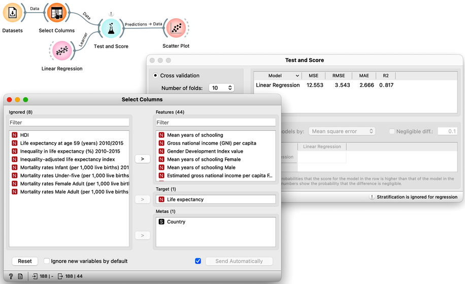
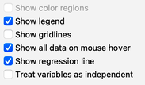
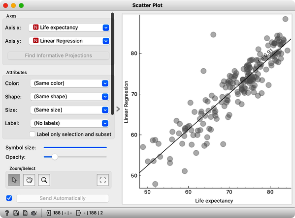
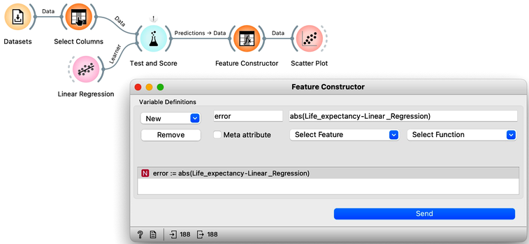
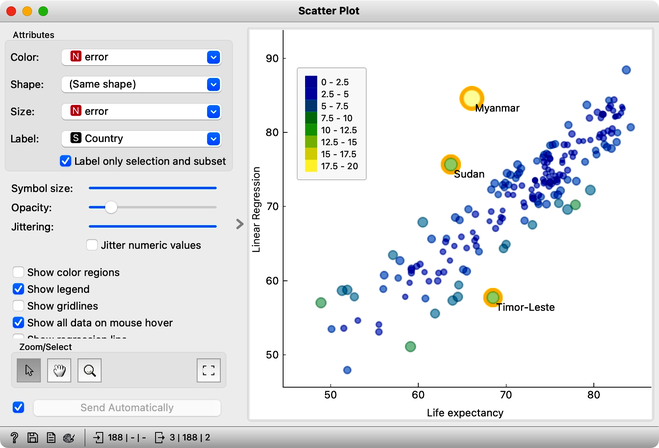

The last lessons quickly introduced scoring for regression and essential measures such as RMSE and R2. In classification, the confusion matrix was an excellent addition to finding misclassified data instances. But the confusion matrix could only be applied to discrete classes. Before Orange gets some similar widgets for regression, one way to find misclassified data instances is through scatter plot. Let us demonstrate this on the regression model we have been developing on socioeconomic data, that is, on the HDI data set.

<!!! float-aside !!!>

    For the visualization on the right, we have switched on the option to show regression line between. This also informs us about correlation between the two variables, which is quite high at 0.91.
    

We would like to observe the cross-validated error of linear regression, or better, the correspondence between true class values and the predictions, when these were made when the data instance was in the training set. We use linear regression with L2 regularization, and in this example set the regularization strength to $\alpha=0.1$. In scatterplot, we plot the predicted value vs. the true class, and can note nice correspondence between the two.

Let us change this workflow to observe the absolute error of our prediction. Here is our workflow. 

 
We used a Feature Constructor widget to compute the error. In scatterplot, we can set the plotting parameters so that we can expose the countries with largest prediction errors, and select them to plot their names. 

Alternatively we could also sent the output of Feature Constructor to the Data Table, sort the countries according to the absolute prediction error, select those with the largest error and send them as a data subset to the Scatter Plot. Or use the Distributions widget for the similar task. We do not show these workflows here, as it is time for an engaged reader to experiment with these and other ideas.

