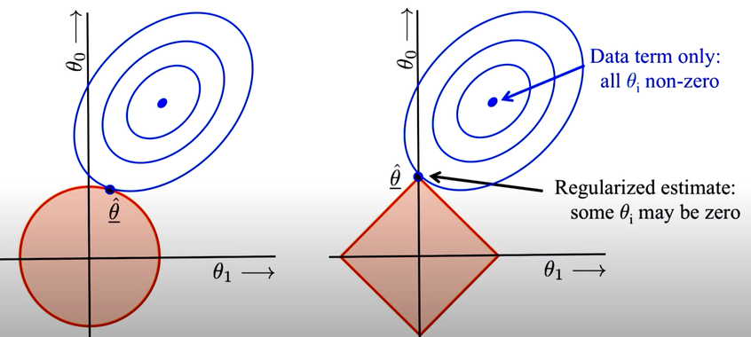

Regularization is a technique used in linear regression to prevent overfitting. During inference, the weights of the linear model are set to minimize the squared error on the training set. However, we also want to avoid models that are too complex or dynamic. To achieve this, we use normalization, which can be either L1 or L2. L2 regularization aims to minimize the sum of the squared feature weights, while L1 regularization sums their absolute values. Ridge regression refers to the inference of a linear model that includes L2 regularization, while lasso regression refers to the inference of a linear model that includes L1 regularization.

Although L1 and L2 regularization can result in similar models, they have different constraints. L2 regularization is roundish, while L1 regularization is squarish, with sharp corners and edges where some weights are 0. As a result, L1 regularization can lead to a linear model where some weights are 0, effectively excluding some features from the model. We can use L1 regularization for feature subset selection, which can help minimize the complexity of the model. 

We have borrowed a conceptual graph from the web that illustrates the differences between two types of regularization: L1 and L2. While we won't delve deeply into the mathematical details (there are plenty of web pages and YouTube videos for this), we'll focus on practical applications and aim to explain the intuition behind L1 and L2 during our lectures. Our goal is to provide examples and real-world scenarios to help you understand how regularization can be used to improve machine learning models.

Let's conduct an experiment using the HDI dataset, which contains socio-economic data. We will normalize the features again to ensure that their weights are comparable, and pre-select relevant features for the model. We will then compare the results of using L1 and L2 regularization and observe how the ranked list of features changes. We will also investigate whether it's possible to obtain weights of exactly zero with L2 regularization and how changing the regularization strength parameter, $\alpha$, affects the results.

<!!! width-max !!!>

