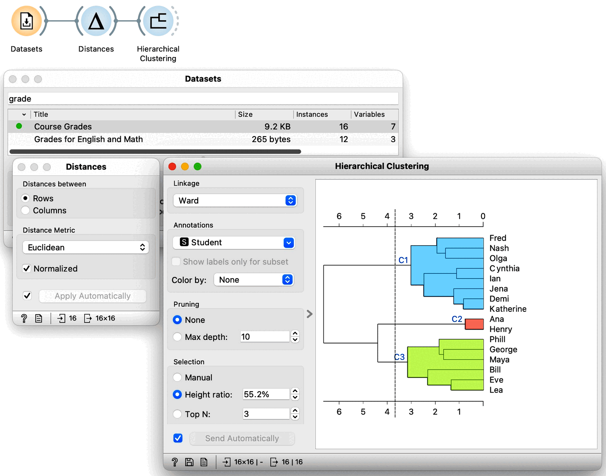
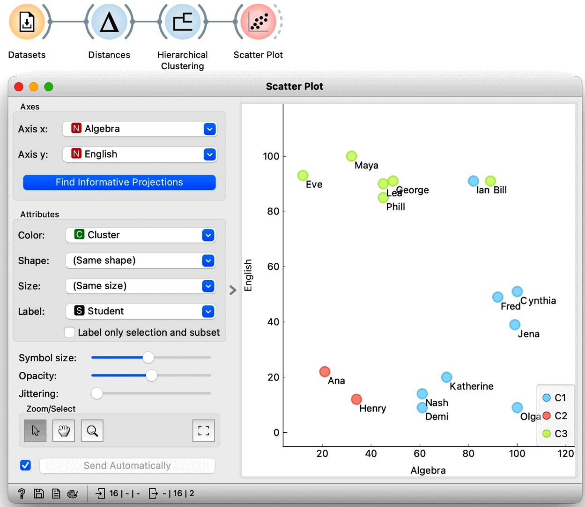

So far we have performed hierarchical clustering in two dimensions. We used the course grades dataset, selecting only the scores in English and Algebra, and visualized them on a scatter plot. There, we developed the concepts of instance distances and distances between clusters. As a refresher: to measure the distance between two students, say, we summed the squared differences between their grades in Algebra and English. We referred to this as the Euclidean distance and noted that it comes from the Pythagorean theorem.

<!!! float-aside !!!>
Just as a side note: using Euclidean distance with data with large number of dimensions hits the problem called the curse of dimensionality, where everything becomes similarly far away. We will skip this problem for now and assume Euclidean distance is just fine for any kind of data.

Now what happens if we add another subject, say History? The data would then be in three dimensions. So we would need to extend our Euclidean distance and add the squared difference of grades in History. And, if we add another subject, like Biology, the distance equation gets extended with the squared differences of those grades as well. In this way, we can use Euclidean distance in a space with an arbitrary number of dimensions.

So, what about distances between clusters, that is, linkages? They stay the same as we have defined them for two dimensions as they depend only on the data item distances, which we now know how to compute.

Equipped with this new knowledge, that is, with the idea that Euclidean distance can be used in arbitrary dimensions and that we can used already introduced linkages between clusters, we can now try clustering our entire dataset. We load the grades data in Datasets widget and get the distances between all the pairs of data instances so we can perform our hierarchical clustering. To make sure: we can again use Euclidean distance, and perhaps normalize the features this time. Let us not forget we need use normalization when variables have different ranges and domains. Now taking a look at the dendrogram we can see our data may include three clusters.

We would now like to get some intuition on what these clusters represent. We could, in principle, use Scatter Plot to try to understand what happened, but now we have seven-dimensional data, and just peeking at two dimensions at a time won’t tell me much. Let us take a quick look anyway by adding a Scatter Plot at the output of Hierarchical Clustering. Here is the data projected onto the Algebra-English plane. 

The students with similar grades in these two subjects are indeed in the same cluster. However, we also see Bill and Ian close together but in different clusters. It seems we are going to need a different tool to explain the clusters. Just as a hint: we have already used the widget that we will use for cluster explanation in the section on data distributions. But before we jump to explaining clusters, which is an all-important subject, let us explore the clustering of countries using human development index data. And use geo-maps to visualize the results.