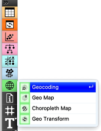
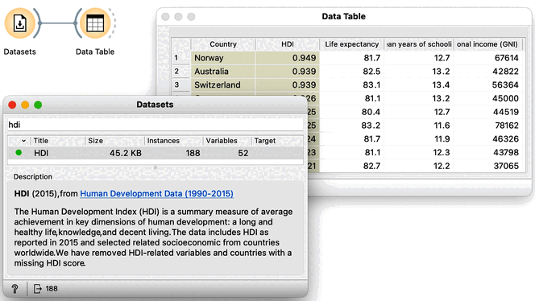
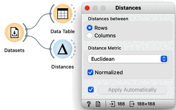
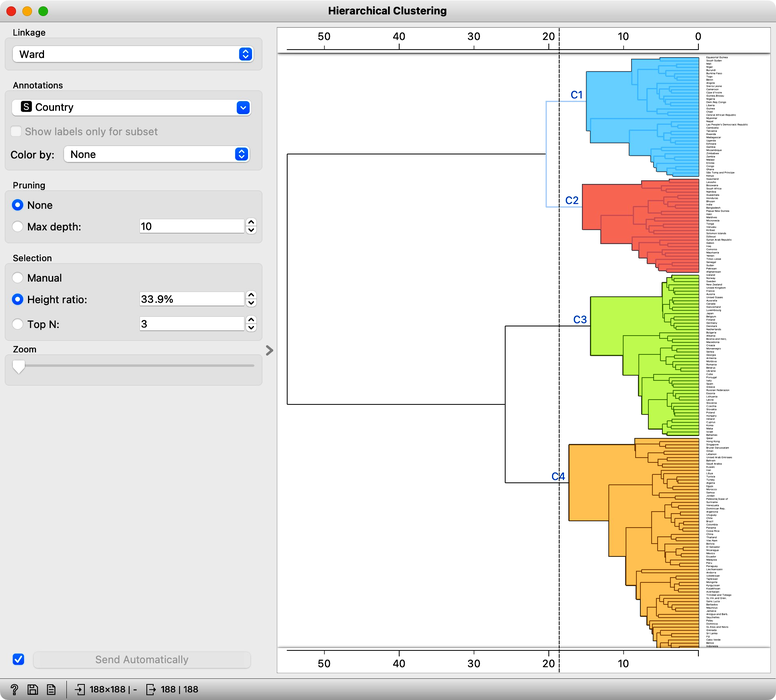

Few chapters back we already peeked at the human development index data. Now, let's see if clustering the data presents any new, interesting findings. We will attempt to visualize these clusters on the geo map. 

Orange comes with a geo add-on, which we will need to install first. Add-ons can be found in the menu under Options. Here we need to select a checkbox for the Geo add-ons. Clicking on the Ok (CHECK) button, the add-on will install, and Orange will restart.

##### show how to install an add-on

<!!! float-aside !!!>

##### show geo toolbox

In the toolbox, we now have another group for Geo widgets.

The human development index data is available from the Datasets widget; we can type "hdi" in the filter box to quickly find it. Double clicking the line with the data set loads the data. Before doing anything else we should to examine it in the Data Table. 

##### the datasets-data table workflow and HDI data set in the table

This data includes 188 countries that are profiled by 52 socioeconomic features. To find interesting groups of countries, we first compute the distances between country pairs. We will use the Distances widget with Euclidean distance and make sure that features are normalized. As this data set includes features with differing value domains, normalization is required to find a common ground. 

##### workflow with distances, show that normalization is on

In hierarchical clustering, where we add the Hierarchical Clustering widget to the workflow, we will use the Ward index for linkage and label the branches with the names of the countries. [Ward index]() joins the clusters so that the data variance in the resulting cluster is decreased and often produces dendrograms with more exposed clusters.

##### workflow with hierarchical clustering, show the result

Our clustering looks quite interesting. We see some clusters of African countries, like Swaziland, Lesotho, and Botswana. We also find Iceland, Norway, and Sweden grouped together. And some countries of the ex-Soviet Union. Try to find each of these groups in the dendrogram! By zooming out the dendrogram we can find such a cut that will group the countries into, say, four different clusters.

##### zoom out and show cut with four groups

Let us take a look at these four groups on the geo map. To do this, we first need to add the Geocoding widget to the output of Hierarchical Clustering. The widget is already set correctly to use the country name as an identifier. By adding the Data Table I can double check the result and find that every row now includes extra information on the Cluster, which comes from the Hierarchical Clustering widget, and information on the latitude and longitude of the country, added by Geocoding. 

##### workflow, with Geocoding, and a Data Table with result

We will pass this data on to the Choropleth Map, change the attribute for visualization to Cluster, and the aggregation to Mode. Well, here it is. The countries of our world clustered!

##### workflow, with Choropleth map

Looks interesting. What we refer to as developed countries are in one cluster. Countries in South America are clustered with some countries in Asia. And we also find a band of sub-Saharan African countries.

It is fascinating that although the data did not explicitly encode any geo-location information, the clusters we found were related to the country's geographical location. Our world really is split into regions, and the differences between countries are substantial.

Did we say "the differences"? So far, authors of this text did an abysmal job of explaining what exactly these clusters are. That is, what are the socioeconomic indicators that are specific to a particular cluster? Are some indicators more characteristic of clusters than others? Which indicators characterize clusters best? So many questions. It is time to dive in into the trick of cluster explanation. 