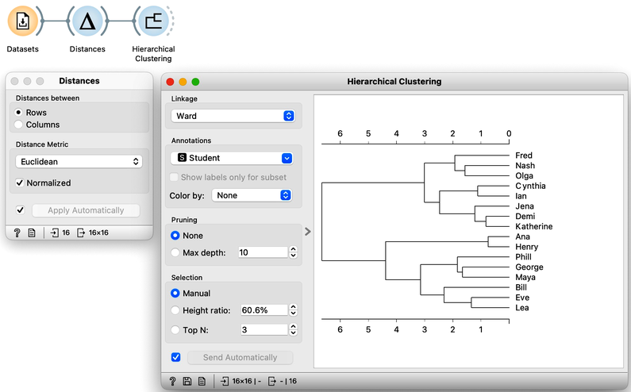
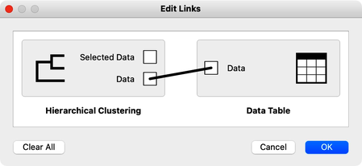
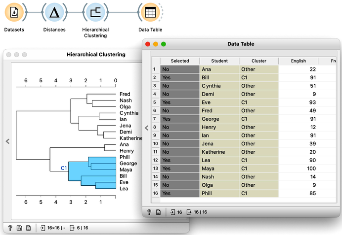
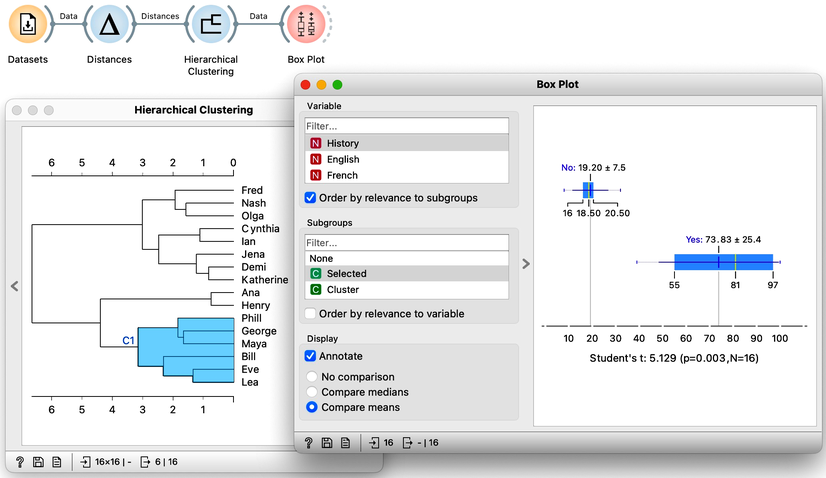
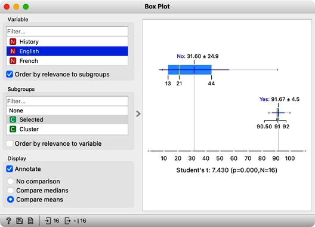
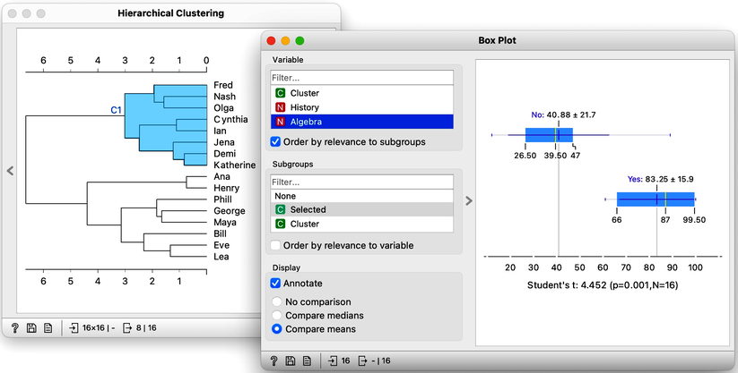
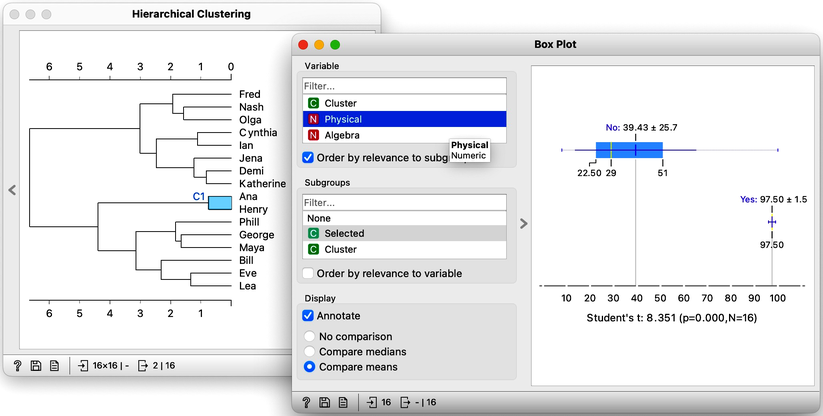

Hierarchical clustering, the topic of our previous chapters, is a simple and cool method of finding clusters in our data. Let us here refresh what we have learned on the course grades example from our previous chapters. The course grades data includes 16 students and seven school subjects. We measured the Euclidean distance between each pair of students and clustered the data accordingly. Let us use the [Ward minimum variance method]() for linkage. This will join clusters so that the points in the resulting cluster are nearest the center. It is a bit more complicated than that, but the idea of Ward linkage is that the points in the resulting clusters are as close together as possible. Below is the workflow and the result of the clustering.

Our problem here, however, is not a clustering algorithm but how to interpret the resulting clustering structure. Why are Phill, Bill, and Lea in the same cluster? What do they have in common? 
 
<!!! float-aside !!!>

The hierarchical clustering widget emits two signals. Selected data as well as the entire dataset with an additional column that indicates the selection. Let me first show this in the Data Table widget. First, I will select a cluster with Phill, Bill, and Lea, and rewire the connection between Hierarchical Clustering and Data Table to communicate the entire data set. The Data Table now includes the "selected" column, that shows which data items, that is, which students were selected in the Hierarchical Clustering. Fine: Phill, Bill and Lea are among selected ones. 

We would now like to find the features, that is, school subjects, which can differentiate between selected students and students outside the selection. This is something we have already done in our chapter on data distribution, where we constructed a workflow that told us which socioeconomic features are related to extended life expectancy? The critical part to remember is that we used [Box Plot](https://orangedatamining.com/widget-catalog/visualize/boxplot/). Let us add one to the output of Hierarchical Clustering and rewire the signal to transfer all the data instead of just a selection. In the Box Plot widget, I have to set “Selected” as a subgrouping feature, and I also check “Order by relevance to subgroups”. 

We find History, English, and French at the top of the list of variables. Taking a closer look at History, for example, we can see that Phil, George, and company perform quite well, their average score being 74. Compare that to the mediocre 19 of everyone else. In English, the cluster’s average score is even higher, at 92 compared to the 32 of everyone else. And the scores in French tell a similar story.

The cluster of students we have selected is particularly good in subjects from social sciences. How about a cluster that includes Fred, Nash, and Katherine? Their scores in History are terrible at 16. However with a score of 83, they do well in Algebra and are better than the other students in Physics. It looks like we have a group of natural science enthusiasts.

The only remaining cluster is the one with Ana and Henry. They love sports.

With the Hierarchical Clustering-Box Plot combination, we can explore any cluster or subcluster in our data. Clicking on any branch, will update the Box Plot, which, with its ordered list of variables, can help us characterize the cluster. Box Plot uses the [Student’s t statistic](https://en.wikipedia.org/wiki/Student%27s_t-test) to rank the features according to the difference between their distribution within the cluster and distribution of feature values outside the cluster. For instance, the feature that best distinguishes students in my current cluster is Biology, with a Student’s t statistic of 5.2.
 
Explaining clusters with Orange’s Box Plot is simple. We find it surprising that it was so easy to characterize groups of students in our data sets. We could use the same workflow for other data sets and hierarchical clusters. For instance, we could characterize different groups of countries we found from the socioeconomic data sets. But we will leave that up to you.
