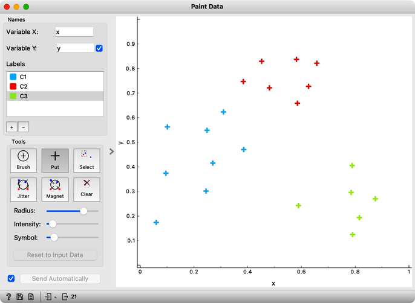
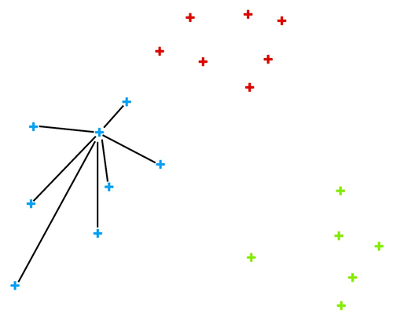
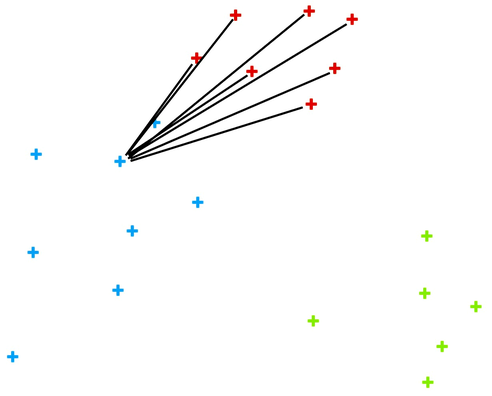
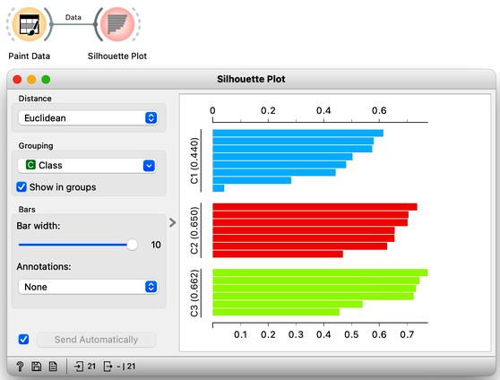
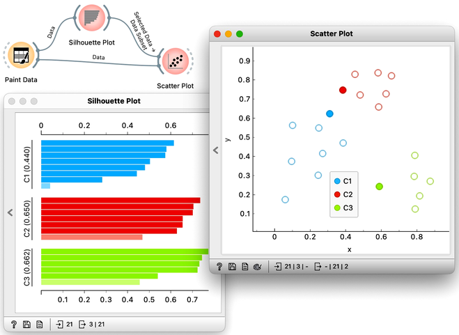

Not all data is created equal. Some are more centralized, and others stick out. There are inliers, and there are outliers. Let us explain these concepts concerning clustering and paint a data set with three clusters, a blue one, a red one, and a green one off to the side. We will use Orange's Paint Data widget for this.

The data points in the green cluster are better separated from those in the other two clusters. Not so for the blue and red points, where several points are on the border between the clusters. We want to quantify how well a data point belongs to the cluster to which it is assigned.

<!!! float-aside !!!>

We compute an average intra-cluster distance A from distances to points in the same cluster.

We can here invent a scoring measure for this, and we will call it a silhouette (because this is how it's called). Our goal: a silhouette of 1 (one) will mean that the data instance is well rooted in the cluster, while we will assign the score of 0 (zero) to data instances on the border between two clusters.

For a given data point (say, the blue point in the image on the left), we can measure the distance to all the other points in its cluster and compute the average. Let us denote this average distance with A. The smaller the A, the better.

On the other hand, we would like a data point to be far away from the points in the closest neighboring cluster. The closest cluster to our blue data point is the red cluster. We can measure the distances between the blue data point and all the points in the red cluster and again compute the average. Let us denote this average distance as B. The larger the B, the better.

The point is well rooted within its cluster if the distance to the points from the neighboring cluster (B) is much larger than the distance to the points from its cluster (A). Hence we compute B-A. We normalize it by dividing it with the larger of these two numbers, S = (B -A) / max{A, B}. Voilá, S is our silhouette score.

<!!! float-aside !!!>

We compute an average inter-cluster distance B from distances to points in the closest foreign cluster.

Orange has a [Silhouette Plot](https://orangedatamining.com/widget-catalog/visualize/silhouetteplot/) widget that displays the values of the silhouette score for each data instance. Silhouette plot assumes that the data set includes a feature that reports on cluster membership. Our painted data has a feature with the name "Class".

We can also choose a particular data instance in the silhouette plot and check its position in the scatter plot. Below, we selected three data instances, one from each cluster, with the worst silhouette scores and used Orange to see where they lie in the scatter plot.

Of course, computing silhouettes and visualizing the position of inliers and outliers look great for data sets with two features, where the scatter plot reveals all the information. In higher-dimensional data, the scatter plot shows just two features at a time, so two points that seem close in the scatter plot may be far apart when all features - perhaps thousands of gene expressions - are taken into account. 

To see how we can use silhouettes to spot outliers in multi-dimensional data, consider zoo data sets from the Datasets widget. Which are the three mammals that stick out most? Why? Why do some of the animals in this data set have negative silhouettes? What would that suggest?