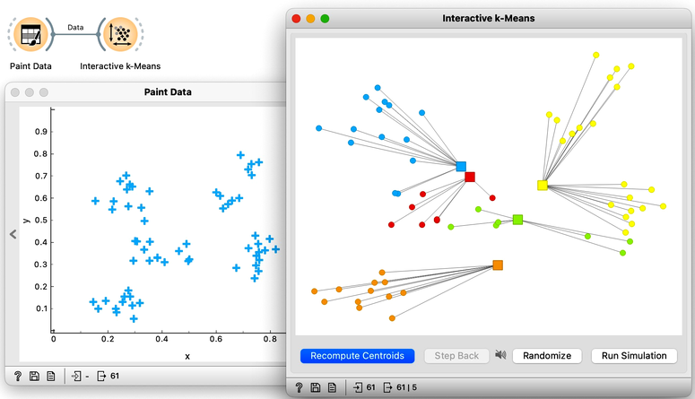
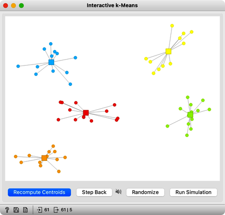
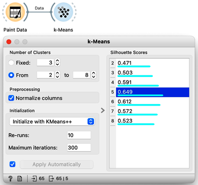
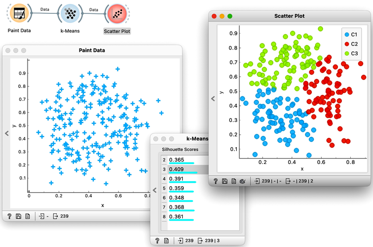

Hierarchical clustering is not suitable for larger data sets due to the prohibitive size of the distance matrix: with, say, 30 thousand data instances, the distance matrix already has almost one billion elements. If the matrix stores floating numbers that each requires 32 bits of memory, just storing such distance matrix would require a prohibitive 32 TB of working memory. An alternative approach that avoids using such large distance matrix is k-means clustering.

<!!! float-aside !!!>
Notice that a squared distance matrix for hierarchical clustering is replaced with a matrix that stores the distances between all data points and k centers. Since k is usually small, this distance matrix can easily be stored in the working memory.

Clustering by k-means randomly selects k centers, where we specify k in advance. Then, the algorithm alternates between two steps. In one step, it assigns each point to its closest center, thus forming k clusters. In the other, it recomputes the centers of the clusters. Repeating these two steps typically converges quite fast; even for big data sets with millions of data points it usually takes just a couple of ten or hundred iterations.

Orange's Educational add-on provides a widget [Interactive k-Means](https://orangedatamining.com/widget-catalog/educational/interactive-kmeans/), which illustrates the algorithm. To experiment with it, we can use the [Paint Data](https://orangedatamining.com/widget-catalog/data/paintdata/) widget to paint some data - maybe five groups of points. The widget would start with three centroids, but you can add additional ones by clicking anywhere on the plot. Click again on the existing centroid to remove it. With this procedure, we may get something like show bellow.

Now, pressing the return key, or clicking on Recompute Centroids and Reassign Membership button we can simulate the k-means algorithm. We can notice its fast convergence. The resulting clustering for the data we have painted above is shown below.

<!!! float-aside !!!>
Try rerunning the clustering from new random positions and observe how the centers conquer the territory. Exciting, isn't it?

With this simple, two-dimensional data it will take just a few iterations; with more points and features, it can take longer, but the principle is the same.

How do we set the initial number of clusters? That's simple: we choose the number that gives the optimal clustering. Well then, how do we define the optimal clustering? This one is a bit harder. We want small distances between points in the same cluster and large distances between points from different clusters. Oh, but we have already been here: we would like to have clustering with large silhouette scores. In other words: we can use silhouette scoring and, given the clustering, compute the average silhouette score of the data points. The higher the silhouette, the better the clustering. 

Now that we can assess the quality of clustering, we can run k-means with different values of parameter k (number of clusters) and select k which gives the largest silhouette. For this, we abandon our educational toy and connect Paint Data to the widget k-Means. We tell it to find the optimal number of clusters between 2 and 8, as scored by the Silhouette.

Works like a charm.

Except that it often doesn't. First, the result of k-means clustering depends on the initial selection of centers. With unfortunate selection, it may get stuck in a local optimum. We solve this by re-running the clustering multiple times from random positions and using the best result. Or by setting the initial position of centroids to the data points that are far away from each other. Or by slightly randomizing this selection, and running the whole algorithm, say, ten times. This later is actually what was proposed as KMeans++ and used in Orange's k-Means widget. 

The second problem: the silhouette sometimes fails to correctly evaluate the clustering. Nobody's perfect.

The third problem: you can always find clusters with k-means, even when they are none.

Time to experiment: use the Paint Data widget, push the data through k-Means with automatic selection of k, and connect the Scatter Plot. Change the number of clusters. See if the clusters make sense. Could you paint the data where k-Means fails? Or where it works really well?