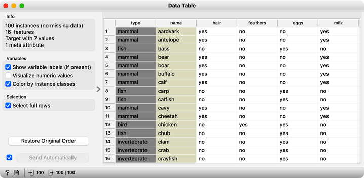
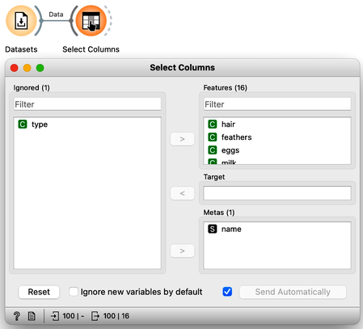
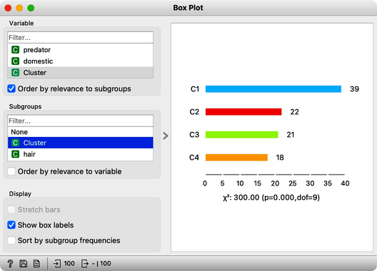
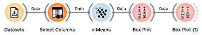
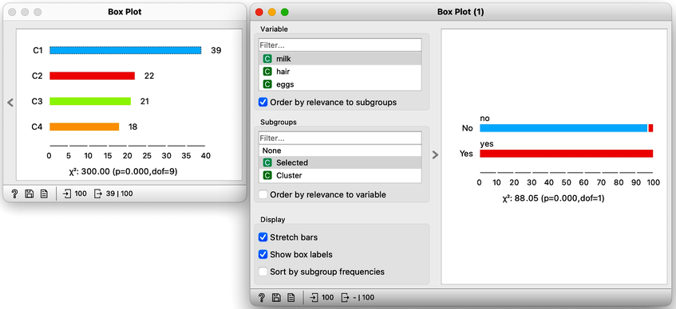
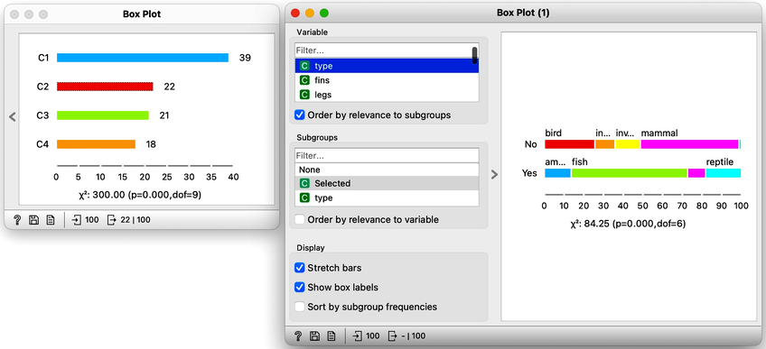

There will be nothing much new in this lesson. We are just assembling the bricks we have encountered and constructing one more new workflow. But it helps to look back and admire what we have learned. Our task will be to take the zoo data set, find clusters and figure out what they are. We will get the zoo data set from the Datasets widget. It includes data on 100 animals characterized by 16 features. The data also provides animal names and the type of animal stored in the class column. 

For a while, we will pretend we do not know about the animal type and remove the "type" variable from the data using the Select Columns widget. 

The widget k-means tells us there may be four or five clusters; the silhouette score differences for these two values of k are tiny. The task here is to try to guess which types of animals are in which cluster and what their characteristics are. We could go ahead in several ways, and to select the target cluster, we are tempted to say that we should use the Select Rows widget, which would be appropriate. But instead, let us use the Box Plot for cluster selection and another Box Plot to analyze and characterize clusters. 

On the first Box Plot: the k-Means widget adds the feature that reports for each data instance on the cluster membership. No wonder the feature is called "Cluster". We use the box plot to visualize the number of data instances in each cluster and to spread the visualization into separate rows, and we will subgroup the plot by the same feature:

We will use this Box Plot for cluster selection: click on any of the four bars (four is the number of clusters we selected in the k-Means widget), and Box Plot will output the data instances belonging to this cluster. We will not care about the selected data but rather pour the entire data set into the next Box Plot. Remember to rewire the connection between two Box Plots accordingly. When outputting the entire data set, the Box Plot will add the column "Selected" to report whether the data instance was selected. In our case, the Selected column will report if the data instance belongs to our target cluster. At this stage, this is our workflow:

Now for the fun part. We can select the first cluster to find that the feature that most define it are milk, hair, and eggs. Examining this further, we find that all the animals in the first clusters give milk, have hair, and do not lay eggs. Mammals. 

In the second (red) cluster, most animals have fins, no legs, and are aquatic. Fish. But there are also some other animals with four legs and no fins, so this cluster is a bit of a mixture. The third cluster is easier, as there are animals with feathers with two legs. Fish. Animals in the fourth cluster have no backbone and are without tails. This cluster is a harder one, but with some thinking, one can reason these are insects or invertebrates.

There are many more things that we can do at this stage, and here are some ideas:

1. Link the output of the last Box Plot to the Data Table and find out what the animals with specific characteristics are, that is, what their name is.

2. Check for some outliers. Say, two animals give milk but are not in the first (mammalian) cluster. Which ones are these?

3. Go back to Select Columns, place the type in the meta-features list, and check out the distribution of animal types in the selected cluster.

