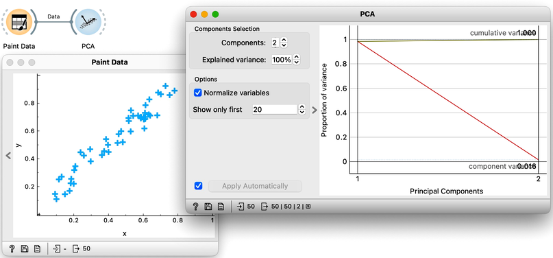
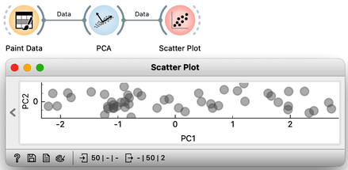
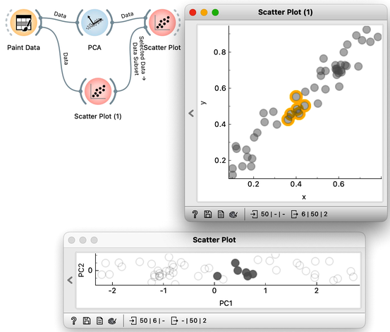
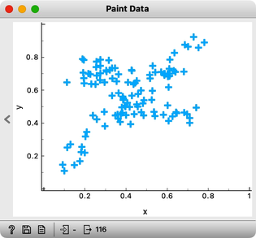
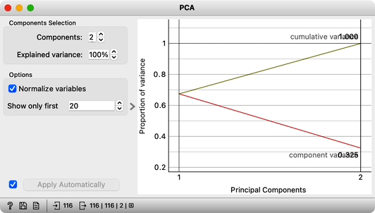

The introduction to principal component analysis in from our previous chapter was intentionally brief. We wanted to dive into using PCA on a data set and to enjoy the benefit of visualizing the multi-dimensional data by reducing it to two dimensions. And so we did: we took a peek into a data set with sixteen features describing one hundred animals.

Now it is time to slow down a bit and delve further into some of the details of this exciting reduction of dimensionality. We will use Orange’s Paint Data to create a two-dimensional data set, and try to make it as linear as we can. This way, to determine the position of each data point, it is sufficient to know its projection onto this line. These distances, from the center of all the points to the individual projections, represent the values of the first PCA component. We can now use these distances, that is, these components, to represent our data with a single number. The prevalence of the first component in our data is also evident in a scree plot of the PCA widget: the values of the first PCA component bear 98% of information about this data. Everything else that remains is a projection to the second PCA component, which is orthogonal to the first one. The projections on the second principal component clutter, and the differences between the projection values are small. 

Notice also that the scree plot reports only two components. They are sufficient to describe all our two-featured data faithfully, as nothing else remains. For more complex data with a higher number of features, the scree plot would report on the higher number of components. We can observe the data in the projection space. Let’s use a scatter plot and set the axis to PC1 and PC2. It looks messy, but notice the scale: PC1 spans from -2 to 2, while PC2 has a much smaller value span. We can squeeze this graph to scale it properly. PC1 is a major axis, and the data spans its entire dimension.

We can also check the location of the original data in the projected space. We can will first plot the original data in the scatterplot, select, say, a few data points in the upper corner of the plot, and send that subset to our plot that shows the projected space. Here they are, where they should be. And here are my data points from the bottom, and from the center.

What would happen if we added a few more data points? This time we might just place them a bit to the side. Like this.

Observe the change in the scree plot. The first component now explains only a portion of the variance, and is nowhere near 100%. If we add some more offset data, this gets even worse. 

If our data were evenly distributed across the entire data space, the explained variance of the first principal component would approach 50%. Thus, we would not be able to effectively reduce the number of dimensions for such data to a single component. Which, we hope, tells us something about PCA. We can only successfully reduce the number of dimensions if the original features are correlated. In our two dimensional space, that would mean that the data is placed along a line. In the absence of any correlation though, there are no opportunities for the reduction of dimensionality. In real data sets, however, features most often correlate to some degree, and there are groups of correlated features. For such data sets, the application of principal component analysis makes sense. It is then useful to find out more about the directions of principal components and features they most depend on.
