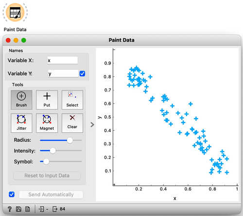
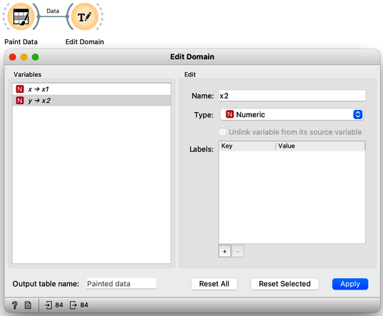
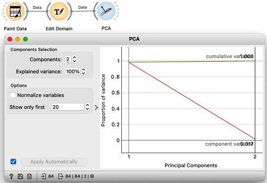
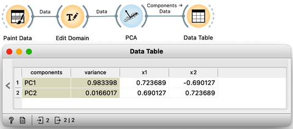
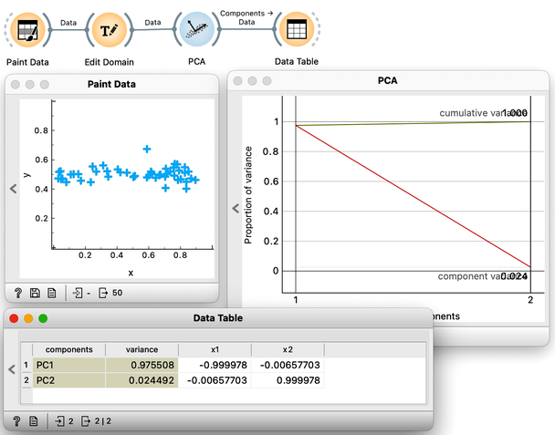
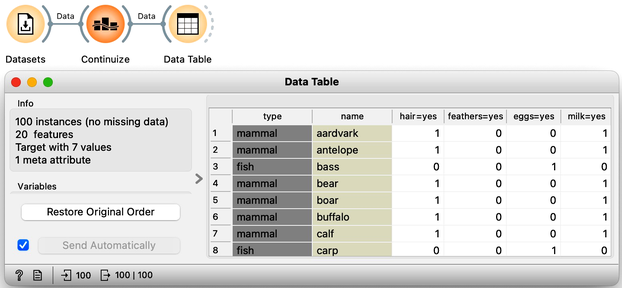
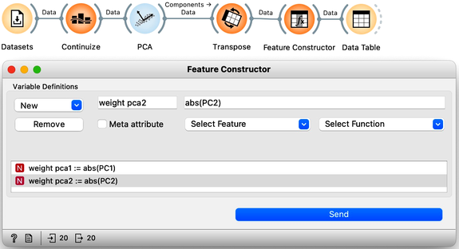
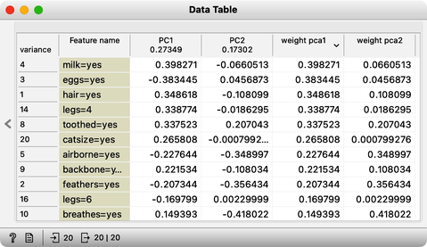

In the previous chapter, we used principal component analysis primarily to reduce and display our data in two-dimensions. This time we’ll take a closer look at the relation between the data’s features and their principal components. Let’s start off by painting some two-dimensional data like in the following figure.

Next, just to use standard notation, I’ll rename the two features to $x_1$ and $x_2$ using [Edit Domain](https://orangedatamining.com/widget-catalog/data/editdomain/) widget. Also, don’t forget to press Apply for the changes to take effect. 

Visualizing our data in Scatter Plot, notice that the first principal component should probably be along the downwards pointing line. And a line is just a set of points that satisfy a linear equation. In our case, I have two features, $x_1$ and $x_2$, and the points on the line would need to satisfy the equation $\theta_0+\theta_1 x_1 + \theta_2 x_2 = 0$.

The $\theta$s are the parameters of the equation that defines the line. A vector that defines my projection line should have a $\theta_1$ and $\theta_2$ of opposite signs, pointing either up and left or down and right. Coefficients $\theta_1$ and $\theta_2$ are also called components of the principal axis and report on the weight or influence each feature has on this principal component's values. Since I drew my data diagonally, I expect both features $x_1$ and $x_2$ to have more or less equal weights. Also, as a side note, the thetas of the line that defines the second component should have the same sign.

It is now time I check this in Orange and stop doing the analysis by hand. We use the PCA widget, and just for this demonstration, we will switch off the normalization. 

The scree diagram tells us that $x_1$ and $x_2$ are well correlated and that the first PCA component covers most of the variance. WE would like to double check if my predictions are correct, so we will take a quick look at the thetas, that is, the weights of the features for each component. For this, I will use a Data Table widget and rewire the link to pass information about PCA components instead of the modified data.

Each row contains information about each principal component, the variance it explains, and the feature weights [highlight accordingly]. Just like we expected: for the first PCA component, $x_1$ and $x_2$ are approximately equally important and have opposite signs. The signs of the weights for the second component are also, unsurprisingly, the same [highlight].

We can now change the data slightly, so it spans along a single axis. Again, the first component explains almost all the variance in this data. But looking at the weights [open Data Table], we can see that the first feature, $x_1$, with the highest weight for PC1, is the one that defines the first component. The remaining variance spans along the $x_2$ axis.

This may have been a little abstract. But we learned that the weights of the principal component axis tell us which features are relevant to each component and to what degree. We can now use the zoo dataset from our previous chapters. Zoo data contains 100 animals described by features like having hair or fathers, or whether they lay eggs or produce milk. One thing to note though, is that all the features are categorical. This means that they are not numbers. For PCA, we need numbers. So, the PCA widget automatically transforms each categorical feature into a numerical one. We can do this explicitly, using the [Continuize](https://orangedatamining.com/widget-catalog/transform/continuize/) widget. Just leave the settings as default. We can use the Data Table to  see what we get on the output. 

All the categorical features have now turned to numeric. The antelope for example, has a one in the ‘hair=yes’ column meaning it has hair. And bass, the fish, has no hair, hence the 0 in this column. We can now add the PCA analysis to our workflow. Again, we could observe the individual feature weights in a Data Table. There, we would see a bunch of numbers in rows with no obvious patterns. Instead, we will first transpose the data on components with weights using Transpose widget and rewiring the connection. We like to order my features according to the magnitude of the weight. As we don’t care if the weight is positive or negative we will add in another widget; the Feature Constructor. This way we can add the feature "weight for PC1" as an absolute value of PC1, and similarly "weight for PC2" as the absolute value of PC2.

We can now rank the features by weights of the first principal component. 

As it turns out “Milk” is the feature that most defines this component [highlight the number in the weight PC1 column]. It’s followed by "eggs". But notice that here, the PC1 value is negative, so it actually is the absence of laying eggs. Then the next most important feature would be “hair”. Accordingly, some animals give milk, do not lay eggs, and have hair. This component could thus distinguish mammals to everything else. The second component has large weights for aquatic animals, animals that breathe, and airborne animals. This component should nicely distinguish between fish and birds.
