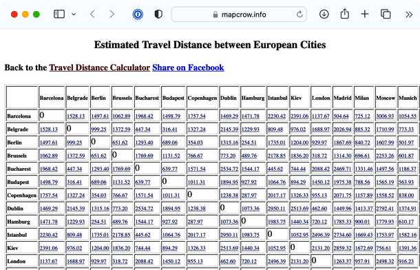
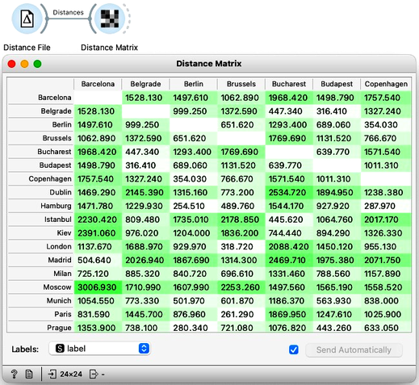
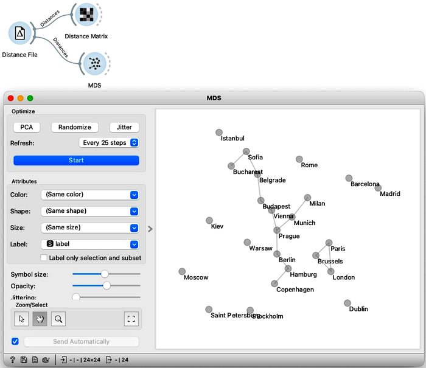
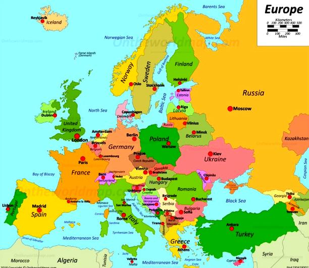
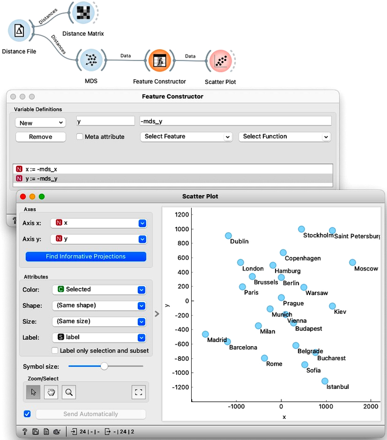
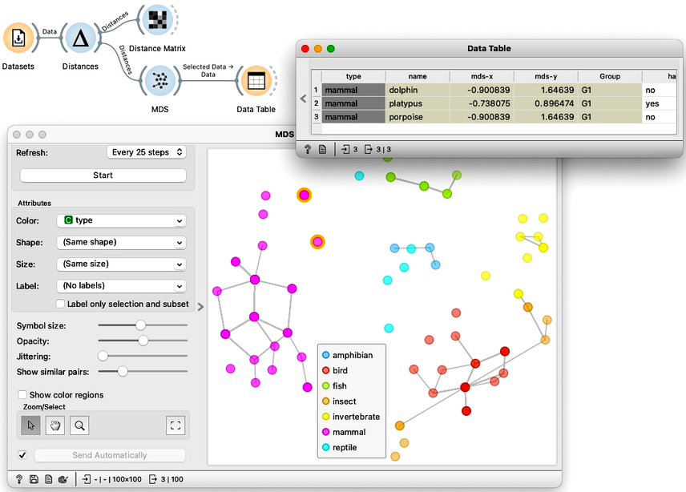

Here, we will discuss about the embedding of data into two-dimensional space. While this may sound complicated, we can assure you it is not. We will start with a simple example and work the idea to the point where I can embed the zoo data set from my previous videos into a 2D map.

<!!! float-aside !!!>
For distances between, say, cities in U.S., please check [another website](https://www.mapcrow.info/united_states.html). Or [this one](https://www.mapcrow.info/asian_travel_distance.html) for the distances between Asian Cities.

We found a [website that reports travel distances between some European cities](https://www.mapcrow.info/european_travel_distance.html). It says, for example, that Barcelona is about 1500 km from Belgrade, which in turn is another 300 km from Budapest.

To do this in Orange, the first step is to prepare the data. We will copy the distances into Excel, using Edit-Paste as Special-Text to get rid of the formatting, and save the file to the desktop. And instead of the first row with labels, write that there are 24 cities and indicate that the matrix contains the row labels (highlight the first row, press delete – do not delete the row, and type “24” and “dist” in the first two empty cells). Orange, for now, uses its own legacy format for distance matrices, so until we fix this, you will have to follow these steps. We will store our data as a tab-delimited text. In Excel, use Save As, choose Tab Delimited Text], and save the data in a distances file. We also need to rename the file to change its extension to .dst. That is, save the file to desktop and rename it to use .dst extension.

To load the distance matrix into Orange I use the [Distance File](https://orangedatamining.com/widget-catalog/unsupervised/distancefile/) widget. It tells me that the data contains 24 labeled data instances which I can examine in a Distance Matrix.

Good, it looks like the distances were read all-right. Now for the main trick. I will use an embedding technique called multi-dimensional scaling and turn the distances into a two-dimensional map of European cities. All I need to do is connect the [MDS](https://orangedatamining.com/widget-catalog/unsupervised/mds/) widget to the Distance File. There we go. I see Belgrade is indeed close to Budapest. And Prague is close to Vienna, Munich, and Berlin. Moscow is way off to one side with Barcelona and Madrid on the other.

Multi-dimensional scaling seems to have recreated a map of European cities, except it’s flipped upside down. This geographic information was not in our original data; we provided only the distances. A map of European capitals, oriented as we are used to, would normally look more like this. 

Madrid on the bottom left, Dublin to the north, and Moscow far right. We can help Orange by flipping the MDS coordinates. Note that MDS can also output the entire data set, with embedding – that is, inferred two-dimensional coordinates – stored as meta-features. Anyway we use the Feature Constructor to introduce two new variables, x and y, that flip the computed MDS coordinates. Please note that we need to rewire the connection between MDS and Feature Construction to pass through the entire dataset and not just selection. Now when we present our data in Scatter Plot, it places the cities the way we are used to on a map.

Take a second to appreciate what multi-dimensional scaling is doing here. We gave it the driving distances between pairs of cities and Orange used that data to place the cities in a way that closely resembles a proper map of Europe.

We can do this with any data as long as we can construct or obtain a distance matrix. Say, the zoo dataset. To do so, let us construct a new workflow. We load the zoo data set using the Dataset widget. Remember, the data contains information on 100 animals described by 16 features such as the number of legs or whether they have hair or feathers. Using this data we construct the distance matrix with the Distances widget. As we have already used this widget in every workflow for hierarchical clustering we will skip the details for now. We can examine the computed distances by feeding them to the Distance Matrix. And finding them intact we can continue by feeding the distances to MDS. Taking a look at the plot, it makes sense. The mammals are clumped together, and so are the fish and the birds. The three mammals that are closest to the fish are, no wonder, the dolphin, platypus, and porpoise.

If we compare this plot to the principal component plot we have developed in the previous chapters we might also remember the insects and birds aren’t as intermixed this time. However, Orange still indicates with a line that some insects should be closer to some birds than depicted on the map.

Remember, we estimated the distances from a 16-dimensional space, and multi-dimension scaling can only approximate these distances in two dimensions. The distances in two dimensions will never be entirely faithful to those we estimate from 16-dimensional data. If they were, all that 16 dimensional data would lay on some two-dimensional plane, making 14 dimensions completely redundant. We can get the impression of "faithfulness" by changing the threshold of when Orange links two instances (use "Show similar pairs" slider in the MDS widget)

Multi-dimensional maps remind us of the plots we constructed with principal component analysis. Remarkably, these two entirely different algorithms can result in very similar visualizations. PCA finds the two-dimensional projection, which retains the most variance, while MDS aims to preserve all the pairwise distances. PCA is a projection-based approach, while MDS iteratively optimizes the placement of points. MDS embeds the data in two-dimensional space, where resulting coordinates have no meaning. The main advantage of multi-dimensional scaling is that it can handle distance matrices directly, while PCA requires tabular data representation.
