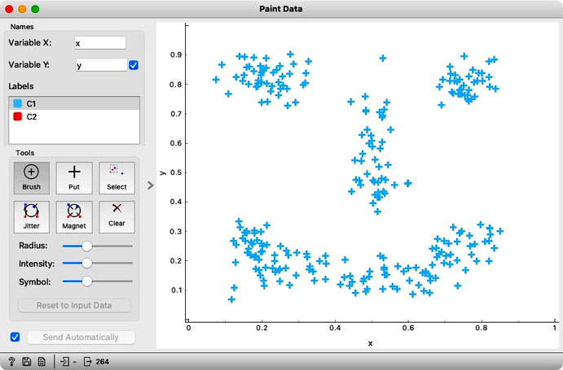
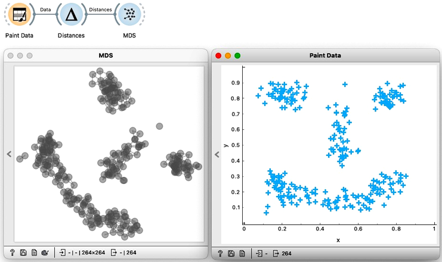
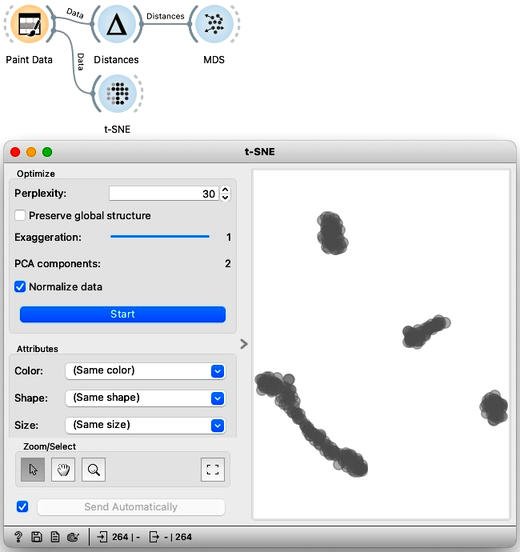
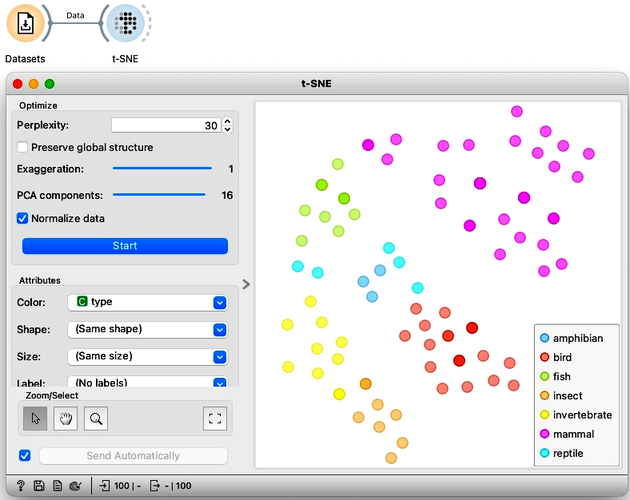

Multidimensional scaling aims to preserve all the distances from the original data space, meaning it tries to maintain both the distances between the neighboring data points and between the data points that are far away. In real life, we often only care about things that are close together. Anything far away is just far away, and the exact distances do not really matter. For example, the author of this text cares how close his home and workplace are, as traveling half an hour more, or less, makes a huge difference. But if he drove from his home in Ljubljana to Paris, thirty minutes would not really matter to him on a 14 hour trip. Paris is just far away.

Similarly in data visualization, anything close together should matter more. Do we worry about retaining each individual distance, or are we just interested in exposing data instances that are close to one another? For example, if we are looking for the clustering structure of some data, then all we really want is to clump together the data that is close enough.

Consider the following painted data with a couple of obvious clusters.

<!!! float-aside !!!>
Note that the MDS widget can be connected to the data source directly, without computing distances explicitly. The result in this situation is the same as using the Distance widget with Euclidean distance. And second, while t-SNE also requires the distances, the current implementation in Orange computes Euclidean distances directly from the data so it cannot actually receive distances on its input. 

First we will use the Distances widget to compute the pairwise distances between the data instances. Then I use the MDS widget to take those distances and create a map. We will be using a two dimensional dataset so we can expect MDS to recreate it exactly. We will here just leave these two images here, side by side, so you can clearly see that they are indeed the same. If, somehow rotated.

Moving on we will here try out another visualization tool, the so-called t-distributed stochastic neighbor embedding, or t-SNE for short. t-SNE only cares about neighbors. In this visualization, the idea is that the points that were nearby in the original space will stay close together. So let’s give it a shot. We will connect our original data to the t-SNE widget. And see that the nearby points are still clumped together. 

This ‘clumping’ in t-SNE is controlled by the exaggeration parameter, so take a look at what happens if I emphasize the locality even more by raising the exaggeration to 2. 

We are now curious to see what t-SNE would do with the zoo data we have been using in our previous chapters. So, starting off with an empty canvas, we can load the zoo data from the Datasets widget, and connect it to t-SNE. We also see it colors the data by animal type. The are no overlaps; the mammals, the fish, the birds, and even the invertebrates are all in their own cluster. 

We can compare this embedding to what we got from MDS and PCA. Try it on your own. The difference is not staggering, but t-SNE did seem to do a better job clustering the same types together.

t-SNE and MDS seem similar in two dimensions, but the difference becomes more pronounced with larger data sets. We will discuss more about this in our next chapter, but for now, we just want to conclude by explaining what the name t-SNE or t-distributed stochastic neighbor embedding actually means. Well, it is an embedding, this means it places data points in a smaller space, in our case a two-dimensional one by optimizing their locality. And it does this by looking at each point’s neighbors. Also stochastic just means there’s an aspect of randomness. In this case it’s because we initialize it with random points. And finally, the $t$ comes from the $t$-distribution which is used to determine the importance of each neighbor.

The main takeaway here is that MDS preserves the distances while t-SNE preserves each point’s neighbors.