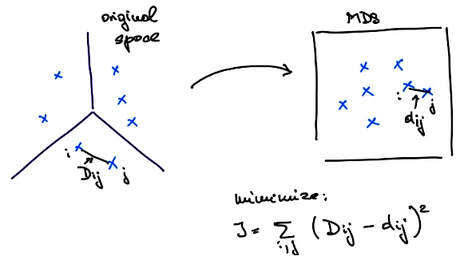
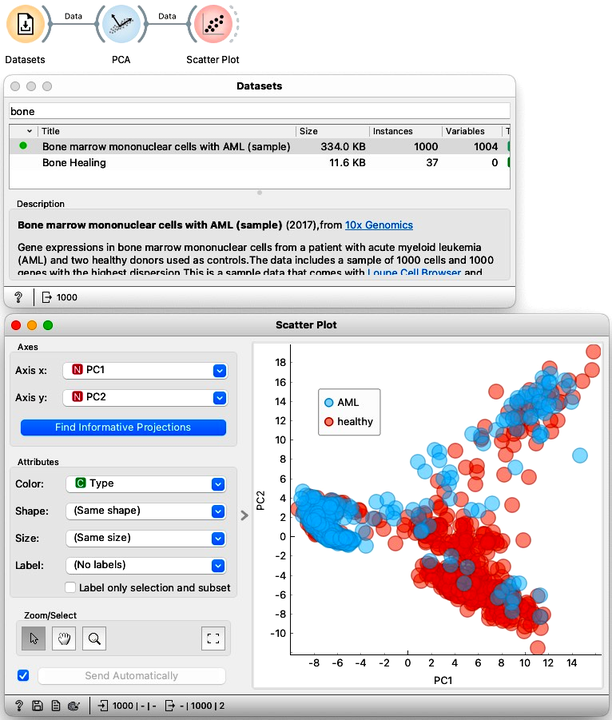
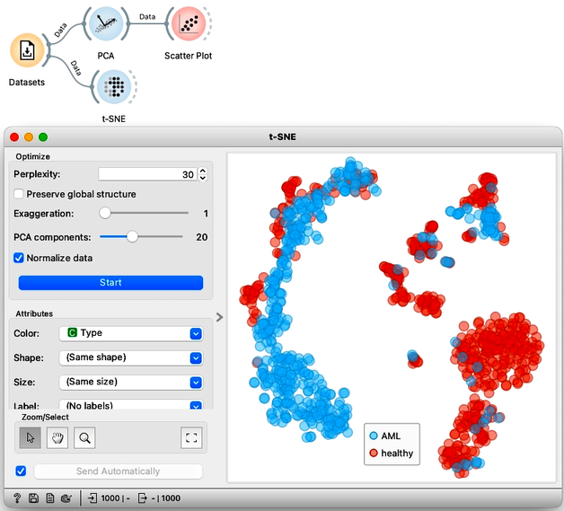
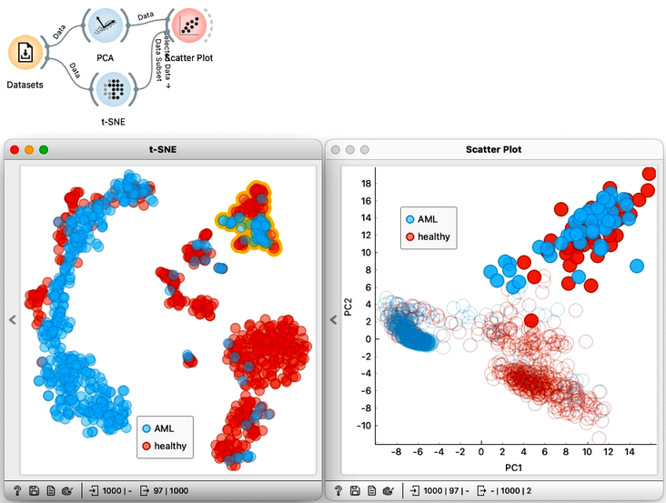

We have introduced three dimensional data reduction techniques: principal component analysis, multidimensional scaling, and t-distributed stochastic embedding. Our main objective was data visualization, that is, in reducing the number of dimensions to two.
On smaller data sets, We have found these techniques to yield similar results. But this should come as a bit of a surprise, because the three approaches are very different in nature. 

PCA is a projection. Meaning that for some data PCA finds its projections to the axes defined by principal components. These principal axes are computed directly from the data using the eigenvectors of the covariance matrix. And they can be used to place new data instances into a data space. On the other hand, MDS considers distances, that can come from some multidimensional data. Let me denote the distances between each pair of points $i$ and $j$ with $D_{ij}$. MDS aims to embed our data into a two-dimensional space in such a way that the resulting distances are as close to the original distances as possible. If I call the distances in the new, two-dimensional space also called the embedded space with $d_{ij}$, then what MDS tries to do is minimize $\sum_{ij} \left(D_{ij}-d_{ij}\right)^2$.

MDS finds the embedding that minimizes this criteria function iteratively. It starts with a random placement of points and then, in each iteration, moves the points slightly to lower the value of the criteria function. We can take a look at how this happens on the zoo data set. In MDS widget we can randomize the positions of the data points, set Refresh to Every iteration, and press Start. Something to be aware of here is that the results of the optimization procedure MDS uses may depend on the random initialization. To make things more deterministic MDS usually starts with the placement of points obtained by PCA instead of a completely random placement.

On to our last algorithm, t-SNE. This is also an embedding that uses iterative optimization to find the best placement of points. It is similar in execution to MDS; they just use different criteria functions. t-SNE's criteria function is a bit more complex and prioritizes maintaining the distances between each point's neighbors.

The differences between the three methods can be huge. This time we will use another biological data set, called "Bone marrow mono-nuclear cells". Each of the 1000 rows contains data on a single bone marrow cell. Here, let us not go into much detail about this data set, it is enough to know that it contains 1000 features, that is genes, that record the activity of the genes in each cell. There are multiple types of bone marrow cells and we might expect to identify them by clustering the data. So, we will first pass this data to PCA and look at the result in a Scatter Plot. The coordinates, PC1, and PC2, are at the very end of the list of features.

Let us compare the PCA visualization to what we get from t-SNE. This time the resulting visualization is really is completely different. The clustering structure is much more pronounced in the t-SNE visualization. 

<!!! float-aside !!!>
We could try to do the same thing again with MDS, but I find that it resembles PCA more than t-SNE, finding much less structure in the data.

We can select a cluster from the t-SNE visualization and see where these points are in the PCA visualization. To do this, we can just pass the selection from t-SNE to the Scatter Plot widget. With both visualizations side by side, we can select any cluster in t-SNE to see how it translates to PCA. Notice that from PCA, we would only be able to find some of the clusters visible in t-SNE, but not all of them. 

In summary: when we want to find clusters we would use t-SNE, when we care about ALL the distances, we would use MDS, and when we need some robust dimensionality reduction methods that use mathematical projection and retain as much variance as possible, we would use PCA.
