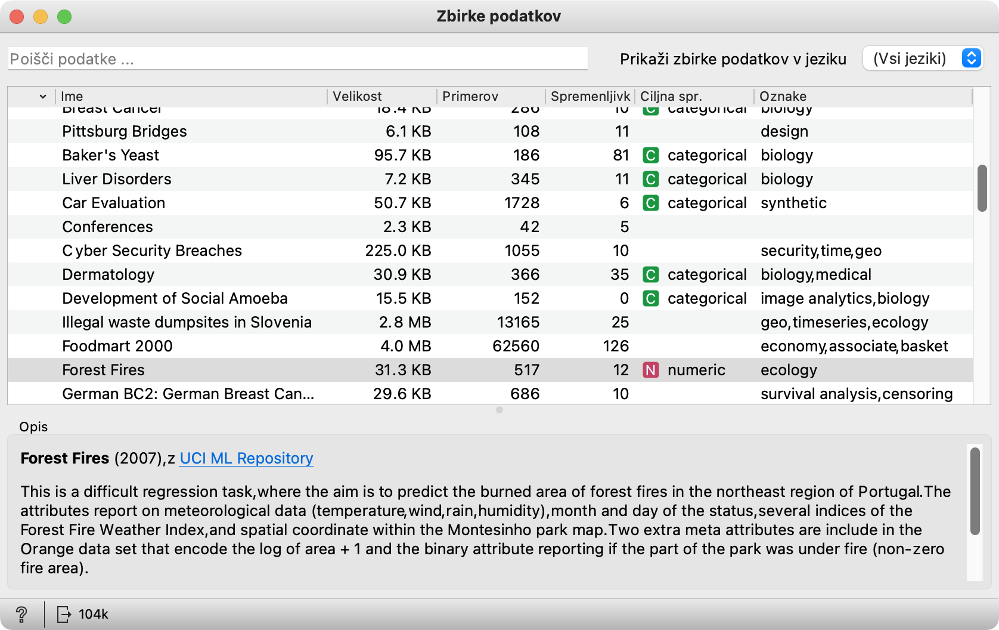
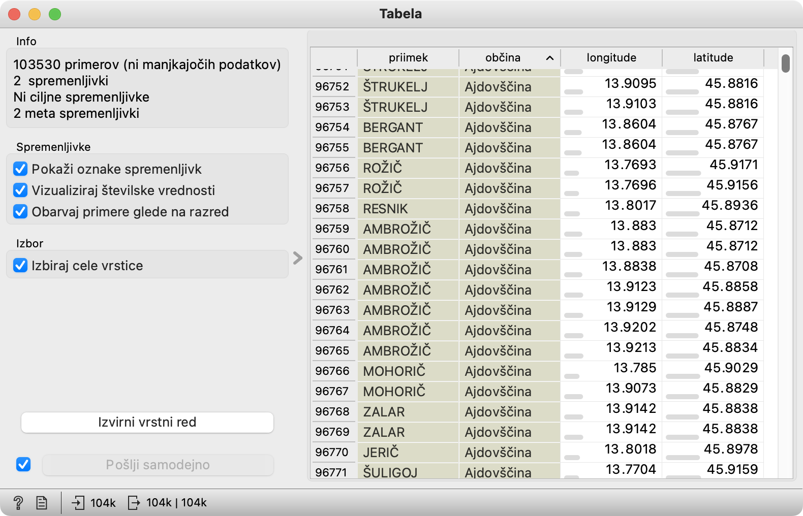
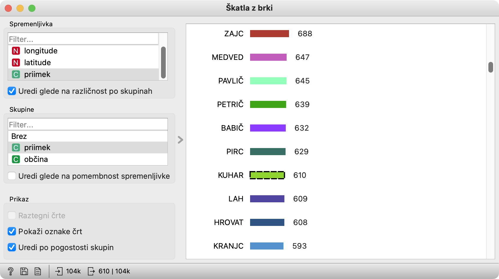
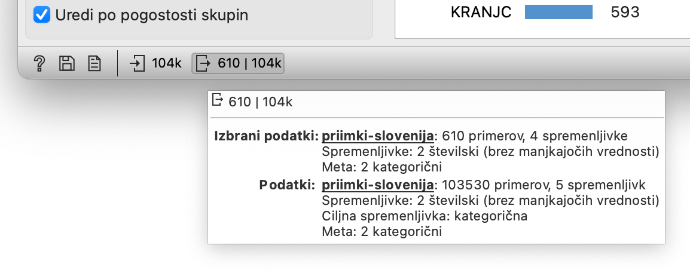
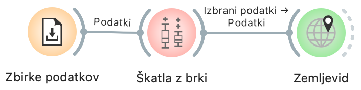
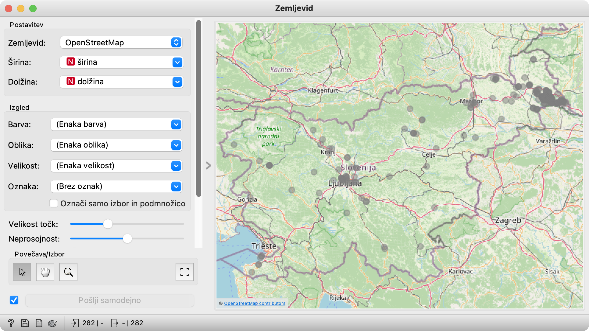
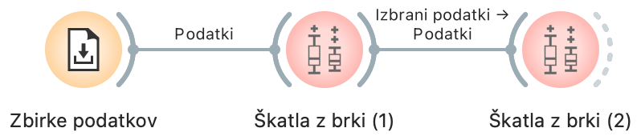
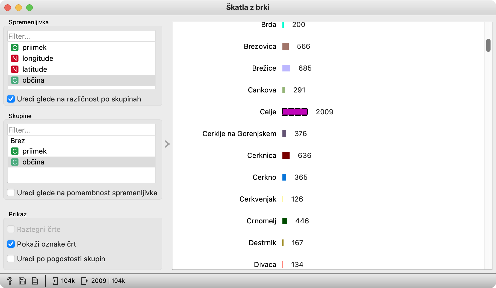
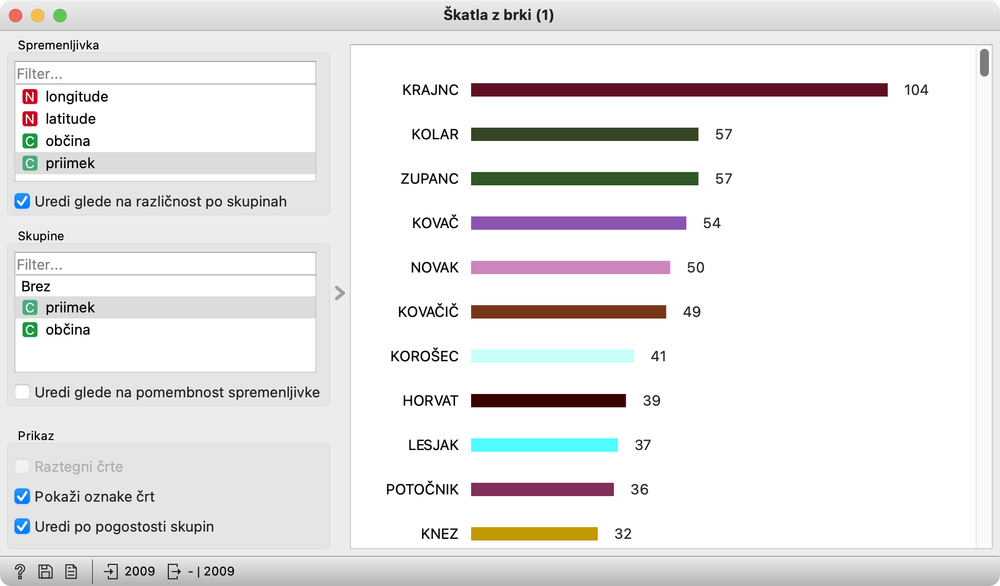

Za začetek se naučimo delati s programom Orange: postavljati in povezovati gradnike ter razumeti idejo izbiranja podatkov za naslednje gradnike v toku. Obenem spoznamo nekaj osnovnih gradnikov, ki jih bomo potrebovali kasneje.

### Uporabljeni gradniki

Gradniki, ki jih potrebujemo, preberejo podatke, jih pokažejo v tabeli ali sliki in jih umestijo na zemljevid.

#### Branje podatkov

Gradnik **Zbirke podatkov** ([Datasets](https://orangedatamining.com/widget-catalog/data/datasets/)) naloži podatke. V slovenski različici privzeto pokaže slovenske zbrike. Radovedni lahko izberejo drug jezik (ali vse jezike) in vidijo še kakšne druge podatke.

<!!! float-aside !!!>
Gradnik Zbirke podatkov nalaga že pripravljene podatke s spletnega strežnika. Svoje podatke, recimo iz Excela, pa naložimo z gradnikom **Datoteka** ([File]([File](https://orangedatamining.com/widget-catalog/data/datasets/))).

Za prvo vprašanje potrebujemo tabelo Priimki po Sloveniji; naložimo jo z dvojnim klikom.

#### Tabela

Gradnik Tabela ([Data Table](https://orangedatamining.com/widget-catalog/data/datatable/)) pokaže podatke, ki jih dobi na vhodu. S klikom na ime stolpca jih uredimo po vrednostih v njem; ponovni klik jih uredi padajoče. Če izberemo vrstice v tabeli, se pojavijo na izhodu.

#### Škatla z brki

Škatlo z brki ([Box Plot](https://orangedatamining.com/widget-catalog/visualize/boxplot/)) tule uporabljamo zgolj za urejanje priimkov po pogostosti in za izbiranje posamičnih priimkov. To ni osnovni namen tega gradnika, vendar je za našo rabo tule prikladen. Kaj z njim počnemo sicer, si lahko preberete v [opisu gradnika](https://orangedatamining.com/widget-catalog/visualize/boxplot/).

V posnetku vidimo primer, ko je kot spremenljivka *in kot skupina* izbran Priimek. Tako lahko opazujemo pogostosti priimkov. Izvirni vrstni red je abecedni (le tisti, ki se začnejo s šumniki, so na dnu). Če želimo opazovati njihov vrstni red po pogostosti, pa obkljukamo "Uredi po pogostosti skupin". 

<!!! float-aside !!!>
Odgovor na naslovno vprašanje. V tem vzorcu podatkov je Zajcev nekoliko, a ne veliko več kot Medvedov. SURS pritrjuje: 1. 1. 2022 je živelo v Sloveniji 2246 Zajcev in 2146 Medvedov. Lovska zveza pa k slednjim dodaja še 1200 svojih.

<!!! float-aside !!!>
Vrstice lahko izbiramo še z mnogimi drugimi gradniki, recimo s Tabelo. Za izbiranje glede na vrednosti ene ali več spremeljivk sicer uporabljamo Izberi vrstice ([Select Rows](https://orangedatamining.com/widget-catalog/transform/selectrows/))

Če kliknemo na posamični priimek, dobimo na izhodu vse osebe s tem priimkom. Tule smo kliknili KUHAR in gradnik pošlje na izhod vse Kuharje. Enako lahko delamo tudi, kadar namesto priimkov opazujemo občine.

Škatla z brki v resnici daje na izhod dve tabeli: v eni so izbrani podatki, v drugi pa vsi podatki z dodatnim stolpcem, ki pove, kateri med njimi so izbrani. Podatke o vhodnih in izhodnih podatkih vidimo v statusni vrstici. Tule piše, da ima prva tabela 610 vrstic (vse Kuharje, torej), druga 104 tisoč. Več informacij o vhodni ali izhodni tabeli dobimo, če nad temi številkami polebdimo z miško, in še več, če jih kliknemo.

#### Zemljevid

Zemljevid pričakuje podatke, v katerih vsaka vrstica ustreza neki lokaciji. Če se stolpca z zemljepisno širino in višino imenujeta *širina* in *višina* (ali *latitude* in *longitude*, *lat* in *long* ali kaj podobnega), ju bo zaznal sam, sicer pa moramo v gradniku sami, ročno izbrati stolpca, ki vsebujeta koordinate.

<!!! float-aside retina !!!>
Kje najdeš Hozjana? Kot se naučimo v posnetku, uporabimo Škatlo z brki, da izberemo Hozjane in jih pošljemo v Zemljevid. Točneje, v Prlekijo.

V katerih grmih se skrivajo Zajci, pa odkrijte sami. (Da, tudi Zajci imajo svoje mesto v Sloveniji in niso kar vsepovsod, tako kot kakšni Novaki.)

### Rešitev naloge

Naloga sprašuje po najpogostejših priimkih v občini. Rešiti jo je mogoče na kup načinov, skupno pa jim je, da moramo nekako izbrati vse vrstice, ki se nanašajo na določeno občino. Tu bomo opisali le rešitev, ki sledi ideji iz posnetka: primere z določeno lastnostjo lahko izbiramo kar v Škatli z brki. Eno za drugo bomo povezali dve brkati škatli.

<!!! retina !!!>

Prvo nastavimo tako, da kaže občine. Izberemo svojo, na primer Celje.

<!!! float-aside !!!>
Če ne obkljukamo "Uredi po pogostosti", obdržimo izvirni, to je, abecedni vrstni red. Tako lažje poiščemo svojo občino. Samo tiste, katerih ime se začne s šumniki, so žal na koncu. Orange se slabo spozna na abecedo.

Prva škatla z brki bo tako poslala drugi škatle vse Celjane. To, drugo škatlo z brki pa nastavimo tako, da pokaže priimke. Obkljukamo "Uredi po pogostosti" in že vidimo: v Celju bomo največkrat naleteli na Krajnce, Kolarje in Zupance.

<!!! float-aside !!!>
V Celju je torej veliko *Krajncev*. Več kot drugje? Ali pa jih je veliko po vsej Sloveniji? Kaj pa *Kra**nj**ci*? V kateri del Slovenije so šli oni? Le razišči, saj znaš!

Morda še beseda o interpretaciji. To, da je v Celju največ Kranjcev, še ne pomeni, da so Kranjci večinoma v Celju. Morda je Kranjc pač pogost priimek. Navsezadnje sta četrti in peti najpogostejši priimek v Celju Kovač in Novak, vendar vemo, da Novak nikakor ni "tipičen za Celje z okolico". Da bi ocenjevali tipičnost priimkov bi morali pogostosti priimkov na nekem področju primerjati s pogostostjo po vsej Sloveniji.