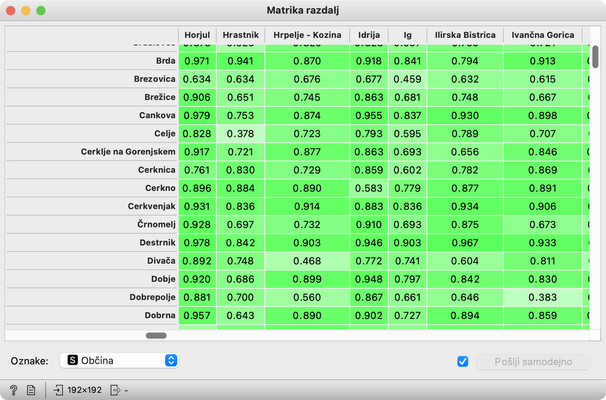
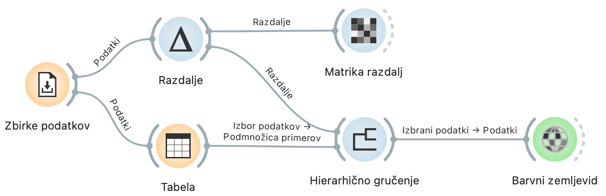
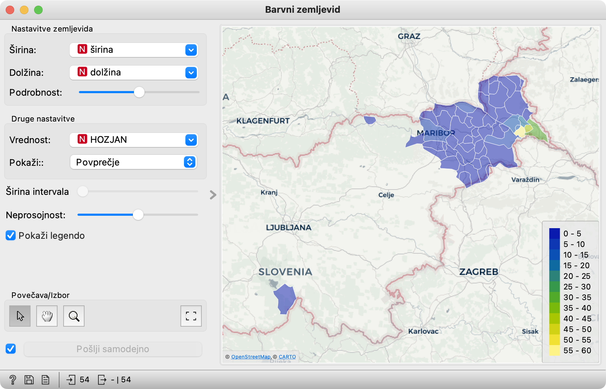

V drugem delu razmišljamo o tem, kako meriti podobnost občin glede na priimke, ki se pojavljajo v njih. Nato se naučimo, kako na podlagi tega združiti občine v gruče. Rezultat gručenja je drevo z učenim imenom *dendrogram*. Izvemo, kaj pomeni in se naučimo nekaj malega o njegovi uporabi.

V tej in naslednjih nalogah uporabljamo drugo zbirko podatkov, *Pogostosti priimkov po občinah*.

## Uporabljeni gradniki

K prejšnjim gradnikom tule dodamo dva nova, povezana z razdaljami, poleg tega pa še gručenje in še eno različico zemljevida.

#### Računanje razdalj

Vrstice v naših podatkih ustrezajo občinam, v splošnem pa poljubnim drugim rečem – strankam trgovske verige, potresom v južni Italiji, primerom želene in neželene pošte ali koščkom genetskih zaporedij pajkov, najdenih v drvarnicah nedaleč od Pivke.

Pri analizi podatkov nas pogosto zanimajo podobnosti – ali, obrnjeno, različnosti – med temi rečmi. Navadno je preprosteje računati različnost, definicije različnosti pa si sposodimo pri matematikih, po zgledu katerih namesto o *različnosti* raje govorimo o *razdalji*.

Razdaljo je mogoče definirati na kup načinov: gradnik Razdalje ([Distances](https://orangedatamining.com/widget-catalog/unsupervised/distances/)) jih ima kar dvanajst. Katero izbrati, je odvisno od naših podatkov in namenov. Najpreprostejša je Evklidska razdalja; če si podatke predstavljamo kot točke na ravnini ali v prostoru (in, v splošnem, če je spremenljivk *n*, v *n*-dimenzionalnem prostoru), je Evklidska razdalja razdalja, ki bi jo namerili z merilom. "Normalizacija" pa pomeni, da spremenljivke predtem postavimo na isto mersko lestvico, tako da vrednosti vsake preslikamo v interval od 0 do 1.

<!!! float-aside !!!>
Kaj pravi statusna vrstica? V gradnik pride tabela s 192 vrsticami, iz njega pa odide matrika razdalj velikosti 192×192.

<!!! retina !!!>

<!!! float-aside !!!>

Geometrijska razlaga: Evklidska razdalja gre naravnost, Manhattanska gre okrog vogalov, kot v mestih s pravokotnim tlorisom ulic, kosinusna pa opazuje, pod kakšnim kotom vidimo točki.

Druge razdalje imajo svoje specifične trike: Manhattanska se manj ozira na izstopajoče vrednosti, Mahalanovisova se obnese pri koreliranih spremenljivkah in Hammingova pri binarnih, Jaccardova pri spremenljivkah, ki označujejo pripadn... Pravzaprav nas tule niti ne zanima. Oprostite, ker sem načel temo. :)

Za naše podatke je najprimernejša kosinusna razdalja. Ta bo dve občini prepoznala kot podobni, če imata podobno mešanico priimkov, ne glede na to, da imata morda zelo različno število prebivalcev. Za razliko od nje bi Evklidska razdalja opazila predvsem razliko v številu prebivalcev.

Gradnik torej prejme tabelo podatkov in med vsakim parom vrstic (ali stolpcev, če bi ga nastavili tako, vendar ga ne bomo) izračuna razdaljo po izbrani definiciji.

Izhod iz gradnika ni tabela podatkov temveč matrika razdalj. Zato nanj ne moremo pripeti nobenega od gradnikov, ki smo jih spoznali v prvem delu, saj ti ne prejemajo takšnih vrst podatkov.

#### Matrika razdalj

Matriko razdalj pokaže istoimenski gradnik ([Distance Matrix](https://orangedatamining.com/widget-catalog/unsupervised/distancematrix/)). V tej aktivnosti ga uporabimo zgolj zato, da ilustriramo, kakšno reč sestavijo Razdalje.

Vhod za Matriko razdalj je, no, pač matrika razdalj. Tabel, s kakršnimi smo delali v prejšnjem poglavju, ne mara. 

<!!! retina !!!>

Gradnik se trudi sam uganiti primerno oznako za vrstice in stolpce – v tem primeru imena občin. Če mu ne uspe, jo (spodaj levo) izberemo sami.

<!!! float-aside !!!>
Celjski priimki niso zelo različni od hrastniških (razdalja je 0.378) (podobni so si celo bolj kot brezoviški in ižanski!). Prav nič pa niso podobni idrijskim (razdalja 0.793). Smiselno?

<!!! retina !!!>

#### Gručenje

Gradnik Hierarhično gručenje ([Hierarchical Clustering](https://orangedatamining.com/widget-catalog/unsupervised/hierarchicalclustering/)) prejme razdalje med občinami in jih na podlagi tega združi v hierarhijo.

Postopek deluje tako, da je v začetku vsaka občina gruča zase. Nato postopno združuje pare najbolj podobnih gruč, dokler ne dobi ene same gruče. Hierarhijo predstavi v obliki drevesa, ki mu rečemo Dendrogram.

<!!! float-aside !!!>
Če v gručenju določimo spremenljivko za barvo, se ob oznakah pojavijo barvni kvadratki. Tule smo za barvo izbrali spremenljivko Pokrajina, da preverimo, ali se dobljene gruče ujemajo z "uradnimi" pokrajinami.

Detajl, na katerega moramo paziti, je razdalja med gručami: nastaviti jo moramo na Wardovo.  Postopek sicer začne s posameznimi občinami, kasneje pa mora računati razdaljo med gručami, sestavljenimi iz več občin. Za razdaljo med njimi lahko vzame najbližji ali najbolj oddaljeni občini iz teh dveh grup, ali pa povprečno razdaljo. Navadno pa se najbolj obnese Wardova razdalja, ki temelji na razpršenosti gruč.

V posnetku vidimo, kako v gradniku izberemo kako gručo občin, da jih posredujemo naslednjemu gradniku, na primer zemljevidu. V kasnejših videih bomo spoznali še druge načine izbiranja gruč.

Gradnik lahko sprejme tudi dodaten vhod s podmnožico občin. Te označi z mastnim tiskom in polnimi kvadratki pred njimi.

<!!! retina !!!>

#### Barvni zemljevid

Za prikaz podatkov, ki se ne nanašajo na točke na zemljevidu temveč na področja, na primer občine, je namesto običajnega primernejši barvni zemljevid ([Choropleth Map](https://orangedatamining.com/widget-catalog/geo/choroplethmap/)). Tako kot običajni zemljevid zahteva stolpca s koordinatami; če ne prepozna njunih imen, ju moramo izbrati sami.

<!!! retina !!!>

Z nastavitvijo Podrobnost določimo velikost področij. Privzeta vrednost (skrajno levo) predstavlja države. Da bomo videli občine, ga moramo povleči vsaj do sredine.

Ker je barvni zemljevid barven, mu moramo določiti še, na podlagi katere spremenljivke naj bo obarvan. Če nas zanima le, katere občine so izbrane, barva ni pomembna. 

<!!! float-aside !!!>
Če za barvo izberemo število oseb z določenim priimkom, vidimo koliko jih je v kateri od izbranih občin. Hozjani žarijo v kljunu Slovenije.

### Rešitev naloge

Za odgovor na vprašanje zadošča povezati Zbirke podatkov, Razdalje in Hierarhično gručenje.

<!!! retina !!!>

Gradnike je potrebno pravilno nastaviti.

- V Zbirke podatkov naložimo Pogostosti priimkov po občinah (ne Priimki v Sloveniji).
- V Razdalje izberemo kosinusno razdaljo.
- V Hierarhično gručenje izberemo Wardovo razdaljo.

Nato v dendrogramu v hierarhičnem gručenju poiščemo svojo občino in razberemo podobne občine. Pri tem je pomembno, da sledimo strukturi.

<!!! float-aside !!!>
Šentilju je najbolj podoben Benedikt, sledita pa Cerkvenjak in Sveta Ana. Dobje ter Bistrica ob Sotli in Kozje pa so iz popolnoma druge veje in so le slučajno narisani zraven Šentilja.

<!!! retina !!!>

