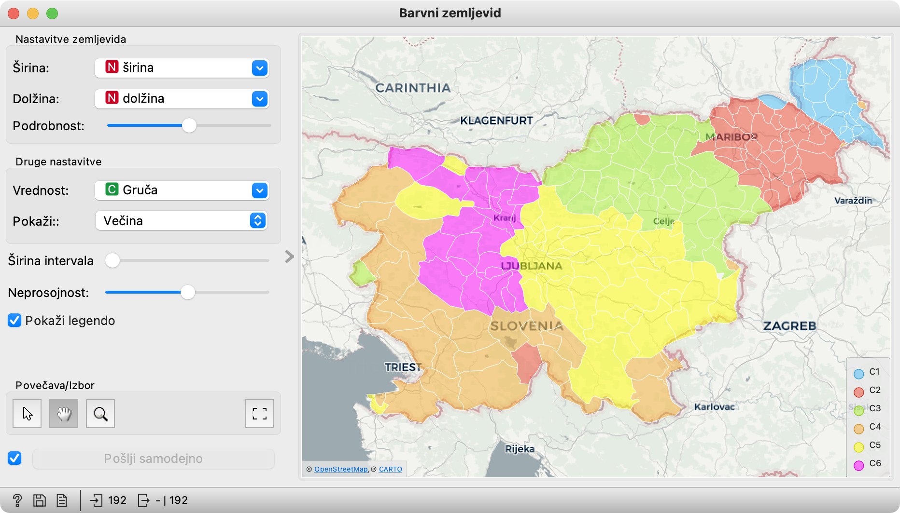

V tem delu izvemo, kako uporabiti hierarhično gručenje za sestavljanje določenega števila skupin in kako opazovati te skupine na barvnem zemljevidu.

### Uporabljeni gradniki

Vse že poznamo. Nov je le način uporabe hierarhičnega gručenja.

#### Hierahično gručenje

Dendrogram kaže celotno hierarhijo, od posamičnih skupin do, na koncu, ene same. Tako pač teče združevanje, do konca. Na podlagi izgleda dendrograma se lahko odločimo, koliko gruč bomo obdržali. Navadno se, posebej, če uporabljamo Wardovo razdaljo, začnejo razdalje med gručami v nekem trenutku bistveno povečevati, kar opazimo po daljših črtah. S klikom v merilo nad dendrogramom "prerežemo" gručenje na tem mestu.

<!!! float-aside !!!>
Če si želimo ogledati celoten dendrogram, ga lahko pomanjšamo, tako da potegnemo drsnik Povečava potegnemo levo. Glede na dolžine črt bi se lahko odločili za tri gruče. Kliknemo nekje pri 2.8 in tako postavimo prag na želeno mesto v dendrogramu.

Črto lahko ročno premikamo, tako da jo vlečemo okrog. Primer je v posnetku. 
Če se vnaprej odločimo za neko število gruč ali pa bi radi eksperimentirali z različnim številom gruč, pa lahko spreminjamo kar številko v nastavitvi Prvih N:.

Pri taki uporabi hierarhično gručenje vedno posreduje vse podatke, doda pa jim stolpec Gruča, ki vsebuje zaporedno številko gruče.

#### Barvni zemljevid

V barvnem zemljevidu kot Vrednost izberemo Gruča, pa bodo občine obarvane glede na gručo.

Rezultati niso popolni. Če naredimo štiri gruče, se Loška dolina se znajde v Podravju, Goriška Brda pa na Štajerskem. Gre za občini z malo prebivalci in, morda, tudi nenavadnejšimi priimki, zato ju je težko zanesljivo primerjati z drugimi in umestiti, kamor sodita. Tako pač je; kadar je podatkov premalo, postanejo stvari naključne.

<!!! retina !!!>

### Rešitev naloge

Delotok je preprost.

<!!! retina !!!>

Prve tri gradnike nastavimo tako kot pri prejšnjem vprašanju: v Zbirke podatkov naložimo Pogostosti priimkov po občinah, v Razdalje ne pozabimo izbrati kosinusne razdalje, v Gručenju pa Warda. V hierarhičnem gručenju povlečemo črto, ki predstavlja prag tako, da dobimo 6 gruč ali pa, še preprosteje, nastavimo Prvih N: na 6. Nato v Barvnem zemljevidu poiščemo svojo občino in poimenujemo regije, ki jih najdemo v tej barvi.

<!!! float-aside !!!>
Poleg Brd in Loške doline sta malo (vendar ne tako zelo) odrezana od svoje barve tudi Bohinj in Jesenice. Bogsigavedi, zakaj. Bohinj najbrž ni prav velik, Jesenice pa imajo zaradi železarske industrije morda sorazmerno malo avtohtonega prebivalstva. Tudi odgovor na vprašanje, zakaj je Piran rumen in ne oranžen, bi zahteval malo več raziskovanja.

<!!! retina !!!>

