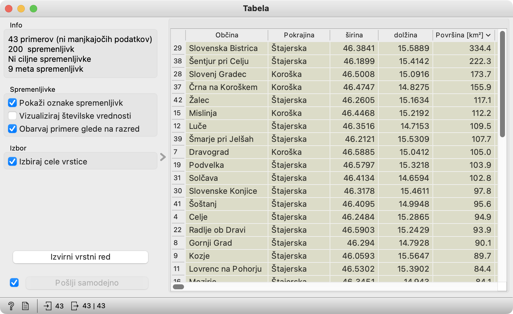

Za zadnji del nismo pripravili videoposnetka, pa tudi novih gradnikov ni. Tu le preverjamo, koliko smo se naučili.

### Rešitev naloge

Na vprašanje najpreprosteje odgovorimo tako, da k Hierarhičnemu gručenju dodamo Tabelo.

<!!! retina !!!>

V Hierarhičnem gručenju izberemo gručo, ki ji pripada naša občina.

<!!! float-aside !!!>
Da izberemo gručo, moramo klikniti znotraj nje. V primeru na sliki smo kliknili malo desno, onstran črte od oznake C1. (Oznaka se seveda pojavi po izboru.)

<!!! retina !!!>

Tabelo uredimo po stolpcu Površina, tako da kliknemo na ime stolpca.

Če smo iz Celja, je največja občina v naši, štajerski gruči Slovenska Bistrica.

<!!! retina !!!>

