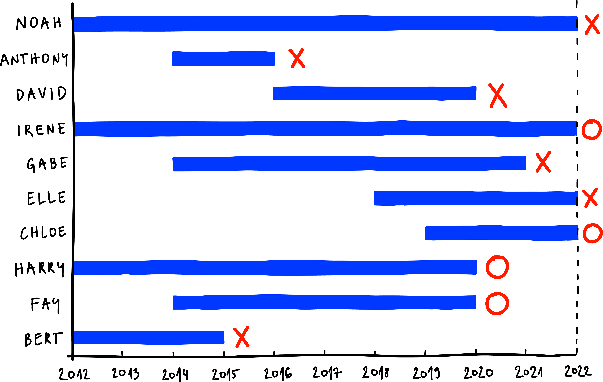
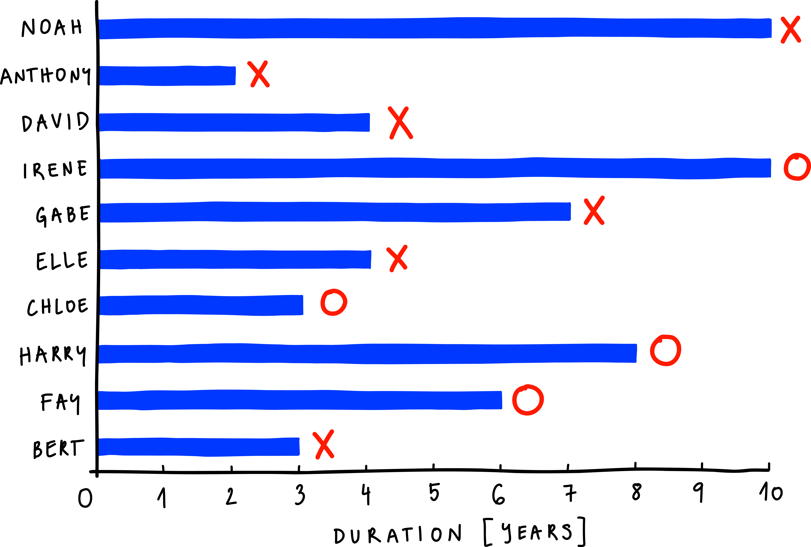

In survival analysis the main outcome we are interested in is the time to an event of interest. The “survival” in survival analysis gets its name from its use in the analysis of the survival of patients. However, the event of interest can be many things: a disease relapse, the first technical failure of a car, or the time untill a dental filling falls out. If the event occurred in all individuals, many methods of analysis would be applicable. However, it is usual that at the end of a study some of the individuals have not had the event of interest and some might have ended their participation in the study beforehand for reasons other than experiencing the event. This doesn't mean that they won't necessarily experience the event in the future, but that their true time to event is unknown. This phenomena is called censoring and the data with unknown time to event is called censored data. Survival analysis includes a set of methods that can deal with datasets that include censored data. Let's look at an example of survival data from the first lecture. 

We gather from a group of 10 friends when they last got a dental filling in the last 10 years and when it fell out if it did. Can we estimate the probability of a new dental filling remaining in place after 5 years? 

We plotted our observations as a diagram. The x-axis is marked with time from 2012 to 2022 and their answers are drawn as a line representing when they got their dental filling and how long it lasted. For instance, Bert got a dental filling in 2012, which lasted until 2015, and Fay got her’s in 2014, which lasted until 2020. The friends whose dental filling fell out are marked with a cross. Some of them, however, didn’t lose their last dental filling (yet) and one - Harry - got it changed before it had the chance to fall out. Their time still tells us something about how long dental fillings last. So instead of discarding their data, we mark them with a circle. 

This is an example of right-censoring, but we also know of cases with left- and interval censoring. Left-censoring would mean that we observe the presence of a state or condition but do not know when it began. Interval censoring, on the other hand, means that individuals come in and out of observation. This tutorial focuses only on right-censoring since this is the form of censoring of most survival data.

A minimal survival dataset is thus composed of observations with a survival time and event column. The later specifies if the event has in fact occured (event = 1) or whether it has been censored (event = 0). We will transform our dental fillings dataset in the form of a diagram into a data table suitable for survival analysis. Since we are interested in how much time the dental filling lasted and not exactly what year it fell out, we re-plot the diagram, aligning when each person got their cavity filled to time 0. 

This diagram can now be transformed into a data table. We order the data instances by time, so that Anthony - whose time to his filling falling out is the shortest - is first, Bert is second, followed by Chloe, and so on. The third column contains the data on event censoring. On the diagram, we see that Anthony and Bert are marked with a cross, which means their filling fell out. Under their names in the table, we input a 1. But Chloe is marked with a circle since her filling hasn’t fallen out by the end of 2022, so we input a 0. We do the same for the others. The data are now prepared for the application of survival analysis methods. 

