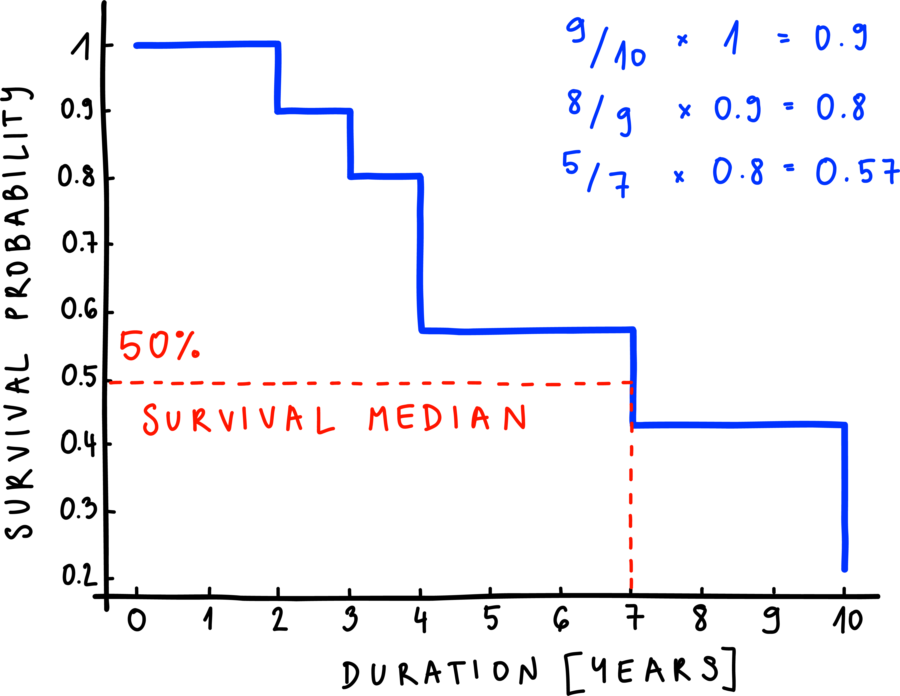
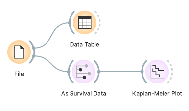
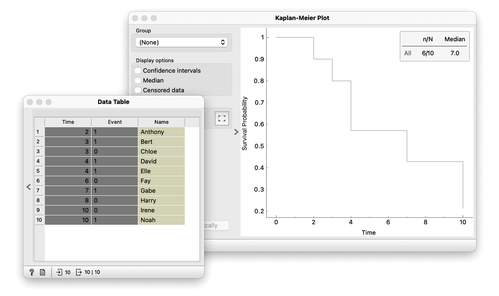

We now have our data nicely organized in a table. Let's return to the question that got us started: can we predict how likely a new dental filling will fall out after five years? Intuitively, the probability of this happening increases over time because minor damages to and around the dental filling accumulate as time goes by. These damages can be due to the type of filling and its interaction with the bacterial biofilm, your diet, saliva composition, mechanical forces, etc. However, when we visually represent such data, we want to plot the probability of the event not happening. In this case, the probability of the dental filling not falling out. To put it a bit crudely, we are interested in the probability of it surviving in your mouth as time passes. We can estimate the survival function - the probability of surviving past a particular time - using the Kaplan-Meier estimator. Let's calculate the survival probability and its changes over time by hand.

On the x-axis, we mark the time in years, and on the y-axis, the probability of the dental filling staying in place. Assuming that your dentist has done a good job when you exit his clinic, the probability of the dental filling staying in place is equal to 1. That means that at time 0, you have a 100% chance of the filling staying in your mouth - let's mark that on the graph. No one loses their filling in the first year, so the probability remains 1. However, when we get to the second year, Anthony's filling gives in and falls out. So after two years, 1 filling from 10 at-risk falls out. The probability of a filling staying in place is thus reduced by 0.1 (1/
10) leading to a new probability of 0.9. 

The probability remains the same from years 2 to 3. After three years, Bert's filling falls out, and Chloe's data point gets censored. Only nine people are at risk since Anthony's filling has already fallen out. The probability that the filling stays in place at year three is thus 1 minus 1/9, so 0.89. However, because the probability is cumulative, we have to multiply the probability of staying in place at this time by the probability from the previous year. Thus the probability at year 3 is really 0.89 multiplied by 0.9, which is approximately 0.8. 

From years 3 to 4, the probability remains the same yet again. After four years, however, two of my friends, David and Elle, lost their dental fillings. How many people are at risk of losing their filling after four years? We started with 10, Anthony and Harry have already lost theirs, and Chloe is no longer at risk for some other reason. So there are only seven people at risk. Notice that this is where we took Chloe's censored data point into account. So the survival probability is 1 minus 2/7 multiplied by 0.8, the probability of staying in place from the previous year. The survival curve thus falls to 0.57.

We make these small calculations for the rest of the time points and draw the steps until we reach the end of our 10-year observation window. The graph we have produced is the Kaplan-Meier plot, which is one of the most used plots in survival analysis. It shows us how the survival probability changes over time. So, for instance, if we want to know the time at which the survival probability drops to 0.5, we can read it on the plot. We can see that the survival probability has fallen to 50% after seven years. In the literature, this time, called the survival median, is often marked on the Kaplan-Meier plot. 

We can reproduce our manual analysis with a computer. We will use Orange, a data mining tool that uses visual programming in the form of data-analysis pipelines consisting of interconnected widgets. We assume you have already downloaded and installed Orange. If you need help, please find the link to the Orange home page below. If you are entirely new to Orange, you are welcome first to watch a few introductory videos available below. We will run Orange, close the welcome screen, and install the Survival Analysis add-on. The list of add-ons is available from the Options menu. We select Survival Analysis and click Ok. Orange will reload automatically.

<!!! float-aside !!!>

Let's load our small dataset into Orange. I will use the File widget and load the data from the Desktop file we have created. The time and event columns must be marked as meta-features. Orange did so automatically. We can inspect the data in the Data Table. Then we have to inform Orange, which are the time and event columns, so that it knows it's dealing with survival data. We do this with the As Survival Data widget. Now we have to connect the output from As Survival Data to the Kaplan-Meier widget. On the left of the Kaplan-Meier widget, we can choose to display the median, confidence intervals, and censored data. We have successfully reproduced the previous plot in Orange.

