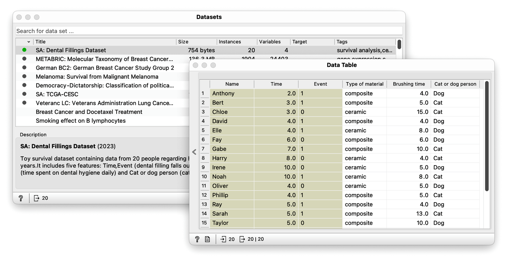
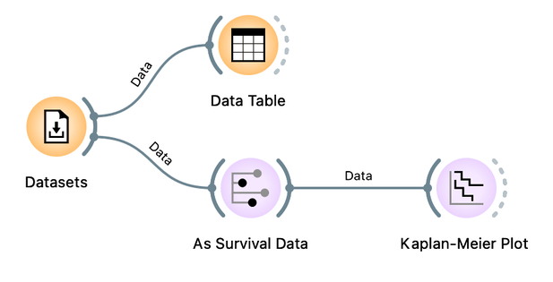
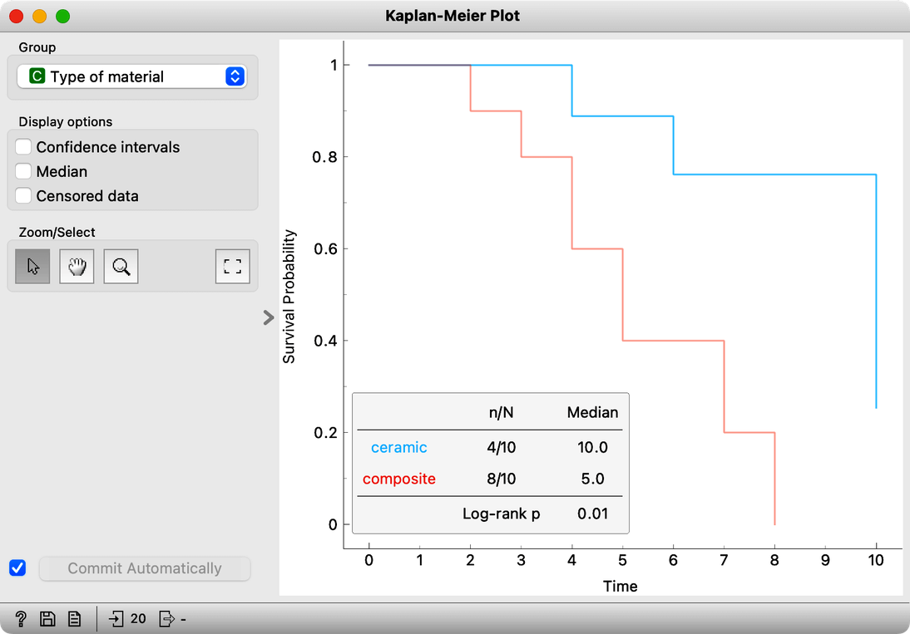
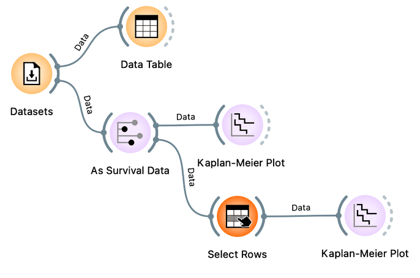
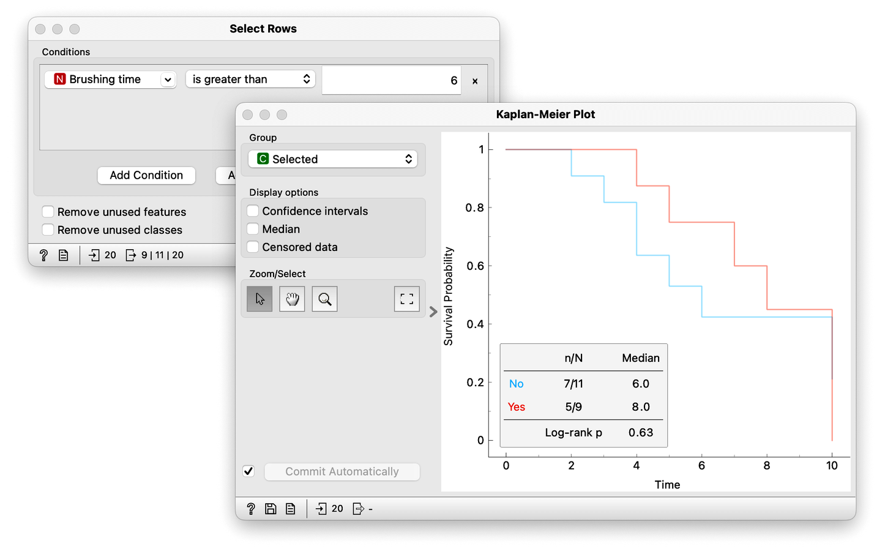
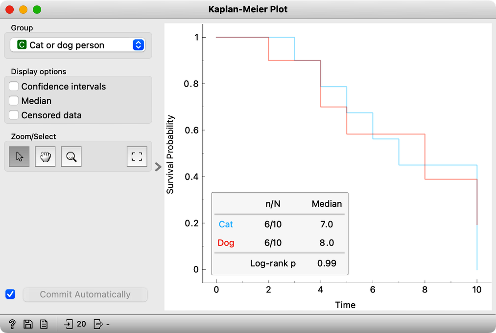

Besides the survival time and event information, observations in a survival dataset are often characterized with a feature or two. We can use the features to form groups and compare their survival curves. Forming groups differs whether the feature is categorical or continuous.

<!!! float-aside !!!>

Returning to our previous example, we have expanded the dental fillings dataset to include 10 more samples and three additional features. The dataset is available in the [Datasets](https://orangedatamining.com/widget-catalog/data/datasets/) widget in Orange. We inspect it in the [Data Table](https://orangedatamining.com/widget-catalog/data/datatable/).

The first additional feature concerns the type of material out of which the dental filling was made of. It turns out they were either composite or ceramic, so type of material is a categorical feature. Anthony got a composite filling, and so did Bert, however, Chloe got a ceramic one and so on. The second additional feature is named Brushing time and denotes the average amount of time in minutes someone spends brushing their teeth daily. Anthony uses an electric toothbrush, so he’s timed his brushing to 4 minutes daily, while Bert says he takes a bit more time. Chloe, on the other hand, has braces and thus spends 15 minutes per day brushing her teeth. Brushing time is a numeric feature, meaning its values are continuous. Lastly, there is another categorical feature, this one denoting whether the subject of the study prefers cats or dogs.

<!!! float-aside !!!>

If we want to form groups based on a categorical feature, we can do so in the [Kaplan-Meier](https://orangedatamining.com/widget-catalog/survival-analysis/kaplan-meier-plot/) widget. We first pass the data through the [As Survival Data](https://orangedatamining.com/widget-catalog/survival-analysis/as-survival-data/) widget to mark the features that record time and event. We can then inspect the data in the Kaplan-Meier plot. When we have a categorical feature, such as the type of material, it’s easy to form groups of data instances. In our case, one group were friends with ceramic filling, and the other friends with composite filling. We can group the samples in the [Kaplan-Meier](https://orangedatamining.com/widget-catalog/survival-analysis/kaplan-meier-plot/) widget and draw two survival curves on the same plot, each one corresponding to the filling type. It seems that ceramic dental fillings have a better prognosis of staying in place than composite ones.

<!!! float-aside !!!>

On the other hand, if we want groupy by a continouus feature we have to define a threshold value to form groups. We will form two groups, one whose members brush their teeth more than six minutes a day, and the other one whose member brush less than that. We use the [Select Rows](https://orangedatamining.com/widget-catalog/transform/selectrows/) widget to define the variable and the threshold.  Normally, [Select Rows](https://orangedatamining.com/widget-catalog/transform/selectrows/) outputs just the data that matches the condition, but in our case we need all the data with the indicator if the condition, brushing over six minutes, was matched. When connecting the [Select Rows](https://orangedatamining.com/widget-catalog/transform/selectrows/) to [Kaplan-Meier](https://orangedatamining.com/widget-catalog/survival-analysis/kaplan-meier-plot/), we have to therefore rewire the connection to indicate Select Rows is sending out all the data. We can now open the Kaplen-Meier plot and choose Selected under Groups. We plotted two curves, one for people that spend over 6 minutes brushing their teeth indicated with Yes, and one for those that spend more time than that, indicated with No.

Let’s compare this plot with the previous one using the type of material to form the two groups. Grouping the subjects of our study by material type made a more considerable difference in the survival curve. We gathered this just by visually inspecting the data.

Of course, it doesn’t make sense to use just any feature to form groups. Not all features affect survival, so not all of them will separate the data into groups with different survival curves. For instance, one can assume that whether a person prefers dogs to cats does not affect how long their dental filling lasts. We can check this by forming groups by the last feature which contains information on whether the person prefers cats or dogs. Since this is a categorical feature, we simply open the [Kaplan-Meier](https://orangedatamining.com/widget-catalog/survival-analysis/kaplan-meier-plot/) widget and select to group by this feature. The survival curves are barely separated. Preferring dogs to cats really doesn’t affect the survival of dental fillings.

Although visual analytics is a useful way of exploring the data, there is of course a more systematic way of comparing how well a particular feature separates the survival curves which is called the log-rank test. It computes how likely the difference between survival curves is not random. The smaller the p-value, the more likely our feature actually separates the data into groups with different survival outcomes. We can see this value next to the Kaplan-Meier plot in Orange. Grouping by type of material gives us a smaller p-value.
