We previously estimated the difference in survival between two cohorts on a Kaplan-Meier plot and manually identified the feature that led to cohorts with distinct survival characteristics. However, real world survival datasets often include more than just 3 features to choose from. We could plot survival curves for each feature in the dataset to compare how much impact they have. Or we could let Orange do some of the work for us. First let's explore one of the available survival datasets in Orange manually.

This time we will be working with a larger dataset. We can find the available survival datasets in Orange using the Dataset widget. Just type "survival" into the search bar. For this example let’s use the German Breast Cancer Study Group data. Select the dataset and conenct it to the Data Table widget. The first two columns show the time and event. Specifically the Recurrence Free Survival Time, the time between the start of the study and the recurrence of cancer. The rest of the data is full of other clinical variables. Some of them categorical, like tumor grade, and other continuous ones, like the patient's age. Note, we dont use As Survival Data widget here because this dataset is already in the correct format for survival analysis.

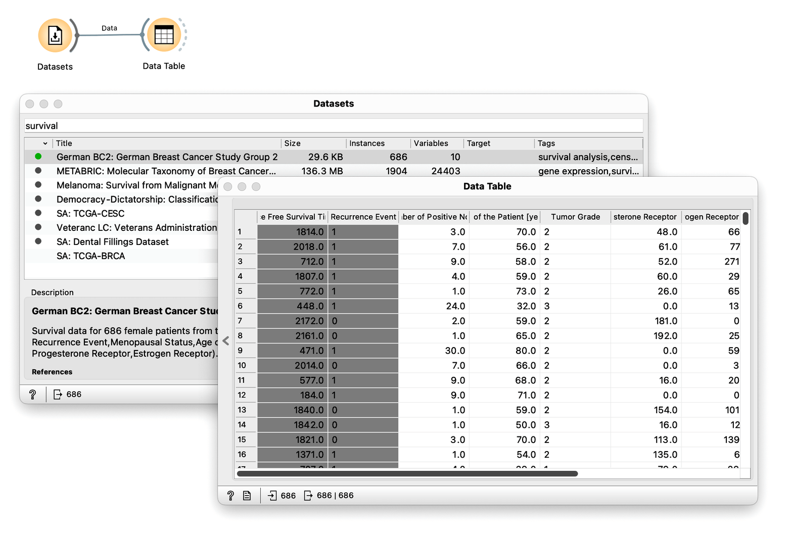

We already know [how to form and compare groups](https://books.biolab.si/books/survival-analysis-tutorial#forming-and-comparing-groups) manually. For categorical features, we simply pass the data to the Kaplan-Meier widget. There are three categorical features to choose from: Tumor Grade, Menopausal Status, and Hormonal Therapy.

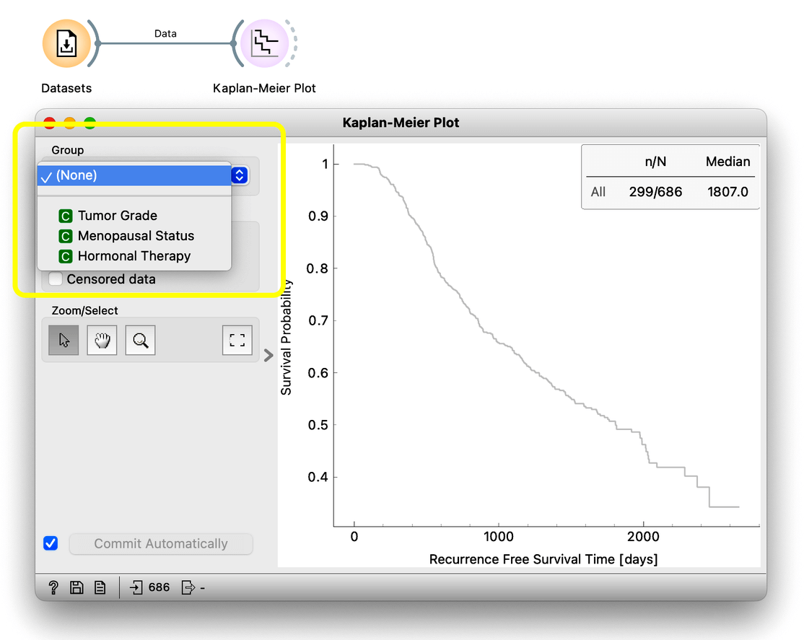

Let's try Menopausal Status and Hormonal therapy. Also, let's plot the median survival time and the confidence intervals to get a better idea of the data. We find that being in menopause doesn't really have much effect on survival; the curves are barely separated, and the p-value is quite large. What about Hormonal therapy? This, on the other hand, is very informative. The patients that did not receive hormonal therapy had a significantly worse prognosis.

<!!! width-max !!!>
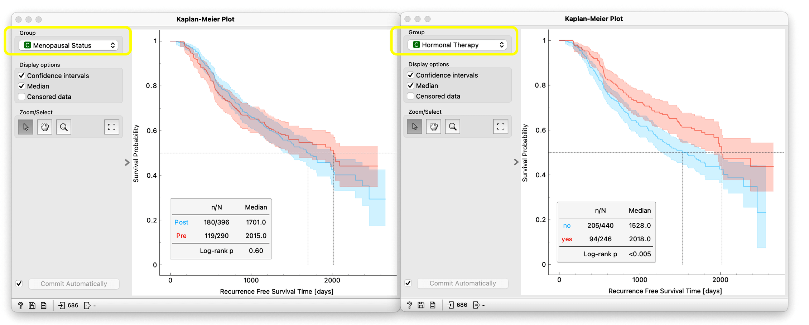

Using numeric features to form cohorts takes an extra step; we need to define a threshold to split the data. In the previous section we used Select rows for this, but this time we do this with the Distributions widget. Say we're interested in whether there is a significant difference in survival between patients above and below the age of 60.

<!!! float-aside !!!>
In the Distributions widget, change the bin width to a small number. Five will do. Then select the population above the age of 60 by interactively selecting bins.

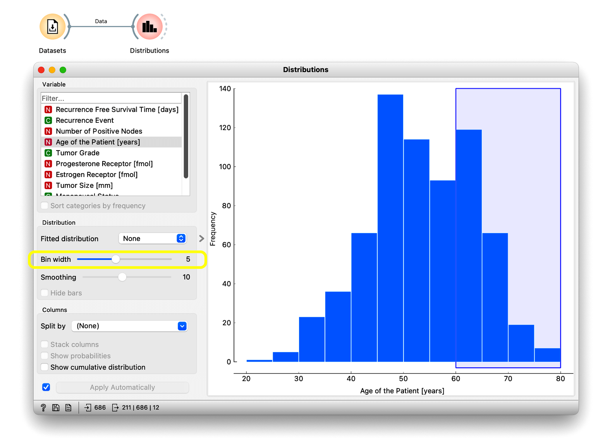

To see what we’ve done we’ll use the Data Table widget.

<!!! float-aside !!!>
The default output of the Distributions widget is only the selected data; in our case, this means only the patients above 60. But we want all the patients, so we have to rewire the connection. Now the Data Table shows everyone. And we find an extra column called "Selected" that specifies the group.
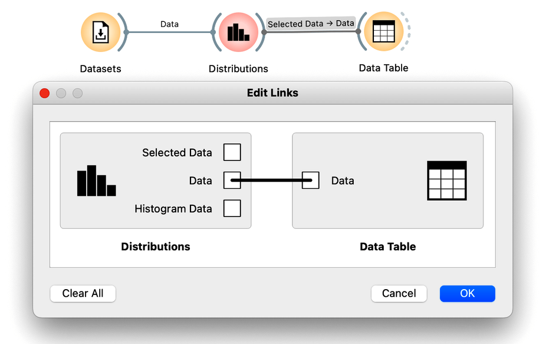

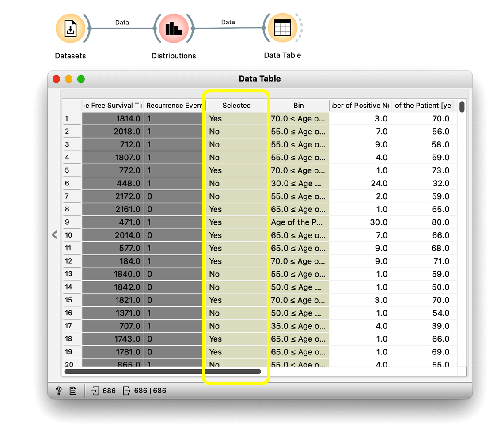

Now we can send the data from Distributions to Kaplan-Meier. It turns out that whether a patient is above or below 60 doesn’t make a big difference in the survival probability over the observed time.

<!!! width-max !!!>
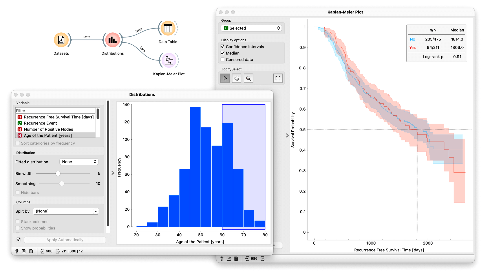

We can also try different thresholds now that we have constructed our workflow. For example, let's select everyone over the age of 40 in Distributions. You can see that Orange automatically reflects this change in the plot. And there is a more significant difference between the survival curves now.

<!!! width-max !!!>
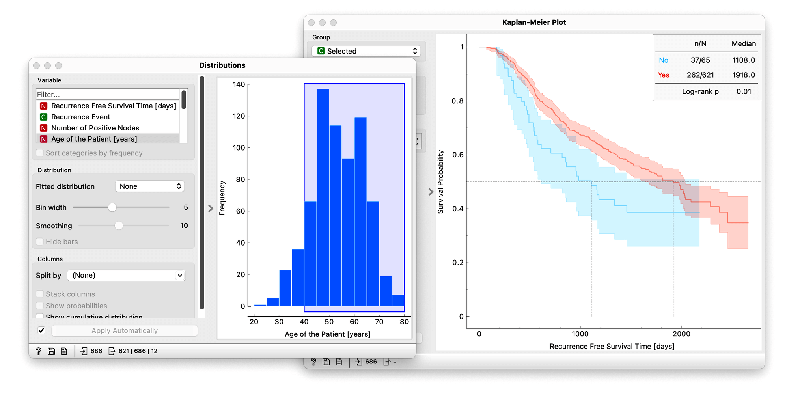

Next, we can try another continuous variable like the Progesterone receptor. Let's select just the first bin since it already contains more than half the patients. This time we really see a big difference.
<!!! width-max !!!>
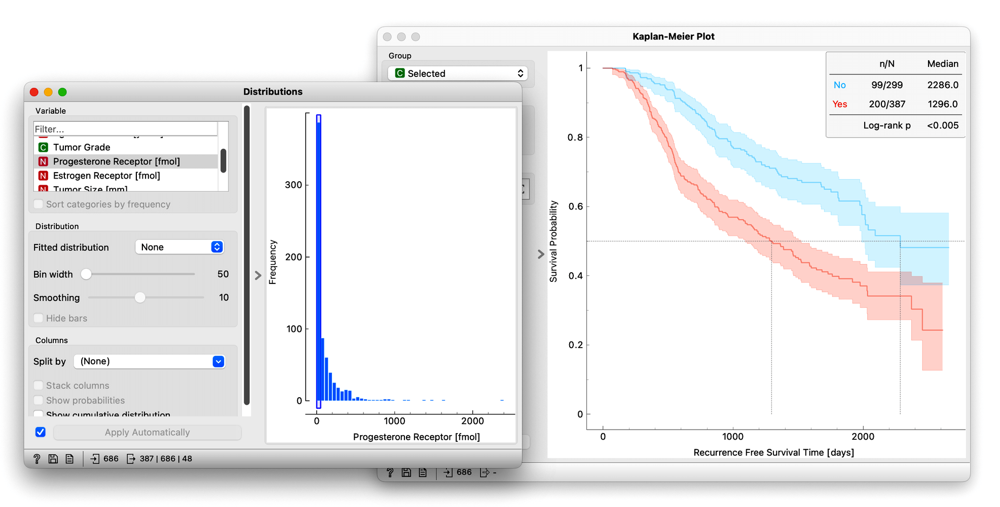

To make comparing features easier, we can use the Rank Survival Features widget, which forms cohorts for each variable and evaluates their difference in survival using the log-rank test. So let's send our data to Rank Survival Features. There's a selection of two scoring methods for establishing which feature is most predictive of survival. Orange automatically selects the multivariate log-rank test, and we'll stick with that. Next, we can sort the features by p-value; we find the most informative is the Number of Positive Nodes. Positive nodes refer to lymph nodes in the armpit area where metastatic cancer cells have been found.

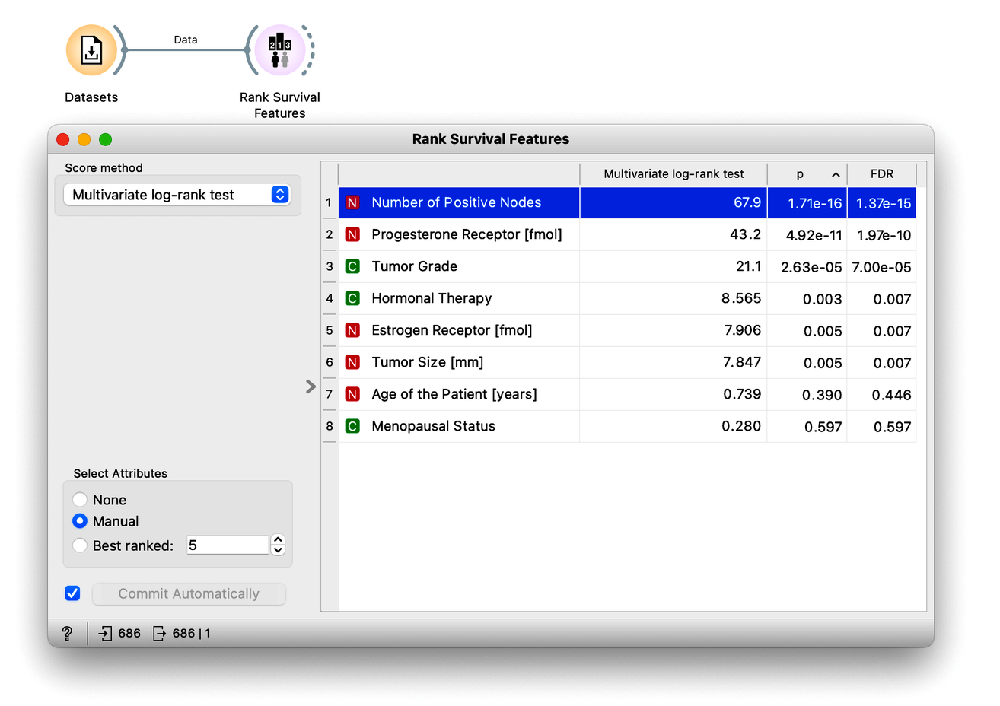

We can inspect what the survival curve actually looks like in this case. The output of the Rank Survival Features widget is a reduced dataset containing the time and event columns along with the selected feature. So we can choose "Number of Positive Nodes," and then we need to split the data at the median again. We could do this via Distributions, like before, or as an alternative, we could use the Discretize widget. So let's connect them and split our data into two intervals of equal frequency. Now we can connect this to another Kaplan-Meier widget, and there we go. We successfully identified the most informative feature regarding survival just with a few clicks.

<!!! width-max !!!>
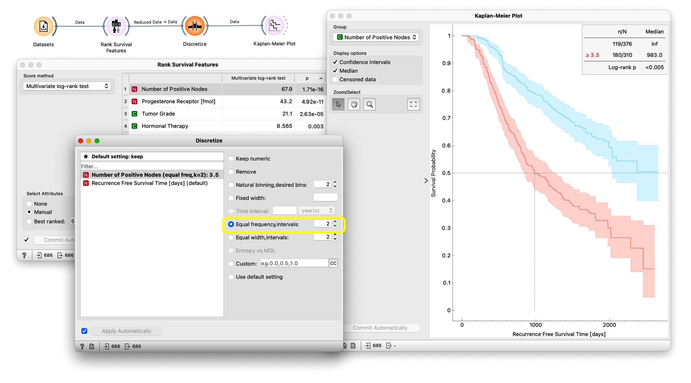