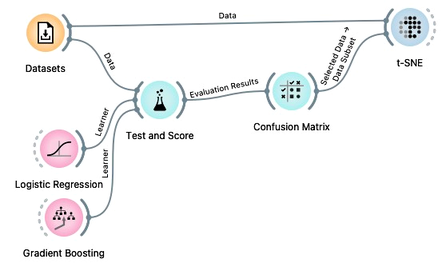

 
Je možno zgraditi klepetalnik, ki predlaga postopek za analizo podatkov in na primer oblikuje delotoke v izbranem programu za podatkovno analitiko. Konkretno, želeli bi zgraditi klepetalnik, ki bi uporabniku pomaga pri vizualnem programiranju, kot ga implementira program [Orange](http://orangedatamining.com).

**Slika:** tipičen delotok v programu Orange. Bi bilo možno, da bi ga sistem predlagal na podlagi opisa delotok, npr. "Za vhodne podatke želim izdelati delotok, ki preveri napovedno točnost nekaterih modelov strojnega učenja. Rezultate primerno vizualiziraj.".

Klepetalnika na tem področju je najbrž silno težko izdelati, zato bi se za začetek pri diplomski nalogi lotili česa lažjega, a nič manj zanimivejšega:

- Iz že izdelanih besedil, ki vsebujejo delotoke, iz lušči delotoke in pripadajočo besedilo. Primer takega besedila je npr. [nedavno uporabljeno učno gradivo](http://books.biolab.si/books/bcm-dm-03-classification).
- Ker so telotoki vključeni v besedila kot slike, bi bilo potrebno iz njih izluščiti strukturo, to je prepoznati gradnike in povezave med njimi. Morda še najlažja bo za to uporaba konvolucijskih nevronskih mrež, ki bi prepoznala območje z ikono in območje z povezavo, znala prepoznati ikono in zgradila delotok. Že samo ta alineja je recimo primerna za temo za diplomsko nalogo.
- Prvi približek klepetalnika bi potem lahko uporabljal vložitve besedil v vektorski prostor, in besedilo z iskalnim nizom v prostoru vložitev primerjal z besedilom povezanim z določenim delotokom. Tudi ta alineja bi bila primerna za (morda nekoliko enostavnejšo) diplomsko nalogo. Ta bi recimo vključevala uporabo razvrščevalnika slik, ki bi prepoznaval, ali je na sliki delokrog ali pa kaj drugega, in potem uporabil samo slike z delotokom.
- V naslednjem približku klepetalnika bi iz besedil in delotokov, ki bi bili opisani kot graf, zgradili globoki generativni model.
- Vse zgornje bi bilo potrebno primerno ovrednotiti.

Iz zgornjega zato izhajajo tri možne teme:

- **Iskalnik delotokov na podlagi besedilnega opisa.**
- **Pretvorba slik delotoka v graf.**
- **Generativni model delotokov, ki iz besedila tvori graf.**