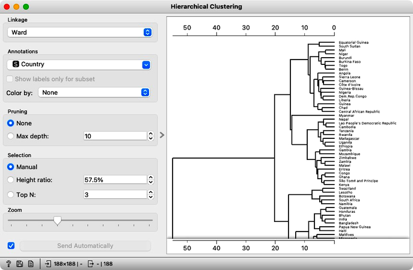

 
Dendrogrami, ki predstavijo rezultate hierarhičnega razvrščanja, so lahko silno zanimivi in razložljivi, a lahko, predvsem, ko so podatki veliki, tudi prekompleksni. Zanimivo bi bilo obdržati samo dele dendrogramov, ki so stabilni in ki se, tudi ob manjših spremembah v podatkih, ne spreminjajo. V zvezi z njimi bi bilo tudi zaimivo oceniti, koliko skupin sploh imamo.

**Slika:** Dendrogrami lahko odlično predstavijo rezulat hierarhičnega razvrščanja v skupine, a čim je podatkovni nabor malo večji, postanejo nepregledni, uporabnik pa iz njih ne more razbrati, kako stabilne so pravzaprav odkrite skupine.

Temi na tem področju sta vsaj dve, in sicer:

- **Oblikuj kvantitavni postopek, ki za dedrogram predlaga področje najbolj primernega reza na skupine.** Preglej literaturo, kaj na tem področju že obstaja, predlagane tehnike pa računsko primerjaj z enostavno tehniko, ki izhaja iz merjenja silhuete in je podobna tej, ki smo jo uporabljali pri določitvi parametra $k$ za metodo voditeljev. Računska primerjava pomeni, da poiščeš recimo deset naborov primerov, za njih zgradiš dendrograme in pregledaš, kakšne so razlike med predlaganimi tehnikami pri ocenjevanju najbolj smiselnega števila skupin. Tu te zanima tudi čas, ki jo potreben za poganjanje takega postopka. Najbolj primerno metodo potem implementiraj v izrisu dendrograma v programu Orange, tako da tam na grafični način predlaga uporabniku število skupin.

- **Poenostavitev dendrogramov z oceno stabilnosti vej**. Tehnika, ki je na tem področju uveljavljena, je [pvclust in njena implementacija v programu R](https://github.com/shimo-lab/pvclust). Problem je tehnike je počasnost in morda pretirana kompliciranost. Zanima nas, ali je moč z enostavnim permutacijskim testom in uporabe silhuete hitro oceniti stabilnost vsake od vej dendrograma. Ideja je namreč, da v njem obdržimo samo veje, ki so tudi po manjši permutaciji podatkov še vedno dovolj stabilne, to je, da je skupina še vedno dovolj dobro ločena od ostalih. 