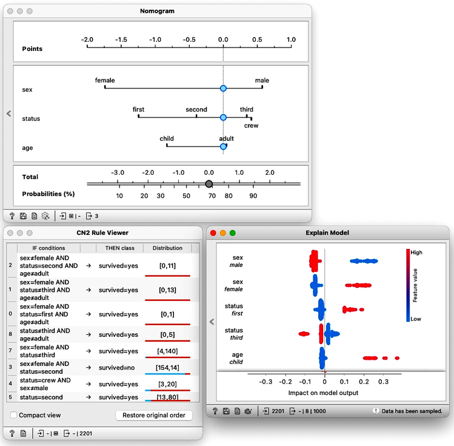

 
Tehnologija umetne inteligence (UI) je dosegla, predvsem v zadnjih 10 letih, številne prebojne uspehe, posebej z izjemno uspešnimi aplikativno pomembnimi metodami strojnega učenja. Te metode se zdaj uspešno uporabljajo na številnih aplikativnih področjih, kot so: razpoznavanje slik, strojno prevajanje, robotika, avtomatsko generiranje besedil in govora, medicinska diagnostika in odločanje v zdravstvu, avtomatizirano odločanje, priporočilni sistemi, avtomatsko odkrivanje v znanosti, odkrivanje novih zdravil itd. Toda nekateri vidiki tehnologije UI, kot so npr. globoke nevronske mreže, vzbujajo v javnosti nezaupanje. Med razlogi za nezaupanje v uporabo UI so: nerazumljivost odločitev sistema UI; videz pristranskosti oz. diskriminacije pri odločitvah, ki jih predlaga sistem UI (npr. v sodstvu, zaposlovanju, zdravstvu); težnje k manipulaciji ljudi prek socialnih medijev; ogrožanja demokracije – možnosti manipulacija volitev; priporočilni sistemi v socialnih medijih, ki povzročajo potenciranje škodljivih in sovražnih vsebin po socialnih medijih; uporaba UI v ubijalskih avtonomnih orožjih.
Gornji zadržki do uporabe UI so vodili do številnih pobud, posvečenim etičnim vidikom UI in pomislekom pred nekaterimi uporabami UI. Te pobude so prispevale k definiranju okvira za t.i. zaupanja vredno UI (trustworthy AI) ter principov, ki bi s predpisi in zakoni utrli pot k zaupanju v uporabo UI.

Eden od glavnih očitkov, ki se pojavljajo v tej zvezi, je v javnosti opisan s frazo pristranskost algoritmov. Naslednja primera sta verjetno v javnosti najbolj pogosto kritizirana kot primera vprašljivih aplikaciji umetne inteligence: (1) sistem COMPAS (Correctional Offender Management Profiling for Alternative Sanctions) za pomoč pri sodniških odločitvah ter (2) sistem za ocenjevanje kandidatov ali kandidatk za zaposlitev pri podjetju Amazon. V obeh kontroverznih primerih je glavni očitek, da sistem UI predlaga pristranske odločitve. Očitana pristranskost je povezana z diskriminacijo po rasi oz. spolu. Ta dva primera in podobni primeri v javnosti veljajo za nesprejemljivo uporabo UI, ki se pogosto povezuje s frazami, kot so »pristranskost algoritmov«, »pristranskost UI« in »pristranskost strojnega učenja«.

V laboratoriju sodelujemo na projektu, ki si je zadal, da temo pristranosti in razlage razišče tako, da ponudi kratke delavnice, kjer bi lahko recimo v pol ure tistim, ki niso strokovnjaki na področju strojnega učenja a jih tema zanima, predstavili, kje so problemi in kakšne so njihove možne rešitve. Možne teme s tega področja so:

- **Razvoj programske opreme za demonstracijo in prikaz delovanja tehnik, ki naslavljajo pristranost in pravičnost.**

- **Razvoj primerov uporabe tehnik razložljive umetne intelligence.**

- **Razvoj novih metod, ki naslavljajo pristranost.** Primer take tehnike bi recimo bil interaktivni nomogram naivnega Bayesa, ali pa popravljanje uteži v razložljivih odločitvenih tabelah, kot jih predlaga [Cynthia Rudin](https://www.nature.com/articles/s42256-019-0048-x).

Pri zgornjih temah bi delo delo obsegalo:

- pregled literature; poišči recimo deset strokovnih in znanstvenih člankov s področja,
- oblikovanje zbirke podatkov iz primerov pristranosti in razložljivosti, kot so navedeni v literaturi,
- primerjalna študija uporabe tehnik iz literature in po možnosti oblikovanje tipičnih telotokov v programu Orange, kjer lahko uporabimo in med sebo primerjamo te tehnike,
- na osnovi povprešnje analize oblikovanje morebitne nove tehnike,
- pisanje poročila o delu v obliki diplomske naloge.

<!!! width-max !!!>

**Slika**: Primer razlage modelov napovedi preživetja na ladji Titanic (naivni Bayesov nomogram, pravila CN2 in razlage nevronske mreže). V to primerjavo bi bilo zanimivo vključiti tudi tehnike, ki jih v članku [Stop explaining black box machine learning models for high stakes decisions and use interpretable models instead](https://www.nature.com/articles/s42256-019-0048-x) omenja Cynthia Rudin, in potem primerjati napovedno točnost teh tehnik na zbrani množici podatkov.