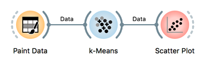
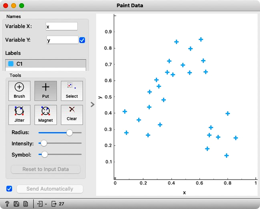
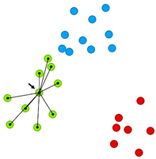
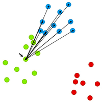
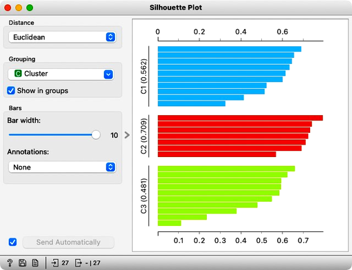
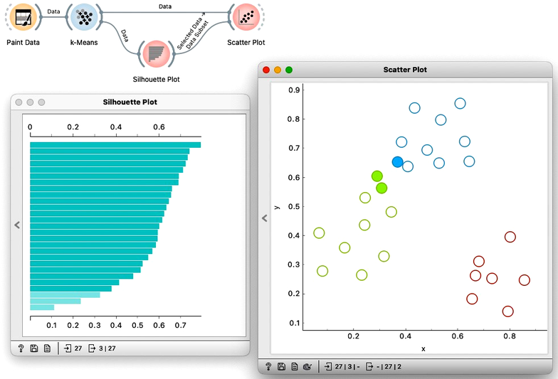
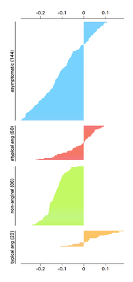
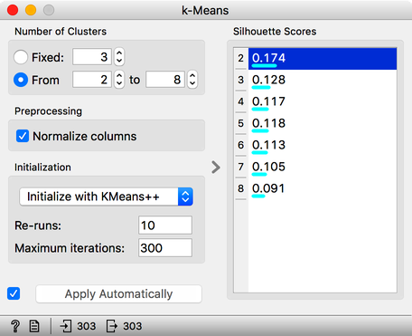

Consider a two-feature data set which we have painted in the [Paint Data](https://orangedatamining.com/widget-catalog/data/paintdata/) widget. 

<!!! float-aside !!!>
Don't get confused: we paint data and/or visualize it with Scatter Plot, which show only two features. This is just for an illustration! Most data sets contain many features and methods like k-Means clustering take into account all features, not just two.

We send the painted data to the k-means clustering, tell it to find three clusters, and display the clustering in the scatter plot.

<!!! float-aside !!!>

Distances to compute average distance A for selected point.

The data points in the red cluster are well separated from points in the other two clusters. Not so for the green and blue points, where several points are on the border between the clusters. We would like to quantify the degree of how well a data point belongs to the cluster to which it is assigned.

We will invent a scoring measure for this and we will call it a silhouette (because this is how it's called). Our goal: a silhouette of 1 (one) will mean that the data instance is well rooted in the cluster, while the score of 0 (zero) will be assigned to data instances on the border between two clusters.

For a given data point (say the blue point in the image on the left), we can measure the distance to all the other points in its cluster and compute the average. Let us denote this average distance with A. The smaller the A, the better.

<!!! float-aside !!!>

Distances to compute average distance B for selected point.

On the other hand, we would like a data point to be far away from the points in the closest neighboring cluster. The closest cluster to our blue data point is the red cluster. We can measure the distances between the blue data point and all the points in the red cluster, and again compute the average. Let us denote this average distance as B. The larger the B, the better.

The point is well rooted within its own cluster if the distance to the points from the neighboring cluster (B) is much larger than the distance to the points from its own cluster (A), hence we compute B-A. We normalize it by dividing it with the larger of these two numbers, 

S = (B -A) / max{A, B}. 

Voilá, S is our silhouette score for the selected data point. Note that we can compute it for each data point in our data set.

Orange has a [Silhouette Plot](https://orangedatamining.com/widget-catalog/visualize/silhouetteplot/) widget that displays the values of the silhouette score for each data instance. We can group the silhouettes by the cluster, and think about how well each of the clusters separates from the other data.

<!!! float-aside !!!>
Cluster C2 is the red cluster, and all its points have larger silhouettes. This could indicate that this cluster is better separated from the other data points than the other two clusters.

We can also choose a particular data instance in the silhouette plot and check out its position in the scatter plot. Below, we selected the three data instances with the lowest silhouettes, and exposed them in the scatter plot. To no surprise they are those on the border of the nearest two clusters.

<!!! width-max !!!>

This of course looks great for data sets with two features, where the scatter plot reveals all the information. In higher-dimensional data, the scatter plot shows just two features at a time, so two points that seem close in the scatter plot may be actually far apart when all features - perhaps thousands of gene expressions - are taken into account. 

The total quality of clustering - the silhouette of the clustering - is the average silhouette across all points. When the [k-Means](https://orangedatamining.com/widget-catalog/unsupervised/k-means/) widget searches for the optimal number of clusters, it tries a different number of clusters and displays the corresponding silhouette scores.

Ah, one more thing: Silhouette Plot can be used on any data, not just on data sets that are the output of clustering. We could use it with the iris data set and figure out which class is well separated from the other two and, conversely, which data instances from one class are similar to those from another.

We don't have to group the instances by the class. For instance, the silhouette on the left would suggest that the patients from the heart disease data with typical anginal pain are similar to each other (with respect to the distance/similarity computed from all features), while those with other types of pain, especially non-anginal pain are not clustered together at all.

<!!! float-aside !!!>

